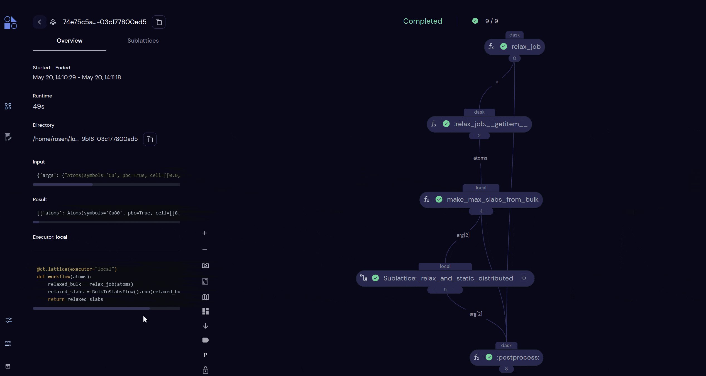

   

---

# Quacc – The Quantum Accelerator 🦆

Quacc is a flexible platform for high-throughput, database-driven computational materials science and quantum chemistry.

The three main goals of Quacc are to:

1. Reduce the barrier for running complex, mixed-code workflows for molecules and materials across distributed compute environments.

2. Promote rapid workflow development and testing via modern workflow management solutions.

3. Enable a seamless interface between the Atomic Simulation Environment and the software infrastructure powering the [Materials Project](https://materialsproject.org).

## Documentation

  📖 <a href="https://quantum-accelerators.github.io/quacc/"><b><i>Learn More Here!</i></b></a> 📖

Includes the following sections:

- 🏎️ [Quick Start](https://quantum-accelerators.github.io/quacc/start/demo.html)
- 🔧 [Installation Guide](https://quantum-accelerators.github.io/quacc/install/install.html)
- 🧠 [User Guide](https://quantum-accelerators.github.io/quacc/user/basics.html)
- 🤝 [Developer Guide](https://quantum-accelerators.github.io/quacc/dev/contributing.html)

## Demonstration ✨

## Citation

If you use Quacc in your work, please cite it as follows:

- A.S. Rosen, Quacc – The Quantum Accelerator, https://doi.org/10.5281/zenodo.7720998.

## Inspiration

Quacc was originally inspired by [Atomate2](https://github.com/materialsproject/atomate2). Refer to the [FAQ section](https://quantum-accelerators.github.io/quacc/about/faq.html) of the documentation for how these codes differ.

## License ⚖️

Quacc is released under a [BSD 3-Clause license](https://github.com/quantum-accelerators/quacc/blob/main/LICENSE.md).
