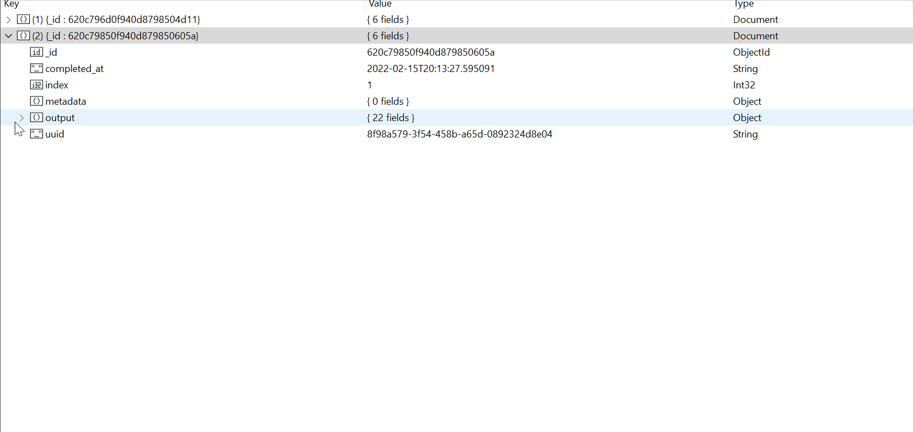

<div align="center">
  <br>
</div>

--------------------------------------

# QuAcc – The Quantum Accelerator


[](https://codecov.io/gh/arosen93/quacc)
[](https://deepsource.io/gh/arosen93/quacc/?ref=repository-badge)
[](https://python.org/downloads)
[](https://pypi.org/project/quacc)
[](https://doi.org/10.5281/zenodo.7720998)

QuAcc is a flexible platform for high-throughput, database-driven computational materials science and quantum chemistry.

The three main goals of QuAcc are as follows:

1. To enable a seamless interface between the [Atomic Simulation Environment](https://wiki.fysik.dtu.dk/ase/index.html) (ASE) and the high-throughput infrastructure powering the [Materials Project](https://materialsproject.org).
2. To reduce the barrier for constructing complex, mixed-code workflows.
3. To promote rapid workflow development and testing via [Jobflow](https://github.com/materialsproject/jobflow).

This package is heavily inspired by [Atomate2](https://github.com/materialsproject/atomate2), which I also recommend checking out.

**Disclaimer**: Currently, this package is under active development and should be considered *experimental.*

## Installation

QuAcc can be installed as follows:

```bash
# For the GitHub development version (recommended)
pip install git+https://github.com/arosen93/quacc.git[all]

# For the latest PyPI release (currently out-of-sync)
pip install quacc[all]
```

## Documentation

[Click me!](https://arosen93.github.io/quacc/)

## Examples

### VASP Job

```python
from ase.build import bulk
from jobflow.managers.local import run_locally

from quacc.recipes.vasp.core import RelaxJob as VaspRelaxJob

# Make a bulk Cu structure
atoms = bulk("Cu")

# Make a job consisting of a VASP relaxation using a pre-defined input set.
# By default, VASP will be run using Custodian for on-the-fly error handling.
job = VaspRelaxJob(preset="BulkSet").make(atoms)

# Run the job locally, with all output data stored in a convenient schema
responses = run_locally(job, create_folders=True)
```

### GFN2-xTB + Gaussian + ORCA Workflow with FireWorks

```python
from ase.build import molecule
from fireworks import LaunchPad
from jobflow import Flow
from jobflow.managers.fireworks import flow_to_workflow

from quacc.recipes.tblite.core import RelaxJob as XTBRelaxJob
from quacc.recipes.gaussian.core import RelaxJob as GaussianRelaxJob
from quacc.recipes.orca.core import StaticJob as OrcaStaticJob

# Make an H2 molecule
atoms = molecule("H2")

# Make a flow consisting of a GFN2-xTB relaxation followed by a Gaussian relaxation
# and then an ORCA static calculation
job1 = XTBRelaxJob(method="GFN2-xTB").make(atoms)
job2 = GaussianRelaxJob(xc="PBE").make(job1.output["atoms"])
job3 = OrcaStaticJob(xc="wB97M-V").make(job2.output["atoms"])
flow = Flow([job1, job2, job3])

# Instead of running locally, we will run the workflow via Fireworks here.
# The commands below convert the flow to a FireWorks workflow and adds it to
# the launchpad. Database-friendly results will be deposited in your JobFlow DB
wf = flow_to_workflow(flow)
lpad = LaunchPad.auto_load()
lpad.add_wf(wf)
```

### Database-Friendly Output

Assuming a Jobflow configuration file has been provided, the input and output data will be automagically tabulated and placed in your selected database. No custom parsing required. An example document is shown below:



## License

QuAcc is released under a [modified BSD license](https://github.com/arosen93/quacc/blob/main/LICENSE.md).
