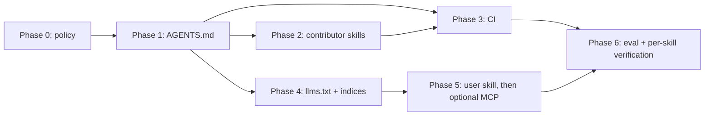

# Design: Phased Agent Integration for quacc

**Status:** Draft / proposal
**Tracking issue:** [#3154](https://github.com/Quantum-Accelerators/quacc/issues/3154) — filed as "Add a agents/claude.md file." That is the seed of this plan, not its ceiling: the filer is new to agent tooling and named the artifact they'd heard of (`CLAUDE.md`). This doc treats the underlying need — "give agents context on the repo" — as the goal, and picks the artifacts that serve it best, which turn out not to be Claude-specific.
**Scope:** How quacc adopts coding-agent tooling (context files, skills, CI automation, machine-readable docs, an MCP server) in a way that benefits quacc's *users* and *contributors*, works with more than one vendor's agent, and doesn't rot the moment conventions drift.
**Audience:** quacc maintainers.

---

## 0. Why provider-neutral, not "Claude integration"

The original draft of this doc scoped everything around Claude Code specifically (`CLAUDE.md`, `.claude/skills/`, `.claude/agents/`). Comparing against a real prior-art example — [deepmd-kit](https://github.com/deepmodeling/deepmd-kit), which ships agent tooling today — changed that.

**What deepmd-kit does, and why it's the better default:**

| Artifact | deepmd-kit's choice | Why it's better than the Claude-specific equivalent |
| --- | --- | --- |
| Root context file | `AGENTS.md`, no `CLAUDE.md` | Plain markdown, no tool-specific syntax. Claude Code, Codex, Cursor, and others all read it directly. One file instead of one per vendor. |
| Contributor skills | `.github/skills/{add-descriptor,debug-gradient-flow}` | Same idea as a Claude subagent skill, but as plain instructions + reference docs any agent can be pointed at — not gated behind a vendor's discovery mechanism. |
| User skills | Top-level `skills/{deepmd-train,deepmd-finetune-dpa3,deepmd-python-inference,lammps-deepmd}/`, each a `SKILL.md` + reference/asset files | Uses the [agentskills.io](https://agentskills.io/what-are-skills) open format and installs per-agent via `npx skills add ./skills -a <agent-name>`. The *content* is written once; the installer adapts it to whichever agent the user runs, instead of the maintainers hand-writing a `.claude/` version and a separate Codex version. |

Two things are still genuinely tool-specific and that's fine, because the tool-specific ergonomics are the point:

- **`.github/workflows/claude.yml`** — a CI job has to run *some* concrete agent; quacc's already runs Claude (`anthropics/claude-code-action@v1`). No vendor-neutral way to avoid this, and there's no need to invent one.
- **`.claude/settings.json`** (permission allowlist) and `.claude/agents/` (subagents) — these configure Claude Code's own runtime and have no portable equivalent yet. Fine to keep, but they're a *convenience layer on top of* the portable artifacts, not a substitute for them.

**Revised guiding principles** (supersedes the original list):

1. **No hard dependency on any agent vendor.** Nothing in quacc's runtime, test suite, or docs build may require an API key. Every artifact is additive and optional.
2. **Provider-neutral by default; vendor-specific only where the vendor-specific ergonomics are the point.** Root context file is `AGENTS.md`. Skills live in a top-level `skills/` folder using the agentskills.io format, not nested under `.claude/`. CI automation and permission config remain Claude-specific because they have to run somewhere concrete.
3. **Reuse the source of truth.** Recipe metadata, settings docs, and schemas already exist in the codebase. Agent-facing artifacts must be *generated from* or *point at* them, never hand-copied — a hand-copied fact rots the first time the code changes and then actively misleads.
4. **A skill only ships if it encodes something not otherwise inferable from the code.** This is the test that separates a meaningful skill from integration theater. See §1 below — it's the whole reason this plan exists rather than just landing `AGENTS.md` and calling it done.
5. **Every skill needs a verification story.** deepmd-kit's skills have zero CI wiring and no automated check that they still match reality (confirmed: no `skills` reference anywhere in `.github/workflows/`). A skill that silently drifts from the actual code is worse than no skill — quacc should not repeat that gap. See Phase 6.
6. **Maintainer cost is the binding constraint.** Every phase names an owner, a per-month cost estimate, and a kill switch.

**Non-goals** (unchanged):

- Replacing human code review, or auto-merging anything.
- Letting an agent submit or babysit jobs on HPC resources on a user's behalf (Phase 5 discusses why this stays out of scope).
- Committing agent-generated recipes without a human author who understands the science.

---

## 1. What actually makes a skill meaningful (not just "AI integration")

This is worth stating explicitly, because it's easy to ship agent artifacts that look like progress but add nothing an agent couldn't already do by reading the code. From the deepmd-kit comparison, a skill (or any agent-facing artifact) earns its keep only when it closes one of these three gaps — otherwise it's ceremony:

1. **The knowledge isn't in the code at all.** Which model family to recommend for a given dataset size, or which of two nearly-identical calculators to reach for first — this is a maintainer's tacit judgment call, not something derivable from source. quacc's analogue: "use EMT for solids / LJ for molecules as the cheap-calculator-first choice" from `contributing.md` — a rule, not a fact the code encodes.
2. **The knowledge is in the code, but reconstructing it by pattern-matching is error-prone.** An agent could infer "how to add a recipe" by reading three existing recipes and generalizing — and then miss the one that doesn't use `@job` correctly, or skip a required schema field none of its three examples happened to need. Writing the *complete* correct procedure down once removes that risk. quacc's analogue: the `@job`/`@flow` contract, the "no `os.chdir`/`os.getcwd()`" rule (subtle, multithreading-related, not obvious from reading one recipe), the pickle-serializability requirement.
3. **The knowledge changes faster than an agent's training data.** Exact CLI flags, current schema shape, current settings — all liable to be stale in a general-purpose agent's memory. A generated, versioned index closes this gap structurally, since it can never drift from the code that generates it.

If a proposed artifact doesn't close one of these three gaps, don't build it. This is the filter applied to every phase below.

---

## 2. Current state (audit)

- `.github/workflows/claude.yml` exists and uses `anthropics/claude-code-action@v1`, triggered by `@claude` mentions in issues, PR comments, and reviews. It is **essentially stock**: every customization option (`prompt`, `claude_args`, allowed tools) is still commented out, and it carries no quacc-specific context.
- There is **no `AGENTS.md`**, no top-level `skills/`, no `.claude/` directory of any kind.
- Docs are built with `zensical` from `docs/`, with API reference auto-generated by `docs/gen_ref_pages.py`. There is **no `llms.txt`** or other machine-readable docs artifact.
- Conventions an agent must know are documented for humans in `docs/dev/contributing.md`, `docs/dev/recipes/jobs.md`, and `docs/dev/recipes/flows.md`, but are not surfaced to any agent automatically.
- Testing has real structure an agent will get wrong by default: `tests/core` plus one directory per workflow engine, `requirements-*.txt` per extra, monkeypatched `conftest.py` for calculators that cannot be pip-installed (with the `--noconftest` escape hatch), and an HPC runner for licensed executables.

**Implication:** Phase 1 closes a real gap where the already-live GitHub Action gives contributors advice that ignores quacc's rules.

---

## 3. Phases at a glance

| Phase | Theme | Primary beneficiary | Ships | Portable? | Effort |
| --- | --- | --- | --- | --- | --- |
| 0 | Decide + guardrails | Maintainers | Policy, secrets, cost caps | n/a | S |
| 1 | Repo context | Contributors | `AGENTS.md` | Yes | S |
| 2 | Contributor skills | Contributors | `skills/{new-recipe,recipe-tests,docs-sync,new-calculator}/` | Yes (agentskills.io format) | M |
| 3 | CI automation | Maintainers | Tuned `claude.yml` + review workflow | No (inherently vendor-specific) | M |
| 4 | Machine-readable docs | **Users** (any assistant) | `llms.txt`, `llms-full.txt`, generated recipe/settings index | Yes | M |
| 5 | User-facing skill(s) + optional MCP | **Users** | `skills/quacc-workflow/`, then `quacc mcp` if warranted | Yes, then no | M → L |
| 6 | Evaluation + upkeep | Everyone | Eval suite, per-skill verification, ownership, sunset criteria | n/a | M |

Phases 1–3 are contributor-facing and low risk; they can land quickly. Phase 4 is the pivot to user value. Phase 5 now starts with a *skill*, not an MCP server — cheaper, ships sooner, and the MCP server (if ever built) should consume the same Phase 4 indices rather than being the first thing built.

---

## Phase 0 — Decide, and set guardrails

**Goal:** Get explicit maintainer sign-off on scope, cost, and policy before any artifact lands.

**Deliverables**

- A short `AGENTS_POLICY` section appended to `docs/dev/contributing.md`: agent-assisted contributions are welcome; the human author is responsible for correctness and for the science; PRs that are visibly unreviewed agent output will be closed; disclosure of substantial agent assistance in the PR description is requested.
- Confirm `ANTHROPIC_API_KEY` ownership, spend limits, and who watches the bill.
- Decide whether agent artifacts live in-repo or in a separate repo. **Recommendation: in-repo** — they must version with the conventions they describe.
- Decide the CI trigger policy: `@claude` mentions from anyone, or restricted to collaborators. **Recommendation: restrict write-capable runs to collaborators.**

**Exit criteria:** Maintainer has said yes to a specific phase list and a monthly spend ceiling.

---

## Phase 1 — Repo context: `AGENTS.md`

**Goal:** Any agent working in the quacc repo — a contributor's local Claude Code/Codex/Cursor session, or the existing GitHub Action — follows quacc's actual conventions on the first try, regardless of which agent they use.

**Deliverables**

1. **`AGENTS.md` at the repo root** (not `CLAUDE.md` — see §0). Deliberately short (target < 120 lines; it's loaded into every session). Contents:
   - Orientation: `src/quacc/{recipes,calculators,runners,schemas,wflow_tools,settings.py}` and what each is for.
   - The recipe contract: `@job` for compute tasks, `@flow` for compositions, inputs/outputs must be pickle-serializable, `Atoms` first positional arg, return a `quacc.schemas` dictionary, no `.` in dict keys, execute via `quacc.runners`, prefer the code's internal optimizer over an ASE optimizer.
   - Hard rules an agent violates by default: **absolute paths only, never `os.chdir`/`os.getcwd()`** (multithreading correctness), NumPy-style docstrings, type hints required, `ruff check --fix && ruff format`, every change needs a test, gzip large test fixtures.
   - Test topology: `pytest tests/core` for the default loop; `pytest tests/<engine>` for engine-specific behavior; the monkeypatched `conftest.py` pattern and `--noconftest`; do not attempt to run licensed codes (VASP, Gaussian, ORCA, Q-Chem, MRCC) locally.
   - Concrete timing/validation expectations, borrowed from what deepmd-kit's `AGENTS.md` does well: expected durations for install/build/test steps so an agent doesn't cancel a slow-but-normal step, plus an explicit "validate with one real scenario before declaring done" instruction.
   - Pointers, not copies: link `docs/dev/contributing.md`, `docs/dev/recipes/jobs.md`, `docs/dev/recipes/flows.md` as the authoritative expansion.
2. **`.claude/settings.json`** (committed) with a conservative permission allowlist for genuinely safe, high-frequency commands — `pytest`, `ruff`, `git status/diff/log`, `pip install -e`. Claude-specific, but additive on top of `AGENTS.md`, not a replacement for it.
3. **`.gitignore` entry for `.claude/settings.local.json`.**

**Acceptance criteria**

- A contributor asks a fresh agent session (any vendor) to "add an `md_job` to `recipes/lj`" and the result uses `@job`, NumPy docstrings, a `quacc.schemas` return, no `os.getcwd()`, and adds a test under `tests/core/recipes/lj_recipes/`. Verify by actually running it, not by reading the file.
- `AGENTS.md` contains no fact that is not also true in the codebase or `docs/dev/`.

**Ownership:** whoever writes it; review by a maintainer who has recently reviewed a recipe PR.

**Sunset criteria:** if `AGENTS.md` is observed contradicting `docs/dev/`, fix or delete it — a stale context file is worse than none.

---

## Phase 2 — Contributor skills (portable format)

**Goal:** Encode the repetitive, error-prone contributor tasks so they close one of the three gaps in §1 — not because "skills" are the trend, but because these specific tasks are currently done by copy-pasting an existing recipe and getting some detail wrong.

**Format decision:** ship these under a top-level `skills/` directory using the agentskills.io `SKILL.md` format (frontmatter: `name`, `description`, `compatibility`, `license`, `metadata`), the same layout deepmd-kit uses — **not** nested under `.claude/skills/`. This is installed per-agent via `npx skills add ./skills -a <agent-name>`, so one written skill serves Claude Code, Codex, or any other agentskills.io-compatible client. Reserve `.claude/agents/` (actual Claude subagents) for anything that specifically needs Claude Code's own dispatch mechanism, which none of these currently do.

**Deliverables** (each a directory: `skills/<name>/SKILL.md` plus `references/` for anything too long to inline, following deepmd-kit's progressive-disclosure pattern)

| Skill | Closes which gap (§1) | What it does |
| --- | --- | --- |
| `new-recipe` | #2 (error-prone pattern-matching) | Scaffolds a new `@job`/`@flow` in `src/quacc/recipes/<code>/`, choosing a template from the closest existing recipe, wiring the correct schema and runner, plus a matching test under `tests/core/recipes/`. Encodes the cheap-calculator-first rule (#1: EMT for solids, LJ for molecules) from `contributing.md`. |
| `new-calculator` | #2 | Walks the larger job: `src/quacc/calculators/<code>/`, presets directory + `pyproject.toml` `package-data` entry, an optional-dependency extra, `tests/requirements-<code>.txt`, and the monkeypatched `conftest.py` if the executable isn't pip-installable. |
| `recipe-tests` | #2 | Given an existing recipe, writes/repairs tests: picks a small system, keeps runtime low, adds a regression test for a bug fix. |
| `docs-sync` | #2 | After a code change, updates the affected `docs/user/` or `docs/dev/` pages and nav config if a page was added. Catches the most common review comment on recipe PRs. |

**Also consider:** a `recipe-reviewer` Claude subagent (`.claude/agents/`) encoding the maintainer's review checklist — this one *is* legitimately Claude-specific since it plugs into Claude Code's review dispatch, and Phase 3's CI review job can consume the same checklist.

**Acceptance criteria**

- A maintainer runs `new-recipe` for a recipe they were going to write anyway and reports the scaffold saved time rather than costing review effort.
- Skills reference files by path and re-read them at runtime rather than embedding code snippets that will go stale.
- Every skill has a corresponding entry in the Phase 6 verification harness (see below) — no skill ships without one.

**Risks:** skill sprawl. Cap at ~4 skills. A skill nobody invokes in 3 months gets deleted.

---

## Phase 3 — CI automation (Claude-specific by necessity)

**Goal:** Make the *already-deployed* GitHub Action actually good, and add narrowly-scoped automation that reduces maintainer load. Unlike Phases 1, 2, and 4, this phase is inherently tied to whichever agent actually runs in CI — currently Claude — and that's fine.

**Deliverables**

1. **Tune `.github/workflows/claude.yml`:**
   - Add a `prompt` establishing quacc context and pointing at `AGENTS.md`.
   - Set `claude_args` with an explicit allowed-tools list rather than defaults.
   - Add the collaborator restriction decided in Phase 0.
   - Grant `actions: read` (already present) so it can read failing test logs.
2. **A separate PR-review workflow** (`.github/workflows/claude-review.yml`) on `pull_request`, posting a *non-blocking* review against the recipe checklist from Phase 2. Explicitly advisory: not a required check, must not approve PRs.
3. **Issue triage** (optional, evaluate after the above): label incoming issues by area, and for "my run failed" issues, ask for the specific missing information maintainers currently request by hand.

**Acceptance criteria**

- Over 10 PRs, the review bot's comments are judged useful-or-harmless by a maintainer. If mostly noise, delete it.

**Risks:** prompt injection from issue/PR text on a public repo (mitigate via no write permissions beyond commenting, collaborator gating); marginal per-PR cost (gate on `paths` if it matters).

---

## Phase 4 — Machine-readable docs (the user-facing pivot)

**Goal:** Make quacc's own documentation consumable by *any* assistant, so a user asking any agent "how do I run a VASP relaxation with quacc and Parsl" gets correct, current answers instead of hallucinated APIs. This closes gap #3 (staleness) structurally, and it's the foundation Phase 5's skill and any future MCP server both consume.

**Deliverables**

1. **`llms.txt` and `llms-full.txt`**, generated at docs-build time (extend `docs/gen_ref_pages.py` or add a sibling script wired into the `docs` extra and `.github/workflows/docs.yaml`).
2. **A generated recipe index** — import path, one-line summary, calculator, and calculation type for every `@job`/`@flow`, introspected from `quacc.recipes` at docs-build time so it can never drift from the code. Directly addresses "78 jobs across 75 modules is not browsable."
3. **A generated settings reference** from `QuaccSettings` field descriptions, which already exist and are already the source of truth.
4. **Docstring quality pass** where introspection reveals recipes with missing/one-word summaries.

**Acceptance criteria**

- Given only `llms.txt`, an assistant with no quacc training data can write a runnable EMT relax + slab flow and a correct `quacc set WORKFLOW_ENGINE` invocation.
- The generated artifacts rebuild automatically on every docs deploy; no manual step.

---

## Phase 5 — A user-facing skill, then (maybe) an MCP server

**Goal:** Let a user working in their own project directory get real, current help composing quacc workflows — the same shape of value deepmd-kit's `skills/deepmd-train` and `skills/lammps-deepmd` provide, adapted to quacc.

This phase is reordered relative to the original draft: **start with a skill that reads Phase 4's static generated indices, not an MCP server.** A skill is cheaper to build, ships as soon as Phase 4 lands, and is provider-neutral. Only build the MCP server afterward, and only for the specific capabilities a static index genuinely cannot provide (live settings resolution, reading a user's actual run directory) — that's the same lesson as gap #1/#3 in §1: don't build infrastructure for knowledge that's already sitting in a file.

**Deliverables**

1. **`skills/quacc-workflow/SKILL.md`** (portable, top-level, same format as Phase 2): given a user's goal ("relax this slab with VASP and Parsl"), searches the Phase 4 recipe index, picks the right `@job`/`@flow`, and walks the user through composing it — the `@job`/`@flow` composition patterns from `docs/user/basics/`, calculator keyword customization, choosing a workflow engine. Uses progressive disclosure like `deepmd-train`: a top-level workflow file, with per-engine or per-calculator reference docs read only when relevant.
2. **Only if Phase 4 + the skill prove insufficient** — an MCP server (`quacc mcp`, optional extra) exposing read-only tools that need *live* state a static index can't provide: `get_settings(effective=True)` (resolved settings + provenance, credential-redacted), `diagnose_rundir(path)` (read an actual results directory and summarize convergence/errors). Read-only by design; no job submission, no credential handling — same deliberate exclusions as the original draft.
3. **Install docs** — `docs/user/miscellaneous/assistant.md`, plus a line in the install guide, following deepmd-kit's `doc/agent-skills.md` pattern (what the skill is, how to install it with `npx skills add`, a minimal verification prompt to sanity-check the install).

**Acceptance criteria**

- A user who has never read the docs can, with the skill alone, get from a POSCAR to a correctly-composed (not necessarily submitted) Parsl workflow using correct recipe imports and no hallucinated kwargs.
- If/when built: `quacc mcp` starts in < 2s and works with `WORKFLOW_ENGINE=None`; `diagnose_rundir` correctly identifies the top 5 failure modes maintainers see in issues (gathered from real issue history, not guessed).

**Deliberate exclusions:** no job submission, no database writes, no credential handling — unchanged from the original draft, and stated here for the skill too, not just the MCP server.

**Risks:** the MCP server, if built, is the largest chunk of net-new code quacc would own — needs a maintainer willing to own it long-term, or it should not start. The skill-first approach means Phase 5 is still a substantial win even if the MCP server never happens.

---

## Phase 6 — Evaluation, ownership, and upkeep

**Goal:** Know whether any of this is working, and be willing to delete what is not — and specifically close the verification gap deepmd-kit currently has (no CI wiring at all for its skills).

**Deliverables**

- **A per-skill verification check**, wired into CI: for each `skills/<name>/SKILL.md`, a corresponding check that the files/commands/paths it references still exist and match current conventions (e.g., `new-recipe`'s referenced test directory pattern, `docs-sync`'s referenced nav config path). This can be as lightweight as a script that greps the skill for path references and asserts they resolve — the point is *some* automated tripwire exists, unlike deepmd-kit's `skills/`, which has none.
- **An eval set**: ~15 realistic tasks with checkable outcomes — 5 contributor tasks (add a recipe, fix a bug with a regression test, update docs), 5 user tasks (find the right recipe, compose a flow, configure an engine), 5 diagnostic tasks (real failed run directories from issue history). Run before and after each phase.
- **A metrics baseline**: time-to-first-review on PRs, fraction of issues needing a "please provide your settings/version" round trip, docs page traffic to `llms.txt`.
- **A named owner per artifact** in `docs/maintainers/internal.md`, plus a sunset rule: any agent artifact not exercised for two release cycles is deleted, not left to rot.
- **A quarterly refresh check** that `AGENTS.md` and skills still match `docs/dev/`.

---

## 4. Sequencing and dependencies

Phases 2 and 4 are independent and can run in parallel. Phase 5's skill depends on Phase 4's generated indices existing; the optional MCP server (if it happens) depends on the skill having shipped and proven insufficient on its own.

---

## 5. Open questions for the maintainer

1. **`AGENTS.md` vs `CLAUDE.md`.** This draft recommends `AGENTS.md` for provider neutrality (§0). If there's a reason to want Claude Code specifically favored (e.g. it's the only agent quacc wants to officially support), `CLAUDE.md` is the narrower alternative — Claude Code will read either.
2. **Where do Phase 2 skills live** — top-level `skills/` (this draft's recommendation, matching deepmd-kit's user-facing convention) vs a `.github/skills/`-style undocumented contributor-only bucket (deepmd-kit's other, separate convention for `add-descriptor`/`debug-gradient-flow`)? This draft recommends one top-level `skills/` folder for everything quacc authors, distinguished by each skill's own `description`, rather than splitting by directory the way deepmd-kit does — simpler for contributors to discover, at the cost of mixing contributor- and user-facing skills in one listing.
3. **In-repo vs. separate repo** for agent artifacts (Phase 0 recommends in-repo).
4. **CI trigger policy** — collaborator-gated or open?
5. **Does anyone own an eventual MCP server long-term?** If not, the plan should stop at the Phase 5 skill, which is still a substantial and durable win on its own.
6. **Spend ceiling** for the GitHub Action.
7. **Where should this document live in the published docs?** `docs/design/` is currently outside the `_zensical.toml` nav, so this page is unlisted. If design docs should be published, add a nav entry; if not, it may belong outside `docs/` entirely.

---

## 6. Decision log

| Date | Decision | Rationale |
| --- | --- | --- |
| 2026-08-01 | Root context file is `AGENTS.md`, not `CLAUDE.md` | Provider-neutral; deepmd-kit precedent; Claude Code reads it natively anyway |
| 2026-08-01 | Skills live in a top-level `skills/` folder using the agentskills.io format, not `.claude/skills/` | Portable across agent vendors via `npx skills add -a <agent>`; deepmd-kit precedent |
| 2026-08-01 | Phase 5 starts with a skill, not an MCP server | Cheaper, ships as soon as Phase 4 lands, provider-neutral; MCP only justified for capabilities a static index can't provide |
| 2026-08-01 | Every skill ships with a Phase 6 verification check | deepmd-kit's `skills/` has zero CI wiring or automated staleness detection — a gap worth deliberately not repeating |
| _(draft)_ | Agent artifacts live in-repo | Must version alongside the conventions they describe |
| _(draft)_ | Any future MCP server is read-only; no job submission | Safety and support burden on shared HPC resources |
| _(draft)_ | Machine-readable docs (Phase 4) are provider-neutral | Helps users on any assistant; zero runtime cost |
| _(draft)_ | Nothing in quacc may require an API key | Core installs and CI must work unchanged |
