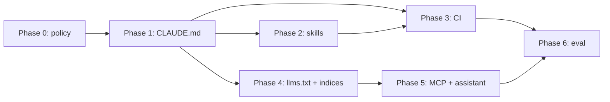

# Design: Phased Claude Integration for quacc

**Status:** Draft / proposal
**Tracking issue:** [#3154](https://github.com/Quantum-Accelerators/quacc/issues/3154) — filed as "Add a agents/claude.md file"; this doc treats that as the starting point (Phase 1) of a broader plan rather than the whole scope.
**Scope:** How quacc adopts Claude (Claude Code, the Claude Agent SDK, and the GitHub Action) in a way that benefits quacc's *users* and *contributors*, not just a single developer.
**Audience:** quacc maintainers.

---

## 1. Framing

There are two distinct populations to serve, and they need different things:

| Population | Who | What they need help with |
| --- | --- | --- |
| **Users** | Computational chemists/materials scientists running quacc on a laptop or HPC cluster | Finding the right recipe out of ~78 `@job` and ~18 `@flow` functions across 75 recipe modules; composing them into flows; picking settings out of a large `QuaccSettings`; deciphering a failed run directory; choosing/configuring one of the 8 supported workflow engines |
| **Contributors** | People adding recipes, calculators, or fixes | Following the recipe/flow conventions, schemas, NumPy docstrings, `ruff`, the monkeypatched `conftest.py` test pattern, and per-engine test suites |

An integration that only ships a `CLAUDE.md` helps contributors and does nothing for users. An integration that only ships a chatbot helps neither. This plan sequences the work so that each phase is independently useful, cheap to revert, and does not create maintenance burden that outlives its value.

**Guiding principles**

1. **No hard dependency on Claude.** Nothing in quacc's runtime, test suite, or docs build may require an Anthropic API key. Every artifact is additive and optional.
2. **Reuse the source of truth.** Recipe metadata, settings docs, and schemas already exist in the codebase. Agent-facing artifacts should be *generated from* or *point at* them, never hand-copied — hand-copied context rots and then actively misleads.
3. **Provider-neutral where it is free to be.** `llms.txt`-style docs output and a plain MCP server work with any assistant. Only lock into Claude-specific formats (skills, subagents, GitHub Action) where the Claude-specific ergonomics are the point.
4. **Maintainer cost is the binding constraint.** Every phase names an owner, a per-month cost estimate, and a kill switch.

**Non-goals**

- Replacing human code review, or auto-merging anything.
- Letting an agent submit or babysit jobs on HPC resources on a user's behalf (Phase 6 discusses why this stays out of scope).
- Committing agent-generated recipes without a human author who understands the science.

---

## 2. Current state (audit, as of this draft)

- `.github/workflows/claude.yml` exists and uses `anthropics/claude-code-action@v1`, triggered by `@claude` mentions in issues, PR comments, and reviews. It is **essentially stock**: every customization option (`prompt`, `claude_args`, allowed tools) is still commented out, and it carries no quacc-specific context. It works, but it is unaware of quacc's conventions.
- There is **no `CLAUDE.md`**, no `.claude/` directory, no skills, no subagents, no MCP server.
- Docs are built with `zensical` from `docs/`, with API reference auto-generated by `docs/gen_ref_pages.py`. There is **no `llms.txt`** or other machine-readable docs artifact.
- Conventions that an agent must know are documented for humans in `docs/dev/contributing.md`, `docs/dev/recipes/jobs.md`, and `docs/dev/recipes/flows.md`, but are not surfaced to a coding agent in any automatic way.
- Testing has real structure an agent will get wrong by default: `tests/core` plus one directory per workflow engine, `requirements-*.txt` per extra, monkeypatched `conftest.py` for calculators that cannot be pip-installed (with the `--noconftest` escape hatch), and an HPC runner for licensed executables.

**Implication:** Phase 1 is not "write a nice README for the robot" — it is closing a real gap where the already-live GitHub Action gives contributors advice that ignores quacc's rules.

---

## 3. Phases at a glance

| Phase | Theme | Primary beneficiary | Ships | Effort |
| --- | --- | --- | --- | --- |
| 0 | Decide + guardrails | Maintainers | Policy, secrets, cost caps | S |
| 1 | Repo context | Contributors | `CLAUDE.md`, `.claude/settings.json` | S |
| 2 | Contributor workflows | Contributors | Skills / slash commands / subagents | M |
| 3 | CI automation | Maintainers | Tuned `claude.yml` + review workflow | M |
| 4 | Machine-readable docs | **Users** (any assistant) | `llms.txt`, `llms-full.txt`, recipe index | M |
| 5 | User-facing assistant | **Users** | `quacc mcp` server + installable skill | L |
| 6 | Evaluation + upkeep | Everyone | Eval suite, ownership, sunset criteria | M |

Phases 1–3 are contributor-facing and low risk; they can land quickly. Phase 4 is the pivot to user value and is the most defensible long-term investment. Phase 5 is the ambitious one and should not start until Phase 4's artifacts exist, because Phase 5 consumes them.

---

## Phase 0 — Decide, and set guardrails

**Goal:** Get explicit maintainer sign-off on scope, cost, and policy before any artifact lands.

**Deliverables**

- A short `AGENTS_POLICY` section appended to `docs/dev/contributing.md` stating: agent-assisted contributions are welcome; the human author is responsible for correctness and for the science; PRs that are visibly unreviewed agent output will be closed; disclosure of substantial agent assistance in the PR description is requested.
- Confirm `ANTHROPIC_API_KEY` ownership, spend limits, and who watches the bill.
- Decide whether agent artifacts live in-repo (`.claude/`) or in a separate `Quantum-Accelerators/quacc-agents` repo. **Recommendation: in-repo.** They must version with the conventions they describe; a separate repo will silently drift.
- Decide the CI trigger policy: `@claude` mentions from anyone, or restricted to org members / `Quantum-Accelerators` collaborators. **Recommendation: restrict write-capable runs to collaborators**; unrestricted mention triggers on a public repo are a spend and prompt-injection surface.

**Exit criteria:** Maintainer has said yes to a specific phase list and a monthly spend ceiling.

**Risks:** Doing Phases 1–5 without this produces artifacts nobody has agreed to maintain.

---

## Phase 1 — Repo context for coding agents

**Goal:** Any agent working in the quacc repo — a contributor's local Claude Code, or the existing GitHub Action — follows quacc's actual conventions on the first try.

**Deliverables**

1. **`CLAUDE.md` at the repo root.** Deliberately short (target < 120 lines; it is loaded into every session, so length is a real cost). Contents:
   - Orientation: `src/quacc/{recipes,calculators,runners,schemas,wflow_tools,settings.py}` and what each is for.
   - The recipe contract: `@job` for compute tasks, `@flow` for compositions, inputs/outputs must be pickle-serializable, `Atoms` first positional arg, return a `quacc.schemas` dictionary, no `.` in dict keys, execute via `quacc.runners`, prefer the code's internal optimizer over an ASE optimizer.
   - Hard rules that agents violate by default: **absolute paths only, never `os.chdir`/`os.getcwd()`** (multithreading correctness), NumPy-style docstrings, type hints required, `ruff check --fix && ruff format`, every change needs a test, gzip large test fixtures.
   - Test topology: `pytest tests/core` for the default loop; `pytest tests/<engine>` for engine-specific behavior; the monkeypatched `conftest.py` pattern and `--noconftest`; do not attempt to run licensed codes (VASP, Gaussian, ORCA, Q-Chem, MRCC) locally.
   - Pointers, not copies: link `docs/dev/contributing.md`, `docs/dev/recipes/jobs.md`, `docs/dev/recipes/flows.md` as the authoritative expansion.
2. **`.claude/settings.json`** (committed) with a conservative permission allowlist for the genuinely safe, high-frequency commands — `pytest`, `ruff`, `git status/diff/log`, `pip install -e`. This removes prompt fatigue for contributors without granting anything destructive.
3. **`.gitignore` entry for `.claude/settings.local.json`** so individual contributors keep personal overrides out of the repo.

**Acceptance criteria**

- A contributor asks a fresh Claude Code session to "add an `md_job` to `recipes/lj`" and the result uses `@job`, NumPy docstrings, a `quacc.schemas` return, no `os.getcwd()`, and adds a test under `tests/core/recipes/lj_recipes/`. Verify by actually running it, not by reading the file.
- `CLAUDE.md` contains no fact that is not also true in the codebase or `docs/dev/`.

**Ownership:** whoever writes it; review by a maintainer who has recently reviewed a recipe PR.

**Sunset criteria:** if `CLAUDE.md` is observed contradicting `docs/dev/`, fix or delete it — a stale context file is worse than none.

---

## Phase 2 — Contributor workflows as skills and subagents

**Goal:** Encode the repetitive, error-prone contributor tasks so they are done consistently instead of re-derived badly each time.

`CLAUDE.md` says *what the rules are*; skills say *how to execute a specific multi-step task*. The tasks below are chosen because they are (a) common, (b) mechanical, and (c) currently done by copy-pasting an existing recipe — the exact thing `docs/dev/contributing.md` already tells people to do, which means it is automatable.

**Deliverables** (in `.claude/skills/`, each a directory with a `SKILL.md`)

| Skill | What it does |
| --- | --- |
| `new-recipe` | Scaffolds a new `@job`/`@flow` in `src/quacc/recipes/<code>/`, choosing a template from the closest existing recipe, wiring the correct schema and runner, plus a matching test under `tests/core/recipes/`. Prompts for the cheap-calculator-first workflow (EMT for solids, LJ for molecules) that contributing.md recommends. |
| `new-calculator` | Walks the larger job: `src/quacc/calculators/<code>/`, presets directory + `pyproject.toml` `package-data` entry, an optional-dependency extra, `tests/requirements-<code>.txt`, and the monkeypatched `conftest.py` if the executable is not pip-installable. |
| `recipe-tests` | Given an existing recipe, writes/repairs tests: picks a small system, keeps runtime low, adds a regression test for a bug fix, checks coverage did not drop. |
| `docs-sync` | After a code change, updates the affected `docs/user/` or `docs/dev/` pages and the `_zensical.toml` nav if a page was added. Catches the most common review comment on recipe PRs. |

**Also consider:** a `recipe-reviewer` subagent (`.claude/agents/`) encoding the maintainer's review checklist — serializability, absolute paths, docstring completeness, test presence, schema use, engine-agnosticism. This is the same checklist Phase 3 uses in CI, so write it once and have both consume it.

**Acceptance criteria**

- A maintainer runs `new-recipe` for a recipe they were going to write anyway and reports the scaffold saved time rather than costing review effort.
- Skills reference files by path and re-read them at runtime rather than embedding code snippets that will go stale.

**Risks:** skill sprawl. Cap at ~4 skills. A skill nobody invokes in 3 months gets deleted.

---

## Phase 3 — CI automation

**Goal:** Make the *already-deployed* GitHub Action actually good, and add narrowly-scoped automation that reduces maintainer load.

**Deliverables**

1. **Tune `.github/workflows/claude.yml`:**
   - Add a `prompt` establishing quacc context and pointing at `CLAUDE.md`.
   - Set `claude_args` with an explicit allowed-tools list rather than defaults.
   - Add the collaborator restriction decided in Phase 0.
   - Grant `actions: read` (already present) so it can read failing test logs — this is the highest-value existing capability and is currently underused.
2. **A separate PR-review workflow** (`.github/workflows/claude-review.yml`) that runs on `pull_request` and posts a *non-blocking* review against the recipe checklist from Phase 2. Explicitly advisory: it must not be a required check, and it must not approve PRs.
3. **Issue triage** (optional, evaluate after the above): label incoming issues by area (`vasp`, `espresso`, `parsl`, `settings`, `docs`), and for "my run failed" issues, ask for the specific missing information (quacc version, workflow engine, settings, the run directory contents) that maintainers currently ask for by hand every time.

**Acceptance criteria**

- Over 10 PRs, the review bot's comments are judged useful-or-harmless by a maintainer; a nontrivial fraction catch something real. If it is mostly noise, delete it — a noisy bot trains contributors to ignore review.

**Risks**

- **Prompt injection** from issue/PR text on a public repo. Mitigations: no write permissions beyond commenting on the review workflow, collaborator gating for anything that can push commits, no secrets beyond the API key in scope.
- **Cost.** Per-PR review on a repo with quacc's traffic is small but non-zero; gate on `paths` (e.g. skip docs-only PRs) if spend is a concern.

---

## Phase 4 — Machine-readable docs (the user-facing pivot)

**Goal:** Make quacc's own documentation consumable by *any* assistant, so a user asking ChatGPT/Claude/Copilot "how do I run a VASP relaxation with quacc and Parsl" gets correct, current answers instead of hallucinated APIs. This is the single highest-leverage user-facing item because it helps every user regardless of which assistant they use, and it costs nothing at runtime.

**Deliverables**

1. **`llms.txt` and `llms-full.txt`**, generated at docs-build time (extend `docs/gen_ref_pages.py` or add a sibling script wired into the `docs` extra and `.github/workflows/docs.yaml`), published at the docs site root. `llms.txt` = curated index of key pages; `llms-full.txt` = concatenated docs corpus.
2. **A generated recipe index** — a machine-readable table of every `@job` and `@flow`: import path, one-line summary from the docstring, calculator, and the type of calculation. Generated by introspecting `quacc.recipes` at docs-build time so it can never drift from the code. This directly addresses the users' single biggest discovery problem: 78 jobs across 75 modules is not browsable.
3. **A generated settings reference in the same machine-readable form**, from `QuaccSettings` field descriptions (which are already written and already the source of truth).
4. **Docstring quality pass** where introspection reveals recipes with missing or one-word summaries — this improves the human docs too, which makes it easy to justify.

**Acceptance criteria**

- Given only `llms.txt`, an assistant with no quacc training data can write a runnable EMT relax + slab flow and a correct `quacc set WORKFLOW_ENGINE` invocation.
- The generated artifacts rebuild automatically on every docs deploy; no manual step.

**Why this before Phase 5:** the MCP server in Phase 5 should serve exactly these generated indices. Building them as static docs artifacts first means they are useful even if Phase 5 never happens.

---

## Phase 5 — A user-facing quacc assistant

**Goal:** Let a user working in their own project directory get real help from an agent that can *query quacc*, not just read prose about it.

**Deliverables**

1. **An MCP server, shipped as `quacc mcp`** in `src/quacc/_cli/` behind an optional extra (`pip install quacc[mcp]`), exposing read-only tools:

   | Tool | Purpose |
   | --- | --- |
   | `search_recipes(query, calculator=None)` | Semantic/keyword search over the Phase 4 recipe index |
   | `get_recipe_signature(import_path)` | Full signature, docstring, and accepted calculator kwargs for one recipe |
   | `get_schema(name)` | The output schema a recipe returns, so an agent can write correct post-processing |
   | `get_settings(effective=True)` | The user's resolved settings and where each value came from (env var, config file, default) |
   | `diagnose_rundir(path)` | Read a quacc results directory and summarize what ran, whether it converged, and the error if not |

   Read-only by design. No tool submits jobs, writes to a database, or mutates settings. See "Deliberate exclusions" below.

2. **An installable skill/plugin** (`quacc-assistant`) that layers workflow-authoring guidance on top of those tools: choosing a workflow engine, the `@job`/`@flow` composition patterns from `docs/user/basics/`, customizing calculator keywords, and the common failure modes.

3. **Install docs** — a new `docs/user/miscellaneous/assistant.md` page, plus a line in the install guide.

**Acceptance criteria**

- A user who has never read the docs can, with the assistant, get from a POSCAR to a submitted Parsl workflow using correct recipe imports and no hallucinated kwargs.
- `quacc mcp` starts in < 2s and works with `WORKFLOW_ENGINE=None`.
- `diagnose_rundir` correctly identifies the top 5 failure modes maintainers see in issues (gather these from real issue history first — do not guess).

**Deliberate exclusions**

- **No job submission.** An agent that can `sbatch` on a shared HPC allocation is a support and safety problem quacc should not own. Users compose workflows with the assistant and submit them themselves.
- **No database writes.** `diagnose_rundir` reads; it never modifies results.
- **No credential handling.** The server must never read or echo API keys, DB connection strings, or cluster credentials, even when they appear in settings — `get_settings` redacts.

**Risks:** this is the largest chunk of net-new code quacc would own. It needs a maintainer willing to own it long-term, or it should not start. Ship behind an extra so it cannot break core installs.

---

## Phase 6 — Evaluation, ownership, and upkeep

**Goal:** Know whether any of this is working, and be willing to delete what is not.

**Deliverables**

- **An eval set**: ~15 realistic tasks with checkable outcomes — 5 contributor tasks (add a recipe, fix a bug with a regression test, update docs), 5 user tasks (find the right recipe, compose a flow, configure an engine), 5 diagnostic tasks (real failed run directories from issue history). Run before and after each phase.
- **A metrics baseline** worth tracking: time-to-first-review on PRs, fraction of issues needing a "please provide your settings/version" round trip, docs page traffic to `llms.txt`.
- **A named owner per artifact** recorded in `docs/maintainers/internal.md`, plus a stated sunset rule: any agent artifact that is not exercised for two release cycles is deleted, not left to rot.
- **A quarterly refresh check** that `CLAUDE.md` and skills still match `docs/dev/`.

---

## 4. Sequencing and dependencies

Phases 2 and 4 are independent and can run in parallel. Phase 5 must not start before Phase 4 lands.

---

## 5. Open questions for the maintainer

1. **Priority order.** This plan front-loads contributor tooling because it is cheap and de-risks the rest. If user-facing value is the actual mandate, Phase 4 can move ahead of Phases 2–3 with no technical penalty. Which ordering is wanted?
2. **In-repo vs. separate repo** for `.claude/` artifacts (Phase 0 recommends in-repo).
3. **CI trigger policy** — collaborator-gated or open?
4. **Does anyone own Phase 5 long-term?** If not, the plan should stop at Phase 4, which is still a substantial and durable win.
5. **Spend ceiling** for the GitHub Action.
6. **Where should this document live in the published docs?** `docs/design/` is currently outside the `_zensical.toml` nav, so this page is unlisted. If design docs should be published, add a nav entry; if they should not be built at all, they may belong outside `docs/`.

---

## 6. Decision log

| Date | Decision | Rationale |
| --- | --- | --- |
| _(draft)_ | Agent artifacts live in-repo | Must version alongside the conventions they describe |
| _(draft)_ | MCP server is read-only; no job submission | Safety and support burden on shared HPC resources |
| _(draft)_ | Machine-readable docs (Phase 4) are provider-neutral | Helps users on any assistant; zero runtime cost |
| _(draft)_ | Nothing in quacc may require an API key | Core installs and CI must work unchanged |
