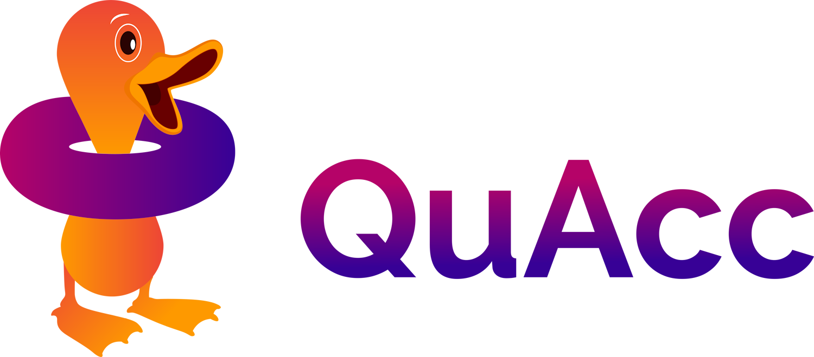

# quacc — the Quantum Accelerator

Quacc (pronounced "quack") is a flexible and extensible platform for high-throughput computational materials science and quantum chemistry.

The three main goals of quacc are to:

1. Reduce the barrier for running complex, mixed-code workflows for molecules and materials across distributed compute environments.

2. Promote rapid workflow development and testing via modern [workflow management solutions](https://workflows.community/).

3. Enable a seamless interface between the [Atomic Simulation Environment](https://wiki.fysik.dtu.dk/ase/) and the software infrastructure powering the [Materials Project](https://materialsproject.org).

---

