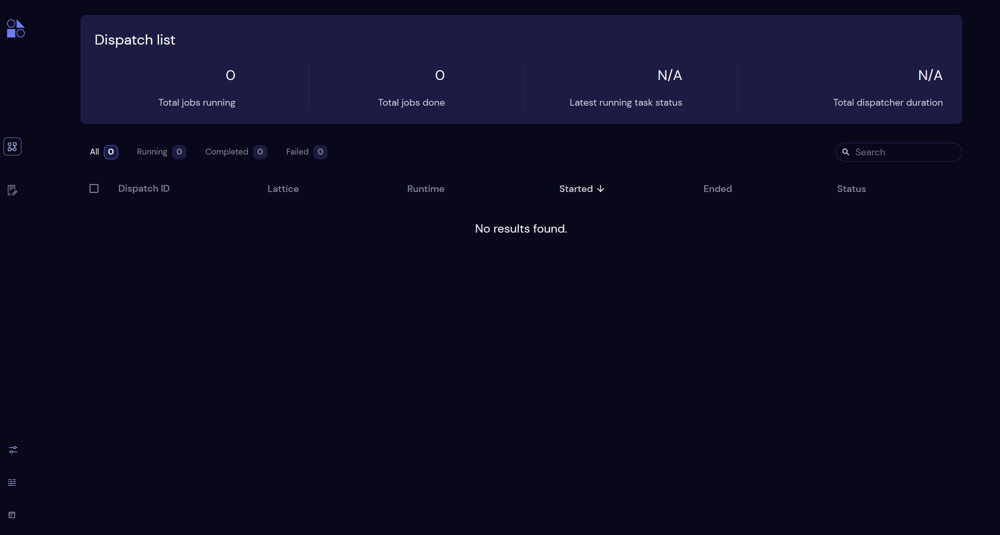

# Workflow Engine Setup

Using a workflow engine is a crucial component for scaling up quacc calculations in a high-throughput setting. We describe the necessary installation steps here for the workflow manager of your choosing.

!!! Tip "Picking a Workflow Engine"

    If you don't want to use a workflow engine or are just starting out, you can simply skip this section.

    For a comparison of the different compatible workflow engines, refer to the [Workflow Engines Overview](../user/basics/wflow_overview.md) section.

=== "Covalent"

    **Installation**

    To install Covalent, run

    ```bash
    pip install quacc[covalent]
    ```

    **Starting the Server**

    Covalent uses a server to dispatch and store calculation details and results. To start the server, simply run `covalent start` in your terminal. It will return a URL (usually http://localhost:48008) that you can use to access the Covalent dashboard, which is shown below.

    

    !!! Tip

        Once you start scaling up your calculations, we recommend hosting the Covalent server on a dedicated machine or using [Covalent Cloud](https://www.covalent.xyz/cloud/). Refer to the [Covalent Deployment Guide](https://docs.covalent.xyz/docs/user-documentation/server-deployment) for details.

    ??? Note "For NERSC Users"

        If you are using Perlmutter at NERSC, you will need to adjust the Covalent configuration directory because the home directory does not support file locking:

        ```bash title="~/.bashrc"
        export COVALENT_CONFIG_DIR="$SCRATCH/.config/covalent"
        ```

=== "Dask"

    **Installation**

    To install Dask, run the following:

    ```bash
    pip install quacc[dask]
    ```

=== "Parsl"

    **Installation**

    To install Parsl, run the following:

    ```bash
    pip install quacc[parsl]
    ```

    Parsl has [many configuration options](https://parsl.readthedocs.io/en/stable/userguide/configuring.html), which we will cover later in the documentation.

=== "Prefect"

    **Installation**

    To install Prefect, run the following:

    ```bash
    pip install quacc[prefect]
    ```

    To connect to Prefect Cloud, run the following as well:

    ```bash
    prefect cloud login
    ```

    Prefect has [many configuration options](https://docs.prefect.io/latest/guides/settings/). For instance, you can store the quacc logs in the UI as follows:

    ```bash
    prefect config set PREFECT_LOGGING_EXTRA_LOGGERS=quacc
    ```

=== "Redun"

    **Installation**

    To install Redun, run the following:

    ```bash
    pip install quacc[redun]
    ```

=== "Jobflow"

    === "Jobflow-Remote"

        **Installation**

        To install Jobflow with support for Jobflow-Remote, run the following:

        ```bash
        pip install quacc[jobflow]
        ```

        **MongoDB Setup**

        Jobflow requires the use of a database (most commonly a MongoDB instance) to store calculation results.

        !!! Tip

            If it is not possible to use MongoDB, you can use a variety of other data store options available within the [maggma package](https://github.com/materialsproject/maggma).

        **Jobflow DB Setup**

        If you plan to use Jobflow-Remote to run your workflows, you will need to carry out the following steps:

        1. Run `jf project generate cms`

        2. Replace the `~/.jfremote/cms.yaml` with the configuration parameters outlined in the Jobflow Remote [configuration documentation](https://matgenix.github.io/jobflow-remote/user/install.html). There are many different kinds of configurations. A representative example is shown below for the "all-in-one" configuration. When the YAML is completed, run `jf project check --errors`. If there are no errors, you can run `jf runner start` to start the runner.

        ```yaml title="~/.jfremote/cms.yaml"
        name: cms
        workers:
        basic_vasp:
            type: local
            scheduler_type: slurm
            work_dir: /path/to/my/jobflow/vasp
            pre_run: |
                source ~/.bashrc
                module load anaconda3/2024.10
                conda activate cms
                module load vasp/6.5.1
                export QUACC_VASP_PARALLEL_CMD="srun -N 1 --ntasks-per-node 112"
                export QUACC_WORKFLOW_ENGINE=jobflow
                export QUACC_CREATE_UNIQUE_DIR=False
            timeout_execute: 60
            resources:
                nodes: 1
                ntasks_per_node: 112
                cpus_per_task: 1
                mem: 900G
                time: 04:00:00
                account: rosengroup
        basic_python:
            type: local
            scheduler_type: slurm
            work_dir: /path/to/my/jobflow/python
            pre_run: |
                source ~/.bashrc
                module load anaconda3/2024.10
                conda activate cms
                export QUACC_WORKFLOW_ENGINE=jobflow
                export QUACC_CREATE_UNIQUE_DIR=False
                timeout_execute: 60
            resources:
                nodes: 1
                ntasks_per_node: 1
                cpus_per_task: 1
                mem: 8G
                time: 04:00:00
                account: rosengroup
        queue:
        store:
            type: MongoStore
            host: localhost
            database: <MongoDB Database Name>
            username: <MongoDB UserName>
            password: <MongoDB PW>
            collection_name: jf_jobs
        flows_collection: jf_flows
        auxiliary_collection: jf_aux
        exec_config: {}
        jobstore:
        docs_store:
            type: MongoStore
            database: <MongoDB Database Name>
            host: localhost
            username: <MongoDB UserName>
            password: <MongoDB PW>
            collection_name: jf_outputs
        ```

        Afterwards, confirm that everything works by running the following minimal example:

        ```python
        from jobflow_remote.utils.examples import add
        from jobflow_remote import submit_flow
        from jobflow import Flow

        job1 = add(1, 2)
        job2 = add(job1.output, 2)
        flow = Flow([job1, job2])

        ids = submit_flow(flow, worker="basic_python")
        print(ids)
        ```

    === "Fireworks"

        **Installation**

        To install Jobflow with support for Fireworks, run the following:

        ```bash
        pip install quacc[jobflow] fireworks
        ```

        **MongoDB Setup**

        Jobflow requires the use of a database (most commonly a MongoDB instance) to store calculation results.

        !!! Tip

            If it is not possible to use MongoDB, you can use a variety of other data store options available within the [maggma package](https://github.com/materialsproject/maggma).

        **Jobflow DB Setup**

        If you plan to use Jobflow to write your workflows, you will need to make a `jobflow.yaml` file. This file will generally be formatted like the example below. Fill in the fields with the appropriate values for your MongoDB cluster, which is where all your calculation inputs and outputs will be stored.

        ```yaml title="jobflow.yaml"
        JOB_STORE:
        docs_store:
            type: MongoStore
            host: <host name>
            port: 27017
            username: <username>
            password: <password>
            database: <database name>
            collection_name: <collection name>
        ```

        !!! Note "MongoDB Atlas"

            If you are using a URI (as is common with MongoDB Atlas), then you will instead have a `jobflow.yaml` file that looks like the example below. Here, you will put the full URI in the `host` field. The `username` and `password` are part of the URI and so should not be included elsewhere in the YAML file.

            ```yaml title="jobflow.yaml"
            JOB_STORE:
            docs_store:
                type: MongoStore
                host: <URI>
                port: 27017
                database: <database name>
                collection_name: <collection name>
            ```

        You will then need to define a `JOBFLOW_CONFIG_FILE` environment variable pointing to the file you made. For instance, in your `~/.bashrc` file, add the following line:

        ```bash
        export JOBFLOW_CONFIG_FILE="/path/to/my/jobflow.yaml"
        ```

        **FireWorks Setup**

        If you plan to use FireWorks to dispatch your Jobflow workflows, you will also need to make a few configuration files: `FW_config.yaml`, `my_fworker.yaml`, `my_launchpad.yaml`, and `my_qadapter.yaml`. To begin, make a directory called `fw_config` where you will store the four files described in greater detail below. The directory structure will look like the following:

        ```text
        fw_config
        ├── FW_config.yaml
        ├── my_fworker.yaml
        ├── my_launchpad.yaml
        └── my_qadapter.yaml
        ```

        **FW Config File**

        For the `FW_config.yaml`, you can use the following template. Make sure to update the path to the `fw_config` folder where the file resides.

        ```yaml title="FW_config.yaml"
        CONFIG_FILE_DIR: </path/to/fw_config>
        QUEUE_UPDATE_INTERVAL: 2
        ```

        You will also need to define a `FW_CONFIG_FILE` environment variable pointing to the `FW_config.yaml` file you made. For instance, in your `~/.bashrc` file, add the following line:

        ```bash
        export FW_CONFIG_FILE="/path/to/config/fw_config/FW_config.yaml"
        ```

        **FWorker**

        For the `my_fworker.yaml`, you can use the following template. You do not need to make any modifications.

        ```yaml title="my_fworker.yaml"
        name: quacc_fworker
        category: ""
        query: "{}"
        ```

        **Launchpad**

        For the `my_launchpad.yaml`, you can use the following template. Replace the entries in `<>` with the appropriate values for your Mongo database.

        ```yaml title="my_launchpad.yaml"
        host: <host name>
        port: 27017
        name: <database name>
        username: <username>
        password: <password>
        logdir: null
        strm_lvl: DEBUG
        user_indices: []
        wf_user_indices: []
        ```

        !!! Note "MongoDB Atlas"

            If you are accessing your MongoDB via a URI (e.g. as with MongoDB Atlas), then you will use the following `my_launchpad.yaml` template instead.

            ```yaml title="my_launchpad.yaml"
            host: <URI>
            port: 27017
            name: <database name>
            uri_store: true
            logdir: null
            strm_lvl: DEBUG
            user_indices: []
            wf_user_indices: []
            ```

        **QAdapter**

        Assuming you plan to use a queuing system for your compute jobs, you will need to make a `my_qadapter.yaml` file. For this, you will need to follow the instructions in the [FireWorks documentation](https://materialsproject.github.io/fireworks/qadapter_programming.html) for your specific job scheduling system. An example `my_qadapter.yaml` file is shown below for Slurm.

        ```yaml title="my_qadapter.yaml"
        _fw_name: CommonAdapter
        _fw_q_type: SLURM
        rocket_launch: rlaunch -w </path/to/fw_config/my_fworker.yaml> singleshot
        nodes: 1
        walltime: 00:30:00
        account: <account>
        job_name: quacc_firework
        qos: regular
        pre_rocket: |
                    export QUACC_WORKFLOW_ENGINE=jobflow
                    export QUACC_CREATE_UNIQUE_DIR=False
        ```

        In the above example, you would need to change the path in the `rocket_launch` field to the correct path to your `my_fworker.yaml`. The nodes, walltime, account, and qos are the corresponding parameters for your queuing system. Finally, anything in the `pre_rocket` field will be executed before the job begins running. It is a good place to load modules and set environment variables. A representative example has been provided above.

        **Database Initialization**

        !!! Danger

            Running `lpad reset` will clear your FireWorks launchpad, so only use this command if you are a new user.

        To check that FireWorks can connect to your database, run `lpad reset` if this is your first time using FireWorks.
