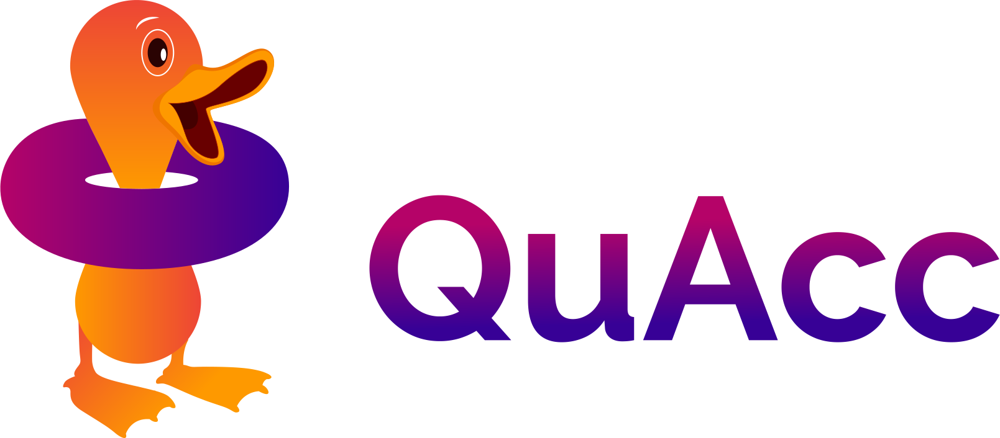

```{toctree}
:caption: Test Drive 🏎️
:hidden:
start/demo
```

```{toctree}
:caption: Installation Guide 🔧
:hidden:
install/install
install/codes
install/covalent
install/advanced/index
```

```{toctree}
:caption: User Guide 🧠
:hidden:
user/basics
user/covalent
user/settings
user/advanced/index
user/api/index
```

```{toctree}
:caption: Developer Guide 🤝
:hidden:
dev/contributing
dev/conduct
```

```{toctree}
:caption: About 📜
:hidden:
about/changelog
about/contributors
about/faq
about/license
```

# Quacc Documentation

**Last Updated**: {sub-ref}`today`

**Useful links**:
[Source Repository](https://github.com/arosen93/quacc) |
[Issues & Ideas](https://github.com/arosen93/quacc/issues) |
[Q & A](https://github.com/arosen93/quacc/discussions)

Quacc is a flexible platform for high-throughput, database-driven computational materials science and quantum chemistry.



::::{grid} 1 1 2 2
:class-container: text-center
:gutter: 3

:::{grid-item-card}
:link: start/demo
:link-type: doc
:class-header: bg-light
**Test Drive** 🏎️
^^^
Easy-to-run demonstrations of Quacc.
:::

:::{grid-item-card}
:link: install/install
:link-type: doc
:class-header: bg-light
**Installation Guide** 🔧
^^^
How to install Quacc and its dependencies.
:::

:::{grid-item-card}
:link: user/basics
:link-type: doc
:class-header: bg-light
**User Guide** 🧠
^^^
How to use the major features of Quacc.
:::

:::{grid-item-card}
:link: dev/contributing
:link-type: doc
:class-header: bg-light
**Developer Guide** 🤝
^^^
A guide for how to contribute to Quacc.
:::
::::
