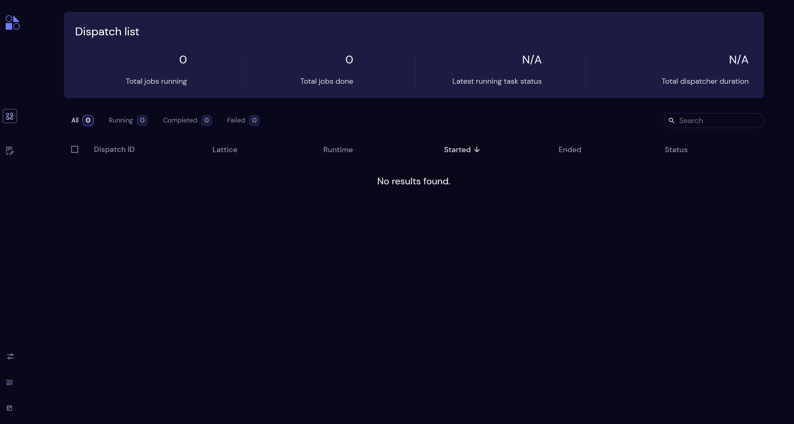

# Covalent Setup

## Introduction

Quacc is made to directly interface with [Covalent](https://github.com/AgnostiqHQ/covalent), an open-source workflow management and dispatching solution with a convenient user interface for job monitoring.

```{note}
If you plan to use Jobflow as your workflow manager instead of Covalent, skip to the [Jobflow Setup](advanced/jobflow.md) section.
```

## Starting the Server

Covalent uses a server to dispatch and retrieve calculation details and results. To start the server, simply run `covalent start` in your terminal. It will return a URL that you can use to access the Covalent dashboard, which is shown below.



```{tip}
Once you start scaling up your calculations, we recommend hosting the Covalent server on a dedicated machine or using [Covalent Cloud](https://www.covalent.xyz/cloud/), but for now you can simply run it on your local machine.
```

## Plugin Installation

```{note}
If you are just starting out, try running some test calculations locally first. Then come back and install the relevant Covalent plugins for your machines.
```

Depending on where you wish to run your Quacc calculations, you may need to install the corresponding Covalent plugin, as described in the [Covalent plugin documention](https://covalent.readthedocs.io/en/latest/plugins.html). For production-quality calculations, we anticipate that most users will rely on the [`SlurmExecutor`](https://github.com/AgnostiqHQ/covalent-slurm-plugin/blob/develop/covalent_slurm_plugin/slurm.py), which can be installed via `pip install covalent-slurm-plugin`. Refer to the [Slurm executor documentation](https://covalent.readthedocs.io/en/latest/api/executors/slurm.html) for instructions on how to configure it for your desired high-performance computing machine.
