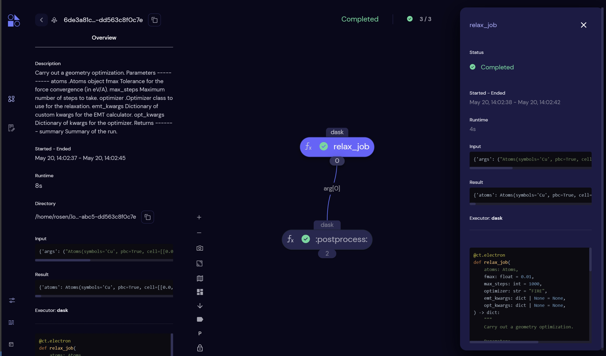

# Quick Start

Want to get up and running with Quacc as fast possible? Here we go!

## Installation

1. Run `pip install git+https://github.com/quantum-accelerators/quacc.git`
2. Run `quacc config`
3. Run `covalent start` and then open [http://localhost:48008](http://localhost:48008)
4. Run a sample workflow and check the webpage for results

## Demo Workflow 1: A Simple One

This demo workflow will relax a bulk Cu structure using the EMT calculator.

```python
import covalent as ct
from ase.build import bulk
from quacc.recipes.emt.core import relax_job

# Define the workflow
workflow = ct.lattice(relax_job)

# Make an Atoms object of a bulk Cu structure
atoms = bulk("Cu")

# Dispatch the workflow to the Covalent server
# with the bulk Cu Atoms object as the input
dispatch_id = ct.dispatch(workflow)(atoms)

# Fetch the result from the server
result = ct.get_result(dispatch_id, wait=True)
print(result)
```



## Demo Workflow 2: A More Complex One

This demo workflow will relax a bulk Cu structure using the EMT calculator, use the relaxed structure to generate a set of surface slabs, and then run a relaxation and static calculation on each generated slab.

```python
from ase.build import bulk
from quacc.recipes.emt.core import relax_job
from quacc.recipes.emt.slabs import bulk_to_slabs_flow

# Define the workflow and set how to execute
@ct.lattice(executor="local")
def workflow(atoms):

    # Relax a bulk structure
    relaxed_bulk = relax_job(atoms)

    # With the relaxed bulk as input, generate and relax slabs
    relaxed_slabs = bulk_to_slabs_flow(relaxed_bulk["atoms"])

    return relaxed_slabs

# Make an Atoms object of a bulk Cu structure
atoms = bulk("Cu")

# Dispatch the workflow to the Covalent server
# with the bulk Cu Atoms object as the input
dispatch_id = ct.dispatch(workflow)(atoms)

# Fetch the result from the server
result = ct.get_result(dispatch_id)
print(result)
```


## What Next?

Read through the documentation to learn more about Quacc and how to use it! And of course, feel free to explore the calculations you just ran in the Covalent UI.


