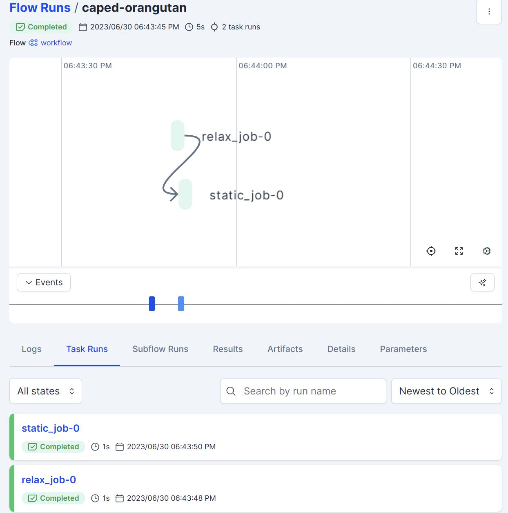
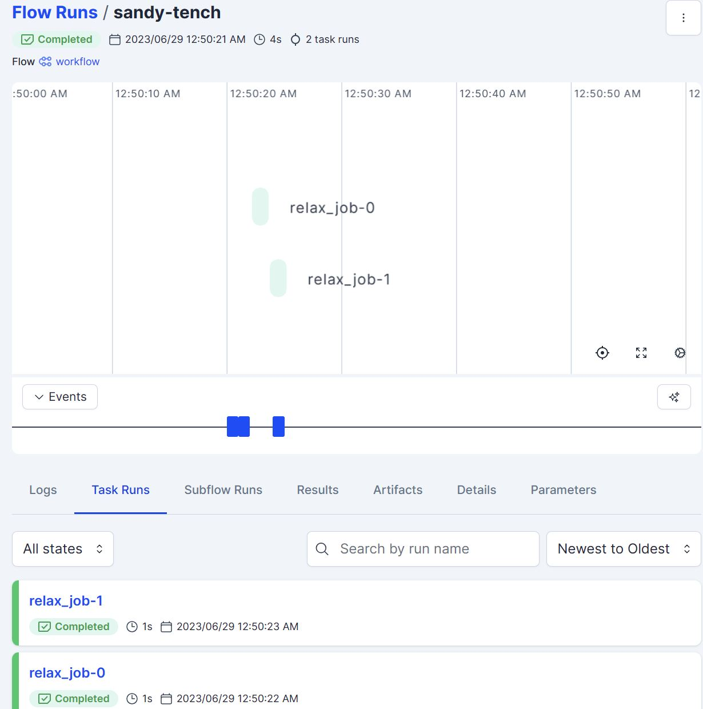
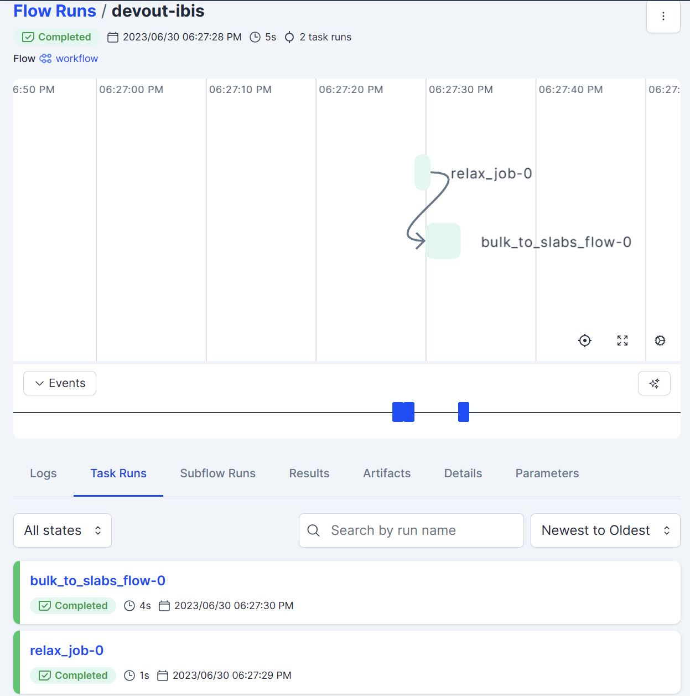
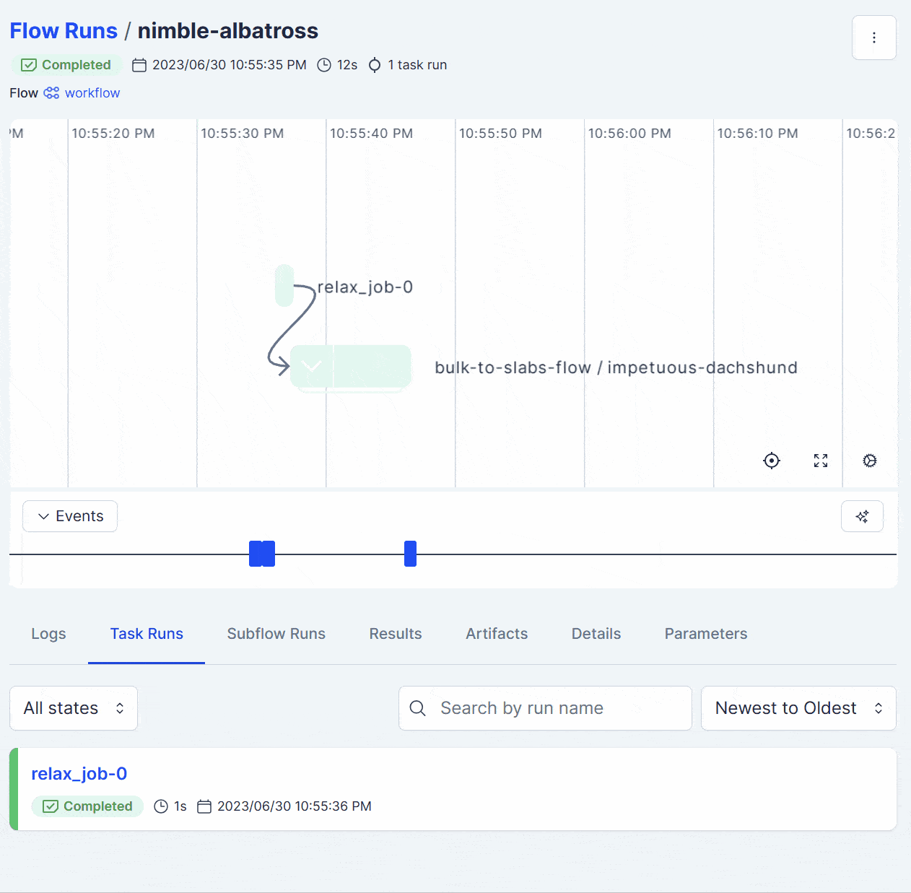

# Using Quacc with Prefect

```{warning}
Support for Prefect is currently *experimental*.
```

## Introduction

[Prefect](https://www.prefect.io/) is a workflow management system that is widely adopted in the data science industry. It can be used in place of Covalent, if preferred.

## Pre-Requisites

Make sure you completed the ["Prefect Setup"](../../../install/advanced/alt_workflows/prefect.md) section of the documentation. Additionally, you should learn about the main Prefect concepts of a [`Flow`](https://docs.prefect.io/concepts/flows/) and a [`Task`](https://docs.prefect.io/concepts/tasks/), as described in the [Prefect Tutorial](https://docs.prefect.io/tutorial/).

## Examples

```{hint}
If you haven't logged into [Prefect Cloud](https://app.prefect.cloud/) yet, you should do so via `prefect cloud login`.
```

### Running a Simple Serial Workflow

We will now try running a simple workflow where we relax a bulk Cu structure using EMT and take the output of that calculation as the input to a follow-up static calculation with EMT.

```python
from prefect import flow, task
from ase.build import bulk
from quacc.recipes.emt.core import relax_job, static_job


# Define the workflow
@flow
def workflow(atoms):

    # Call Task 1
    future1 = task(relax_job).submit(atoms)

    # Call Task 2, which takes the output of Task 1 as input
    future2 = task(static_job).submit(future1.result()["atoms"])

    return future2.result()

# Make an Atoms object of a bulk Cu structure
atoms = bulk("Cu")

# Run the workflow with Prefect tracking
result = workflow(atoms)
print(result)
```

```{note}
We have used a short-hand notation here of `task(<function>)`. This is equivalent to using the `@task` decorator and definining a new function for each task. Calling `.submit()` enables concurrent execution of the tasks, which also requires the use of `.result()` to retrieve the output of the task.
```

Opening up the Prefect Cloud UI will show you the status of the workflow. You can also click on the workflow to see the details of each task.



### Running a Simple Parallel Workflow

Now let's consider a similar but nonetheless distinct example. Here, we will define a workflow where we will carry out two EMT structure relaxations, but the two jobs are not dependent on one another. In this example, Prefect will know that it can run the two jobs separately, and even if Job 1 were to fail, Job 2 would still progress.

```python
from prefect import flow
from ase.build import bulk, molecule
from quacc.recipes.emt.core import relax_job

# Define workflow
@flow
def workflow(atoms1, atoms2):

    # Define two independent relaxation jobs
    future1 = task(relax_job).submit(atoms1)
    future2 = task(relax_job).submit(atoms2)

    return {"result1": future1.result(), "result2": future2.result()}

# Define two Atoms objects
atoms1 = bulk("Cu")
atoms2 = molecule("N2")

# Run the workflow with Prefect tracking
result = workflow(atoms1, atoms2)
print(result)
```

As expected, the Prefect Cloud UI shows two jobs that are not dependent on one another.



### Running Workflows with Complex Connectivity

#### The Inefficient Way

For this example, let's consider a toy scenario where we wish to relax a bulk Cu structure, carve all possible slabs, and then run a new relaxation calculation on each slab (with no static calculation at the end). This is an example of a dynamic workflow.

In Quacc, there are two types of recipes: individual compute tasks with the suffix `_job` and pre-made multi-step workflows with the suffix `_flow`. Here, we are interested in importing a pre-made workflow. Refer to the example below:

```python
from prefect import task, flow
from ase.build import bulk
from quacc.recipes.emt.core import relax_job
from quacc.recipes.emt.slabs import bulk_to_slabs_flow


@flow
def workflow(atoms):
    future1 = task(relax_job).submit(atoms)
    future2 = task(bulk_to_slabs_flow).submit(future1.result()["atoms"], slab_static_electron=None)

    return future2.result()

# Define the Atoms object
atoms = bulk("Cu")

# Run the workflow
result = workflow(atoms)
print(result)
```

When running a Covalent-based workflow like {obj}`.emt.slabs.bulk_to_slabs_flow` above, the entire function will run as a single compute task even though it is composed of several individual sub-tasks. If these sub-tasks are compute-intensive, this might not be the most efficient use of resources.



#### The Efficient Way

Quacc fully supports Prefect-based workflows to resolve this limitation. For example, the workflow above can be equivalently run as follows using the Prefect-specific {obj}`.emt.prefect.slabs.bulk_to_slabs_flow` workflow.

```python
from prefect import flow, task
from ase.build import bulk
from quacc.recipes.emt.core import relax_job
from quacc.recipes.emt.prefect.slabs import bulk_to_slabs_flow

@flow
def workflow(atoms):
    future1 = task(relax_job).submit(atoms)
    result = bulk_to_slabs_flow(future1.result()["atoms"], task(relax_job), None)

    return result

atoms = bulk("Cu")
result = workflow(atoms)
print(result)
```

In this example, all the individual tasks and sub-tasks are run as separate jobs, which is more efficient. By comparing {obj}`.emt.prefect.slabs.bulk_to_slabs_flow` with its Covalent counterpart {obj}`.emt.slabs.bulk_to_slabs_flow`, you can see that the two are extremely similar such that it is often straightforward to [interconvert](comparison.md) between the two. The `bulk_to_slabs_flow` used here is a Prefect `Flow` object, which is why we didn't need to wrap it with a `task()`. Since this is a `Flow` within a `Flow`, we call the inner flow a ["subflow"](https://docs.prefect.io/concepts/flows/?h=subflow#composing-flows).



## Job Management

### Using a Prefect Agent

So far, we have dispatched calculations immediately upon calling them. However, in practice, it is often more useful to have a [Prefect agent](https://docs.prefect.io/concepts/work-pools/#agent-overview) running in the background that will continually poll for work to submit to the task runner. This allows you to submit only a subset of workflows at a time, and the agent will automatically submit more jobs as the resources become available.

To run Prefect workflows with an agent, on the computing environment where you wish to submit jobs, run `prefect agent start -p "quacc-pool"` to start a worker pool named "quacc-pool". Then submit your workflows as usual. It is best to run the agent on some perpetual resource like a login node or a dedicated workflow node.

### Defining a Task Runner

To modify where tasks are run, set the `task_runner` keyword argument of the corresponding `@flow` decorator. The jobs in this scenario would be submitted from a login node.

An example is shown below for setting up a task runner compatible with the NERSC Perlmutter machine. By default, {obj}`make_runner` will generate a `prefect_dask.DaskTaskRunner` composed of a `jobqueue.SLURMCluster` object.

```python
from quacc.util.wflows import make_runner

cluster_kwargs = {
    # Dask worker options
    "n_workers": 1, # number of Slurm jobs to launch
    "cores": 1, # total number of cores (per Slurm job) for Dask worker
    "memory": "4GB", # total memory (per Slurm job) for Dask worker
    # SLURM options
    "shebang": "#!/bin/bash",
    "account": "AccountName",
    "walltime": "00:10:00", # DD:HH:SS
    "job_mem": "0", # all memory on node
    "job_script_prologue": ["source ~/.bashrc", "conda activate quacc"], # run before calculation
    "job_directives_skip": ["-n", "--cpus-per-task"], # Slurm directives we can skip
    "job_extra_directives": [f"-N 1", "-q debug", "-C cpu"], # num. of nodes for calc (-N), queue (-q), and constraints (-c)
    "python": "python", # Python executable name
}

runner = make_runner(cluster_kwargs)
```

With this instantiated cluster object, you can set the task runner of a `Flow` as follows.

```python
@flow(task_runner=cluster)
def workflow(atoms):
    ...
```

Now, when the worklow is run from the login node, it will be submitted to the job scheduling system (Slurm in this case), and the results will be sent back to Prefect Cloud once completed. To modify an already imported `Flow` object, the `Flow.task_runner` attribute can also be modified directly.

### Troubleshooting

One of the most difficult parts of scaling up Prefect jobs is figuring out the right `cluster_kwargs` for your machine. If you are having trouble, the best option is to print the job script to the screen, as noted in the [`dask-jobqueue` documentation](https://jobqueue.dask.org/en/latest/debug.html#checking-job-script). An example, entirely independent of Prefect, is shown below for the `SLURMCluster`.

```python
from dask_jobqueue import SLURMCluster

cluster_kwargs = {...}
cluster = SLURMCluster(**cluster_kwargs)
print(cluster.job_script())
```

This will allow you to fine-tune `cluster_kwargs` until you get your job submission script just right. Note that instantiating the `SLURMCluster` will immediately submit a Slurm job, so you'll probably want to `scancel` it.

```{seealso}
Refer to the [Dask-Jobqueue Documentation](https://jobqueue.dask.org/en/latest/generated/dask_jobqueue.SLURMCluster.html) for the available `cluster_kwargs` that can be defined and how they relate to a typical job script.
```

## Learn More

That ends the Perfect section of the documentation. If you want to learn more about Perfect, you can read the [Prefect Documentation](https://docs.prefect.io/). Please refer to the [Prefect Slack Channel](https://www.prefect.io/slack/) and/or [Prefect Community Discourse](https://discourse.prefect.io/) page for any Prefect-specific questions.
