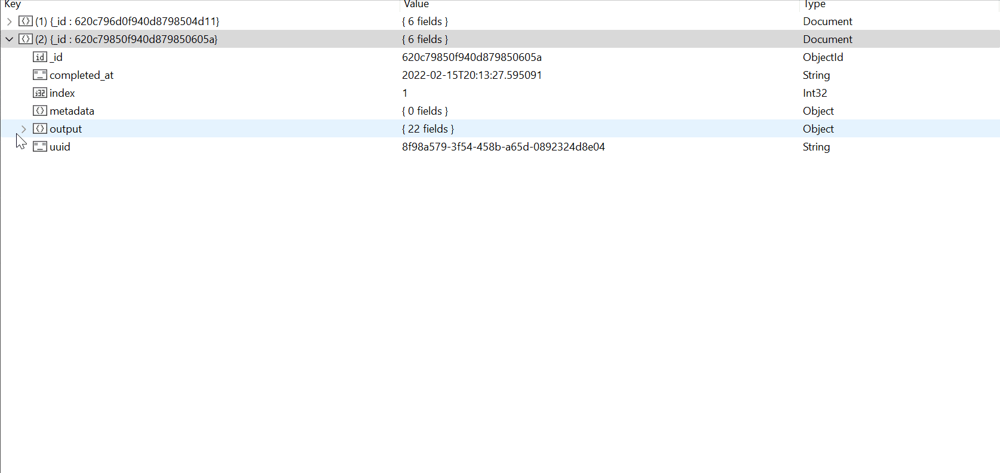

# Using a Database

Oftentimes, it is beneficial to store the results in a database for easy querying (like the example below). There are many ways to achieve this with Quacc depending on your preferences.



## With Covalent as the Workflow Manager

Covalent automatically stores all the inputs and outputs in an SQLite database, which you can find at the `"db_path"` when you run `covalent config`, and the results can be queried using the `ct.get_result(<dispath ID>)` syntax. However, if you want to store the results in a different database of your choosing, you can use [maggma](https://github.com/materialsproject/maggma) to do so quite easily.

An example is shown below for storing the results in a MongoDB. For assistance with setting up a MongoDB of your own, refer to the ["MongoDB Setup"](../../install/advanced/config_db.md) section of the installation instructions.

```python
from maggma.stores import MongoStore
from quacc.util.db import covavlent_to_db

# Define your database credentials
database = "my_db"
collection_name = "my_collection"
store = MongoStore(
    database,
    collection_name,
    host="localhost",
    port=27017,
    username="my_username",
    password="my_password",
)

# Store the results
covalent_to_db(store)
```

## With Jobflow as the Workflow Manager

If you are using Jobflow to construct your workflows, it will automatically store the results in the database you defined during the [setup process](jobflow.md).
