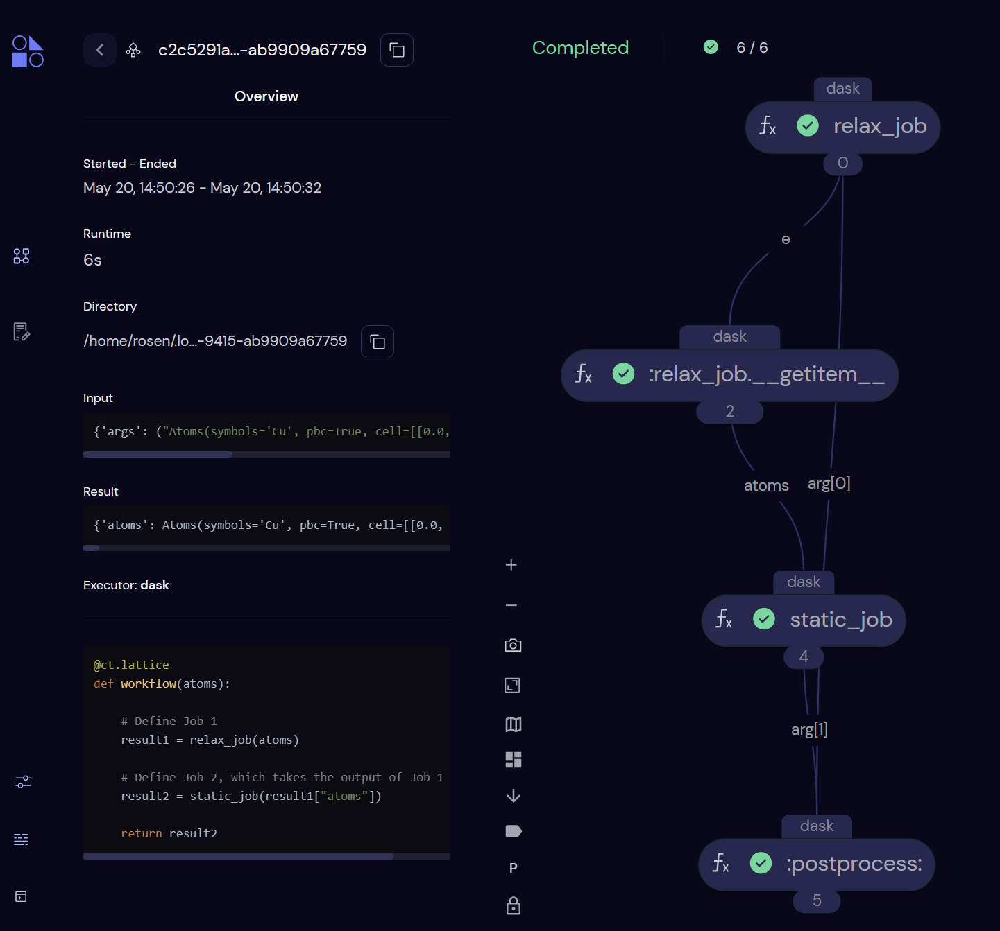
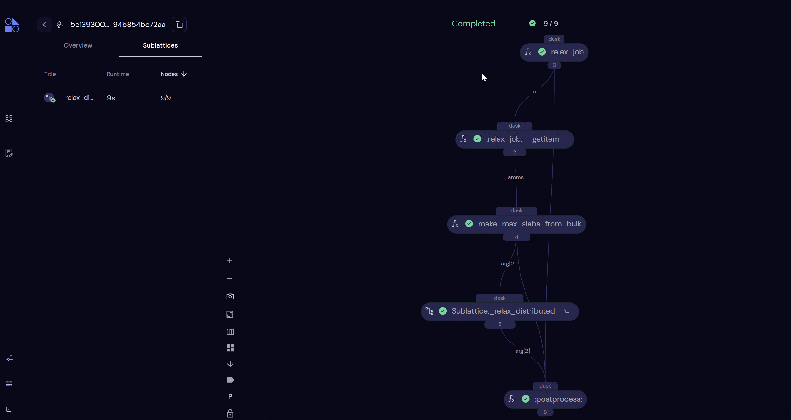

# Using Quacc with Covalent

Here, we will show how to use [Covalent](https://github.com/AgnostiqHQ/covalent) to construct, dispatch, and monitor workflows in Quacc.

```{note}
If you prefer to use Parsl or Jobflow, then skip to the ["Using Quacc with Parsl"](advanced/parsl.md) or ["Using Quacc with Jobflow"](advanced/jobflow.md) sections of the documentation.
```

## Pre-Requisites

Make sure you completed the ["Covalent Setup"](../install/covalent.md) section of the documentation. If you haven't done so already, run `covalent start` prior to starting these examples to start the Covalent server and UI.

Additionally, you should learn about the main [Covalent Concepts](https://docs.covalent.xyz/docs/user-documentation/concepts/concepts-index), namely the [`Electron`](https://docs.covalent.xyz/docs/user-documentation/concepts/covalent-basics#electron) and [`Lattice`](https://docs.covalent.xyz/docs/user-documentation/concepts/covalent-basics#lattice) objects, which describe individual compute tasks and workflows, respectively.

In Covalent, the `@ct.lattice` decorator indicates that the function is a workflow, and the `@ct.electron` decorator indicates that the function is a job (i.e. an individual compute task). If you plan to use a job scheduling system like Slurm, you can think of each `Electron` as an individual Slurm job.

All `Electron` and `Lattice` objects behave as normal Python functions when the necessary arguments are supplied. However, if the `ct.dispatch` command is used, the workflow will be dispatched to the Covalent server for execution and monitoring.

## Running a Simple Serial Workflow

```{hint}
If you haven't done so yet, make sure you started the Covalent server with `covalent start` in the command-line.
```

We will first try running a simple workflow where we relax a bulk Cu structure using EMT and take the output of that calculation as the input to a follow-up static calculation with EMT.

```python
import covalent as ct
from ase.build import bulk
from quacc.recipes.emt.core import relax_job, static_job

# Define the workflow
@ct.lattice
def workflow(atoms):

    # Define Job 1
    result1 = relax_job(atoms)

    # Define Job 2, which takes the output of Job 1 as input
    result2 = static_job(result1["atoms"])

    return result2

# Make an Atoms object of a bulk Cu structure
atoms = bulk("Cu")

# Dispatch the workflow to the Covalent server
# with the bulk Cu Atoms object as the input
dispatch_id = ct.dispatch(workflow)(atoms)

# Fetch the result from the server
result = ct.get_result(dispatch_id, wait=True)
print(result)
```

You can see that it is quite trivial to set up a workflow using the recipes within Quacc. We define the full workflow as a `Lattice` object that stitches together the individual workflow steps.

```{note}
Because the workflow is only sent to the server with `ct.dispatch`, calling `workflow(atoms)` would run the workflow as if Covalent were not being used at all.
```

```{hint}
By default, all Quacc jobs are defined as `Electron` objects, so we didn't need to use the `@ct.electron` decorator around each function here.
```

Covalent will also automatically construct a directed acyclic graph of the inputs and outputs for each calculation to determine which jobs are dependent on one another and the order the jobs should be run. In this example, Covalent will know not to run `job2` until `job1` has completed successfully.

The job will be dispatched to the Covalent server with the [`ct.dispatch`](https://docs.covalent.xyz/docs/user-documentation/concepts/covalent-basics#dispatch) command, which takes in the workflow function and the input arguments to the workflow. The [`ct.get_result`](https://docs.covalent.xyz/docs/user-documentation/concepts/covalent-basics#result) command is used to fetch the results from the server.



## Running a Simple Parallel Workflow

Now let's consider a similar but nonetheless distinct example. Here, we will define a workflow where we will carry out two EMT structure relaxations, but the two jobs are not dependent on one another. In this example, Covalent will know that it can run the two jobs separately, and even if Job 1 were to fail, Job 2 would still progress.

```python
import covalent as ct
from ase.build import bulk, molecule
from quacc.recipes.emt.core import relax_job

# Define workflow
@ct.lattice
def workflow(atoms1, atoms2):

    # Define two independent relaxation jobs
    result1 = relax_job(atoms1)
    result2 = relax_job(atoms2)

    return {"result1": result1, "result2": result2}

# Define two Atoms objects
atoms1 = bulk("Cu")
atoms2 = molecule("N2")

# Dispatch the workflow to the Covalent server
dispatch_id = ct.dispatch(workflow)(atoms1, atoms2)

# Fetch the results from the server
result = ct.get_result(dispatch_id, wait=True)
print(result)
```


## Running Workflows with Complex Connectivity

For this example, let's consider a toy scenario where we wish to relax a bulk Cu structure, carve all possible slabs, and then run a new relaxation calculation on each slab.

In Quacc, there are two types of recipes: 1) individual compute tasks that are functions; 2) workflows that are classes. Here, we are interested in importing a workflow, so it will be instantiated slightly differently from the prior examples. See the example below:

```python
import covalent as ct
from ase.build import bulk
from quacc.recipes.emt.core import relax_job
from quacc.recipes.emt.slabs import BulkToSlabsFlow

@ct.lattice
def workflow(atoms):
    relaxed_bulk = relax_job(atoms)
    relaxed_slabs = BulkToSlabsFlow(slab_static_electron=None).run(relaxed_bulk["atoms"])

    return relaxed_slabs

atoms = bulk("Cu")
dispatch_id = ct.dispatch(workflow)(atoms)
result = ct.get_result(dispatch_id, wait=True)
print(result)
```

We have imported the {obj}`.emt.slabs.BulkToSlabsFlow` class, which is instantiated with optional parameters and is applied to an `Atoms` object. Here, for demonstration purposes, we specify the `slab_static_electron=None` option to do a relaxation but disable the static calculation on each slab. All we have to do to define the workflow is wrap it inside a `@ct.lattice` decorator.

```{hint}
You don't need to set `wait=True` in practice. Once you call `ct.dispatch`, the workflow will begin running. The `ct.get_result` function is used to fetch the workflow status and results from the server.
```

If you want to understand what is going on underneath the hood, it is worth checking out the source code. Because the number of slabs is not pre-determined, this recipe is using a Covalent feature called a [Sublattice](https://docs.covalent.xyz/docs/user-documentation/concepts/covalent-basics#sublattice) that enables dynamic workflows.

```{seealso}
To learn more about how to construct dynamic workflows in Covalent, see [this tutorial](https://docs.covalent.xyz/docs/user-documentation/tutorials/quantumchemistry/).
```



## Setting Executors

By default, Covalent will run all `Electron` tasks on your local machine using the [`DaskExecutor`](https://docs.covalent.xyz/docs/user-documentation/api-reference/executors/dask). This is a parameter that you can control. For instance, you may want to define the executor to be based on [Slurm](https://docs.covalent.xyz/docs/user-documentation/api-reference/executors/slurm) to submit a job to an HPC cluster. The example below highlights how one can change the executor.

### Setting Executors via the Lattice Object

If you want to use the same executor for all the `Electron` objects in a `Lattice`, you can pass the `executor` keyword argument to the `@ct.lattice` decorator, as shown below.

```python
import covalent as ct
from ase.build import bulk
from quacc.recipes.emt.core import relax_job, static_job

@ct.lattice(executor="local")
def workflow(atoms):

    result1 = relax_job(atoms)
    result2 = static_job(result1["atoms"])

    return result2

atoms = bulk("Cu")
dispatch_id = ct.dispatch(workflow)(atoms)
result = ct.get_result(dispatch_id, wait=True)
print(result)
```

### Setting Executors via the Electron Objects

The individual `Electron` executor options can be modified after they are imported as follows:

```python
import covalent as ct
from ase.build import bulk
from quacc.recipes.emt.core import relax_job, static_job

@ct.lattice
def workflow(atoms):
    job1 = relax_job
    job1.executor = "dask"

    job2 = static_job
    job2.executor = "local"

    output1 = job1(atoms)
    output2 = job2(output1["atoms"])
    return output2

atoms = bulk("Cu")
dispatch_id = ct.dispatch(workflow)(atoms)
result = ct.get_result(dispatch_id, wait=True)
print(result)
```

```{hint}
If you are defining your own workflow functions to use, you can also set the executor for individual `Electron` objects by passing the `executor` keyword argument to the `@ct.electron` decorator.
```

## Learn More

That ends the Covalent section of the documentation. If you want to learn more about Covalent, you can read the [Covalent Documentation](https://docs.covalent.xyz/docs/). Please refer to the Covalent [Discussion Board](https://github.com/AgnostiqHQ/covalent/discussions) for any Covalent-specific questions.
