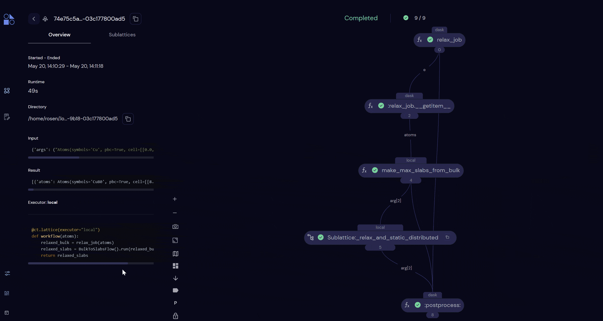

# Quick Start

Want to get up and running with quacc as fast possible? Here we go!

## Installation

Run the following commands in the terminal:

```bash
pip install --upgrade https://gitlab.com/ase/ase/-/archive/master/ase-master.zip
pip install quacc[covalent]
covalent start
```

Then open the URL printed in the terminal (usually http://localhost:48008) and run a sample workflow below!

!!! Tip

    Don't want to use Covalent? No problem! Quacc supports a [variety of workflow managers](../user/basics/wflow_overview.md) (or none at all!).

## Demo Workflow

This demo workflow will generate a set of surface slabs from bulk Cu and then run a relaxation and static calculation on each generated slab.

```python
import covalent as ct
from ase.build import bulk
from quacc.recipes.emt.slabs import bulk_to_slabs_flow

# Make an Atoms object of a bulk Cu structure
atoms = bulk("Cu")

# Define the workflow
workflow = bulk_to_slabs_flow

# Dispatch the workflow to the Covalent server
# with the bulk Cu Atoms object as the input
dispatch_id = ct.dispatch(workflow)(atoms)

# Fetch the result from the server
result = ct.get_result(dispatch_id, wait=True)
print(result)
```



## What Next?

Read through the [User Guide](../user/recipes_intro.md) to learn more about using quacc! And of course, feel free to explore the calculations you just ran in the Covalent UI.


