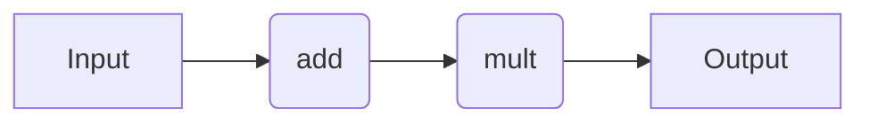

# Workflow Syntax

## Introduction

Here, we provide code snippets for several decorator-based workflow engines. For a comparison of the pros and cons of each approach, refer to the [Workflow Engines Overview](wflow_overview.md) page. We describe the specifics of how to use each workflow engine in more detail later in the documentation.

## Background

To help enable interoperability between workflow engines, quacc offers a unified set of decorators: [`#!Python @job`](https://quantum-accelerators.github.io/quacc/reference/quacc/utils/wflows.html#quacc.utils.wflows.job), [`#!Python @flow`](https://quantum-accelerators.github.io/quacc/reference/quacc/utils/wflows.html#quacc.utils.wflows.flow), and [`#!Python @subflow`](https://quantum-accelerators.github.io/quacc/reference/quacc/utils/wflows.html#quacc.utils.wflows.subflow).

=== "Covalent ⭐"

    Take a moment to learn about the main [Covalent Concepts](https://docs.covalent.xyz/docs/user-documentation/concepts/concepts-index), namely the [`#!Python @ct.electron`](https://docs.covalent.xyz/docs/user-documentation/concepts/covalent-basics#electron) and [`#!Python @ct.lattice`](https://docs.covalent.xyz/docs/user-documentation/concepts/covalent-basics#lattice) decorators, which describe individual compute tasks and workflows, respectively.

    <center>

    | Quacc              | Covalent                           |
    | ------------------ | ---------------------------------- |
    | `#!Python @job`     | `#!Python @ct.electron`             |
    | `#!Python @flow`    | `#!Python @ct.lattice`              |
    | `#!Python @subflow` | `#!Python @ct.electron`<br>`#!Python @ct.lattice`</br> |

    </center>

=== "Parsl ⭐"

    Take a moment to read the Parsl documentation's ["Quick Start"](https://parsl.readthedocs.io/en/stable/quickstart.html) to get a sense of how Parsl works. Namely, you should understand the concept of a [`#!Python python_app`](https://parsl.readthedocs.io/en/stable/1-parsl-introduction.html#Python-Apps) and [`#!Python join_app`](https://parsl.readthedocs.io/en/stable/1-parsl-introduction.html?highlight=join_app#Dynamic-workflows-with-apps-that-generate-other-apps), which describe individual compute tasks and dynamic job tasks, respectively.

    <center>

    | Quacc              | Parsl                 |
    | ------------------ | --------------------- |
    | `#!Python @job`     | `#!Python @python_app` |
    | `#!Python @flow`    | No effect             |
    | `#!Python @subflow` | `#!Python @join_app`   |

    </center>

=== "Prefect"

    Take a moment to read the [Prefect documentation's](https://docs.prefect.io/latest/tutorial/) to get a sense of how it works. Namely, you should understand the `Task` and `Flow` decorators as well as how to interface with the server.

    <center>

    | Quacc              | Prefect         |
    | ------------------ | --------------- |
    | `#!Python @job`     | `#!Python @task` |
    | `#!Python @flow`    | `#!Python @flow` |
    | `#!Python @subflow` | `#!Python @flow` |

    </center>

=== "Redun"

    Take a moment to read the Redun documentation's [Design Overview page](https://insitro.github.io/redun/design.html) to get a sense of how Redun works. Namely, you should understand the `Task` decorator and how to interface with the `Scheduler`.

    <center>

    | Quacc              | Redun           |
    | ------------------ | --------------- |
    | `#!Python @job`     | `#!Python @task` |
    | `#!Python @flow`    | `#!Python @task` |
    | `#!Python @subflow` | `#!Python @task` |

    </center>

=== "Jobflow"

    Take a moment to read the Jobflow documentation's [Quick Start](https://materialsproject.github.io/jobflow/tutorials/1-quickstart.html) to get a sense of how Jobflow works. Namely, you should understand the `Job` and `Flow` definitions, which describe individual compute tasks and workflows, respectively.

    <center>

    | Quacc              | Jobflow        |
    | ------------------ | -------------- |
    | `#!Python @job`     | `#!Python @job` |
    | `#!Python @flow`    | No effect      |
    | `#!Python @subflow` | No effect      |

    </center>

The quacc descriptors are drop-in replacements for the specified workflow engine analogue, which we will use for the remainder of the tutorials. Based on the value for the `WORKFLOW_ENGINE` global variable in your [quacc settings](../settings/settings.md), the appropriate decorator will be automatically selected. If the `WORKFLOW_ENGINE` setting is set to `"local"`, the decorators will have no effect on the underlying function.

## Simple Workflow

Let's do the following:

1. Add two numbers (e.g. `#!Python 1 + 2`)
2. Multiply the output of Step 1 by a third number (e.g. `#!Python 3 * 3`)

In practice, we would want each of the two tasks to be their own compute job.



=== "Covalent ⭐"

    !!! Important

        If you haven't done so yet, make sure you update the quacc `WORKFLOW_ENGINE` [configuration variable](../settings/settings.md) and start the Covalent server:

        ```bash
        quacc set WORKFLOW_ENGINE covalent
        covalent start
        ```

    ```python
    import covalent as ct
    from quacc import flow, job


    @job  #  (1)!
    def add(a, b):
        return a + b


    @job
    def mult(a, b):
        return a * b


    @flow  #  (2)!
    def workflow(a, b, c):
        return mult(add(a, b), c)


    dispatch_id = ct.dispatch(workflow)(1, 2, 3)
    result = ct.get_result(dispatch_id, wait=True)
    print(result)
    ```

    1. The `#!Python @job` decorator will be transformed into `#!Python @ct.electron`.

    2. The `#!Python @flow` decorator will be transformed into `#!Python @ct.lattice`.

    3. This commmand will dispatch the workflow to the Covalent server.

=== "Parsl ⭐"

    !!! Important

        If you haven't done so yet, make sure you update the quacc `WORKFLOW_ENGINE` [configuration variable](../settings/settings.md) and load the default Parsl configuration:

        ```bash title="terminal"
        quacc set WORKFLOW_ENGINE parsl
        ```

        ```python title="python"
        import parsl
        parsl.load()
        ```

    ```python
    from quacc import job


    @job  #  (1)!
    def add(a, b):
        return a + b


    @job
    def mult(a, b):
        return a * b


    def workflow(a, b, c):  #  (2)!
        return mult(add(a, b), c)

    result = workflow(1, 2, 3).result()  # 9
    print(result)
    ```

    1. The `#!Python @job` decorator will be transformed into `#!Python @python_app`.

    2. The `#!Python @flow` decorator doesn't actually do anything when using Parsl, so we chose to not include it here for brevity.

=== "Prefect"

    !!! Important

        If you haven't done so yet, make sure you update the quacc `WORKFLOW_ENGINE` [configuration variable](../settings/settings.md):

        ```bash
        quacc set WORKFLOW_ENGINE prefect
        ```

    ```python
    from quacc import flow, job


    @job  #  (1)!
    def add(a, b):
        return a + b


    @job
    def mult(a, b):
        return a * b


    @flow  #  (2)!
    def workflow(a, b, c):
        return mult(add(a, b), c)


    future = workflow(1, 2, 3)
    result = future.result()
    print(result)
    ```

    1. The `#!Python @job` decorator will be transformed into a Prefect `#!Python @task`.

    2. The `#!Python @flow` decorator will be transformed into a Prefect `#!Python @ct.lattice`.

=== "Redun"

    !!! Important

        If you haven't done so yet, make sure you update the quacc `WORKFLOW_ENGINE` [configuration variable](../settings/settings.md):

        ```bash
        quacc set WORKFLOW_ENGINE redun
        ```

    ```python
    from redun import Scheduler
    from quacc import flow, job

    scheduler = Scheduler()  #  (1)!


    @job  #  (2)!
    def add(a, b):
        return a + b


    @job
    def mult(a, b):
        return a * b


    @flow  #  (3)!
    def workflow(a, b, c):
        return mult(add(a, b), c)


    result = scheduler.run(workflow(1, 2, 3))
    print(result)
    ```

    1. It is necessary to instantiate the scheduler before submitting calculations.

    2. The `#!Python @job` decorator will be transformed into a Redun `#!Python @task`.

    3. The `#!Python @flow` decorator will also be transformed into a Redun `#!Python @task`. Everything in Redun is a `#!Python @task`, so it doesn't matter what quacc decorator you apply. We chose `#!Python @flow` simply for clarity.

=== "Jobflow"

    !!! Important

        If you haven't done so yet, make sure you update the quacc `WORKFLOW_ENGINE` [configuration variable](../settings/settings.md):

        ```bash
        quacc set WORKFLOW_ENGINE jobflow
        ```

    ```python
    import jobflow as jf
    from quacc import job


    @job  #  (1)!
    def add(a, b):
        return a + b


    @job
    def mult(a, b):
        return a * b


    job1 = add(1, 2)
    job2 = mult(job1.output, 3)
    flow = jf.Flow([job1, job2])

    responses = jf.run_locally(flow)
    result = responses[job2.uuid][1].output
    print(result)
    ```

    1. The `#!Python @job` decorator will be transformed into `#!Python @jf.job`.

## Stripping the Decorator Altogether

If you ever want to strip the decorator from a pre-decorated function for any reason, you can call the `.__wrapped__` attribute. This returns the original function.

```python
from quacc import job


@job
def add(a, b):
    return a + b

add.__wrapped__(1, 2)
```

## Learn More

=== "Covalent ⭐"

    If you want to learn more about Covalent, you can read the [Covalent Documentation](https://docs.covalent.xyz/docs/). Please refer to the Covalent [Discussion Board](https://github.com/AgnostiqHQ/covalent/discussions) for any Covalent-specific questions.

=== "Parsl ⭐"

    If you want to learn more about Parsl, you can read the [Parsl Documentation](https://parsl.readthedocs.io/en/stable/#). Please refer to the [Parsl Slack Channel](http://parsl-project.org/support.html) for any Parsl-specific questions.

=== "Prefect"

    If you want to learn more about Perfect, you can read the [Prefect Documentation](https://docs.prefect.io/). Please refer to the [Prefect Slack Channel](https://www.prefect.io/slack/) and/or [Prefect Community Discourse](https://discourse.prefect.io/) page for any Prefect-specific questions.

=== "Redun"

    If you want to learn more about Redun, you can read the [Redun documentation](https://insitro.github.io/redun/index.html).

=== "Jobflow"

    If you want to learn more about Jobflow, you can read the [Jobflow Documentation](https://materialsproject.github.io/jobflow/). Please refer to the [Jobflow Discussions Board](https://github.com/materialsproject/jobflow/discussions) for Jobflow-specific questions.
