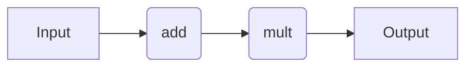

# Workflow Syntax

## Introduction

Here, we provide code snippets for several decorator-based workflow engines. For a comparison of the pros and cons of each approach, refer to the [Workflow Engines Overview](wflow_overview.md) page. We describe the specifics of how to use each workflow engine in more detail later in the documentation. Nonetheless, this page serves as a quick point of reference that is independent of quacc-specific recipes.

!!! Tip

    You don't need to learn how to use all the different workflow solutions. You only need to learn the syntax for the one you plan to use! Regardless, the behavior is relatively similar across all of them.

## Background

=== "Covalent"

    !!! Info

        For a detailed tutorial on how to use Covalent, refer to the ["Covalent Quick Start"](https://docs.covalent.xyz/docs/get-started/quick-start).

    Take a moment to learn about the main [Covalent Concepts](https://docs.covalent.xyz/docs/user-documentation/concepts/concepts-index), namely the [`#!Python ct.electron`](https://docs.covalent.xyz/docs/user-documentation/concepts/covalent-basics#electron) and [`#!Python ct.lattice`](https://docs.covalent.xyz/docs/user-documentation/concepts/covalent-basics#lattice) decorators, which describe individual compute tasks and workflows, respectively.

=== "Parsl"

    !!! Info

        For a detailed tutorial on how to use Parsl, refer to the ["Parsl Tutorial"](https://parsl.readthedocs.io/en/stable/1-parsl-introduction.html) and the even more detailed ["Parsl User Guide"](https://parsl.readthedocs.io/en/stable/userguide/index.html).

    Take a moment to read the Parsl documentation's ["Quick Start"](https://parsl.readthedocs.io/en/stable/quickstart.html) to get a sense of how Parsl works. Namely, you should understand the concept of a [`#!Python python_app`](https://parsl.readthedocs.io/en/stable/1-parsl-introduction.html#Python-Apps) and [`#!Python join_app`](https://parsl.readthedocs.io/en/stable/1-parsl-introduction.html?highlight=join_app#Dynamic-workflows-with-apps-that-generate-other-apps), which describe individual compute tasks and dynamic job tasks, respectively.

=== "Redun"

    !!! Info

        Refer to the official set of [Redun tutorials](https://github.com/insitro/redun/tree/main/examples) for several worked examples.

    Take a moment to read the Redun documentation's [Design Overview page](https://insitro.github.io/redun/design.html) to get a sense of how Redun works. Namely, you should understand the `Task` decorator and how to interface with the `Scheduler`.

=== "Jobflow"

    !!! Info

        For a detailed tutorial on how to use Jobflow, refer to the [Jobflow Tutorials](https://materialsproject.github.io/jobflow/tutorials).

    Take a moment to read the Jobflow documentation's [Quick Start](https://materialsproject.github.io/jobflow/tutorials/1-quickstart.html) to get a sense of how Jobflow works. Namely, you should understand the `Job` and `Flow` definitions, which describe individual compute tasks and workflows, respectively.

To help enable interoperability between workflow engines, quacc offers a unified set of decorators.

| Quacc              | Covalent                           | Parsl                 | Redun           | Jobflow        |
| ------------------ | ---------------------------------- | --------------------- | --------------- | -------------- |
| `#!Python job`     | `#!Python ct.electron`             | `#!Python python_app` | `#!Python task` | `#!Python job` |
| `#!Python flow`    | `#!Python ct.lattice`              | N/A                   | `#!Python task` | N/A            |
| `#!Python subflow` | `#!Python ct.electron(ct.lattice)` | `#!Python join_app`   | `#!Python task` | N/A            |

The quacc descriptors are drop-in replacements for the specified workflow engine analogue, which we will use for the remainder of the tutorials.

!!! Tip

    Based on the value for the `WORKFLOW_ENGINE` global variable in your [quacc settings](../settings.md), the appropriate decorator will be automatically selected. If the `WORKFLOW_ENGINE` setting is set to `"local"` (or for any entries marked N/A in the above table), the decorators will have no effect on the underlying function.

## Examples

### Simple Workflow

Let's do the following:

1. Add two numbers (e.g. `#!Python 1 + 2`)
2. Multiply the output of Step 1 by a third number (e.g. `#!Python 3 * 3`)

In practice, we would want each of the two tasks to be their own compute job.



=== "Covalent"

    !!! Important

        If you haven't done so yet, make sure you started the Covalent server with `covalent start` in the command-line.

    ```python
    import covalent as ct
    from quacc import flow, job


    @job  #  (1)!
    def add(a, b):
        return a + b


    @job
    def mult(a, b):
        return a * b


    @flow  #  (2)!
    def workflow(a, b, c):
        return mult(add(a, b), c)


    dispatch_id = workflow(1, 2, 3)  # (3)!
    print(ct.get_result(dispatch_id, wait=True))
    ```

    1. The `#!Python @job` decorator will be transformed into `#!Python @ct.electron`.

    2. The `#!Python @flow` decorator will be transformed into `#!Python @ct.lattice`.

    3. When using the `#!Python @flow` decorator, you do not need to call `ct.dispatch()`. It will be done automatically.

=== "Parsl"

    !!! Important

        Make sure you run `#!Python import parsl` followed by `#!Python parsl.load()` in Python to load a default Parsl configuration.

        Also make sure you have specified `"parsl"` as the `WORKFLOW_ENGINE` in your [quacc settings](../settings.md).

    ```python
    from quacc import job


    @job  #  (1)!
    def add(a, b):
        return a + b


    @job
    def mult(a, b):
        return a * b


    future1 = add(1, 2)
    future2 = mult(future1, 3)

    result = future2.result()  # 9
    ```

    1. The `#!Python @job` decorator will be transformed into `#!Python @python_app`.

=== "Redun"

    !!! Important

        Make sure you have specified `"redun"` as the `WORKFLOW_ENGINE` in your [quacc settings](../settings.md).

    ```python
    from redun import Scheduler
    from quacc import flow, job

    scheduler = Scheduler()  #  (1)!


    @job  #  (2)!
    def add(a, b):
        return a + b


    @job
    def mult(a, b):
        return a * b


    @flow  #  (3)!
    def workflow(a, b, c):
        return mult(add(a, b), c)


    result = scheduler.run(workflow(1, 2, 3))
    print(result)
    ```

    1. It is necessary to instantiate the scheduler before submitting calculations.

    2. The `#!Python @job` decorator will be transformed into Redun `#!Python @task`.

    3. The `#!Python @flow` decorator will also be transformed into Redun `#!Python @task`. Everything in Redun is a `#!Python @task`, so it doesn't matter what quacc decorator you apply. We chose `#!Python @flow` simpler for clarity.

=== "Jobflow"

    !!! Important

        Make sure you have specified `"jobflow"` as the `WORKFLOW_ENGINE` in your [quacc settings](../settings.md).

    ```python
    import jobflow as jf
    from quacc import job


    @job  #  (1)!
    def add(a, b):
        return a + b


    @job
    def mult(a, b):
        return a * b


    job1 = add(1, 2)
    job2 = mult(job1.output, 3)
    flow = jf.Flow([job1, job2])

    responses = jf.run_locally(flow)
    result = responses[job2.uuid][1].output
    ```

    1. The `#!Python @job` decorator will be transformed into `#!Python @jf.job`.

## Learn More

=== "Covalent"

    If you want to learn more about Covalent, you can read the [Covalent Documentation](https://docs.covalent.xyz/docs/). Please refer to the Covalent [Discussion Board](https://github.com/AgnostiqHQ/covalent/discussions) for any Covalent-specific questions.

=== "Parsl"

    If you want to learn more about Parsl, you can read the [Parsl Documentation](https://parsl.readthedocs.io/en/stable/#). Please refer to the [Parsl Slack Channel](http://parsl-project.org/support.html) for any Parsl-specific questions.

=== "Redun"

    If you want to learn more about Redun, you can read the [Redun documentation](https://insitro.github.io/redun/index.html).

=== "Jobflow"

    If you want to learn more about Jobflow, you can read the [Jobflow Documentation](https://materialsproject.github.io/jobflow/). Please refer to the [Jobflow Discussions Board](https://github.com/materialsproject/jobflow/discussions) for Jobflow-specific questions.
