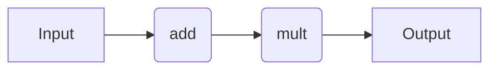
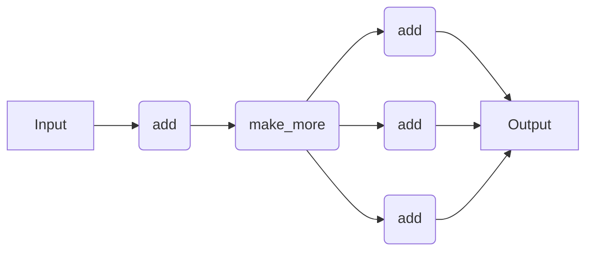

# Workflow Syntax

## Introduction

Here, we provide code snippets for several decorator-based workflow engines. For a comparison of the pros and cons of each approach, refer to the [Workflow Engines Overview](wflow_overview.md) page. We describe the specifics of how to use each workflow engine in more detail later in the documentation. Nonetheless, this page serves as a quick point of reference that is independent of quacc-specific recipes.

!!! Tip

    You don't need to learn how to use all the different workflow solutions. You only need to learn the syntax for the one you plan to use! Regardless, the behavior is relatively similar across all of them.

## Examples

### Simple Workflow

Let's do the following:

1. Add two numbers (e.g. `#!Python 1 + 2`)
2. Multiply the output of Step 1 by a third number (e.g. `#!Python 3 * 3`)

In practice, we would want each of the two tasks to be their own compute job.



=== "Covalent"

    !!! Info

        For a more detailed tutorial on how to use Covalent, refer to the ["Covalent Quick Start"](https://docs.covalent.xyz/docs/get-started/quick-start).

    Take a moment to learn about the main [Covalent Concepts](https://docs.covalent.xyz/docs/user-documentation/concepts/concepts-index), namely the [`#!Python @ct.electron`](https://docs.covalent.xyz/docs/user-documentation/concepts/covalent-basics#electron) and [`#!Python @ct.lattice`](https://docs.covalent.xyz/docs/user-documentation/concepts/covalent-basics#lattice) decorators, which describe individual compute tasks and workflows, respectively.

    All `Electron` and `Lattice` objects behave as normal Python functions when the necessary arguments are supplied. However, if the `#!Python ct.dispatch` command is used, the workflow will be dispatched to the Covalent server for execution and monitoring.

    !!! Important

        If you haven't done so yet, make sure you started the Covalent server with `covalent start` in the command-line.

    ```python
    import covalent as ct


    @ct.electron  #  (1)!
    def add(a, b):
        return a + b


    @ct.electron
    def mult(a, b):
        return a * b


    @ct.lattice  #  (2)!
    def workflow(a, b, c):
        return mult(add(a, b), c)


    # Locally
    result = workflow(1, 2, 3)  # 9  (3)!

    # Dispatched
    dispatch_id = ct.dispatch(workflow)(1, 2, 3)  # (4)!
    print(ct.get_result(dispatch_id, wait=True))  # 9  (5)!
    ```

    1. `#!Python @ct.electron` tells Covalent to treat the function as a compute job.

    2. `#!Python @ct.lattice` tells Covalent to treat the function as a workflow.

    3. If you call any `#!Python @ct.electron`- or `#!Python @ct.lattice`-decorated functions normally, Covalent will simply run it like a normal function.

    4. The `#!Python ct.dispatch` function tells Covalent to dispatch the workflow to the Covalent server. A unique dispatch ID will be returned instead of the actual result so that the result can be fetched asynchronously.

    5. The `#!Python ct.get_result` function tells Covalent to fetch the result from the server. We chose to set `wait=True` so that the function will block until the result is ready simply for demonstration purposes.

=== "Parsl"

    !!! Info

        For a more detailed tutorial on how to use Parsl, refer to the ["Parsl Tutorial"](https://parsl.readthedocs.io/en/stable/1-parsl-introduction.html) and the even more detailed ["Parsl User Guide"](https://parsl.readthedocs.io/en/stable/userguide/index.html).

    Take a moment to read the Parsl documentation's ["Quick Start"](https://parsl.readthedocs.io/en/stable/quickstart.html) to get a sense of how Parsl works. Namely, you should understand the concept of a [`#!Python @python_app`](https://parsl.readthedocs.io/en/stable/1-parsl-introduction.html#Python-Apps) and [`#!Python @join_app`](https://parsl.readthedocs.io/en/stable/1-parsl-introduction.html?highlight=join_app#Dynamic-workflows-with-apps-that-generate-other-apps), which describe individual compute tasks and dynamic job tasks, respectively.


    !!! Important
        Make sure you run `#!Python import parsl` followed by `#!Python parsl.load()` in Python to load a default Parsl configuration.

        Also make sure you have specified `"parsl"` as the `WORKFLOW_ENGINE` in your [quacc settings](../settings.md).

    ```python
    from parsl import python_app


    @python_app  #  (1)!
    def add(a, b):
        return a + b


    @python_app  # @python_app
    def mult(a, b):
        return a * b


    future1 = add(1, 2)
    future2 = mult(future1, 3)

    result = future2.result()  # 9  (2)!
    ```

    1. The `#!Python @python_app` decorator tells Parsl to treat the function as a compute job.

    2. `#!Python .result()` is a method that tells Parsl to wait for the result of the job. If `#!Python .result()` were not called, an `#!Python AppFuture` would be returned instead of the actual result.

=== "Jobflow"

    !!! Info

        For a more detailed tutorial on how to use Jobflow, refer to the [Jobflow Tutorials](https://materialsproject.github.io/jobflow/tutorials) and [this helpful guide](https://github.com/JaGeo/Advanced_Jobflow_Tutorial) written by Dr. Janine George.

    Take a moment to read the Jobflow documentation's [Quick Start](https://materialsproject.github.io/jobflow/tutorials/1-quickstart.html) to get a sense of how Jobflow works. Namely, you should understand the `Job` and `Flow` definitions, which describe individual compute tasks and workflows, respectively.

    !!! Important

        Make sure you have specified `"jobflow"` as the `WORKFLOW_ENGINE` in your [quacc settings](../settings.md).

    ```python
    import jobflow as jf


    @jf.job  #  (1)!
    def add(a, b):
        return a + b


    @jf.job
    def mult(a, b):
        return a * b


    job1 = add(1, 2)
    job2 = mult(job1.output, 3)
    flow = jf.Flow([job1, job2])  # (2)!

    responses = jf.run_locally(flow)  # (3)!
    result = responses[job2.uuid][1].output  # 9
    ```

    1. The `#!Python @jf.job` decorator tells Jobflow to treat the function as a compute job.

    2. The Jobflow `#!Python Flow` object is a class that tells Jobflow to treat the list of jobs as a workflow. We cannot use the quacc `#!Python @flow` decorator with Jobflow.

    3. `#!Python run_locally` is a function that tells Jobflow to run the workflow locally.

### Dynamic Workflow

Let's do the following:

1. Add two numbers (e.g. `#!Python 1 + 2`)
2. Make a list of copies of the output from Step 1 (e.g. `#!Python [3, 3, 3]`) where the size of the list is not known until runtime
3. Add a third number to each element of the list from Step 2 (e.g. `#!Python [3 + 3, 3 + 3, 3 + 3]`)

We will treat this as a dynamic workflow where the number of elements in the list from Step 2 may not necessarily be known until runtime. In practice, we would want each of the individual addition tasks to be their own compute job.



=== "Covalent"

    ```python
    import random
    import covalent as ct


    @ct.electron
    def add(a, b):
        return a + b


    @ct.electron
    def make_more(val):
        return [val] * random.randint(2, 5)


    @ct.electron  #  (1)!
    @ct.lattice
    def add_distributed(vals, c):
        return [add(val, c) for val in vals]


    @ct.lattice
    def workflow(a, b, c):
        result1 = add(a, b)
        result2 = make_more(result1)
        return add_distributed(result2, c)


    # Dispatched
    dispatch_id = ct.dispatch(workflow)(1, 2, 3)
    print(ct.get_result(dispatch_id, wait=True))  # e.g. [6, 6, 6]
    ```

    1. The `#!Python @ct.electron(@ct.lattice)` pattern is called a sublattice and tells Covalent to treat the function as a dynamic, sub-workflow.

=== "Parsl"

    ```python
    from parsl import join_app, python_app


    @python_app
    def add(a, b):
        return a + b


    @python_app
    def make_more(val):
        import random

        return [val] * random.randint(2, 5)


    @join_app  #  (1)!
    def add_distributed(vals, c):
        return [add(val, c) for val in vals]


    future1 = add(1, 2)
    future2 = make_more(future1)
    future3 = add_distributed(future2, 3)

    result = future3.result()  # e.g. [6, 6, 6]
    ```

    1. The `#!Python @join_app` decorator tells Parsl to treat the function as a dynamic, sub-workflow. Calling `#!Python .result()` will wait for all of the jobs to finish before returning the result.

=== "Jobflow"

    ```python
    import random
    import jobflow as jf

    from quacc import job


    @jf.job
    def add(a, b):
        return a + b


    @jf.job
    def make_more(val):
        return [val] * random.randint(2, 5)


    @jf.job
    def add_distributed(vals, c):
        jobs = []
        for val in vals:
            jobs.append(add(val, c))
        return jf.Response(replace=jf.Flow(jobs))  # (1)


    job1 = add(1, 2)
    job2 = make_more(job1.output)
    job3 = add_distributed(job2.output, 3)
    flow = jf.Flow([job1, job2, job3])

    responses = jf.run_locally(flow)  # e.g. [6, 6, 6] (job3.output)
    ```

    1. `#!Python Response(replace=Flow(<jobs>))` is a class that tells Jobflow to replace the current job with the specified `#!Python Flow`.

## Unified Workflow Syntax

To help enable interoperability between workflow engines, quacc offers a unified set of decorators.

| Quacc               | Covalent                             | Parsl                  | Jobflow         |
| ------------------- | ------------------------------------ | ---------------------- | --------------- |
| `#!Python @job`     | `#!Python @ct.electron`              | `#!Python @python_app` | `#!Python @job` |
| `#!Python @flow`    | `#!Python @ct.lattice`               | N/A                    | N/A             |
| `#!Python @subflow` | `#!Python @ct.electron(@ct.lattice)` | `#!Python @join_app`   | N/A             |

The quacc descriptors are drop-in replacements for the specified workflow engine analogue.

Based on the value for the `WORKFLOW_ENGINE` global variable in your [quacc settings](../settings.md), the appropriate decorator will be automatically selected. If the `WORKFLOW_ENGINE` setting is set to `None` (or for any entries marked N/A in the above table), the decorators will have no effect on the underlying function.

## Learn More

=== "Covalent"

    If you want to learn more about Covalent, you can read the [Covalent Documentation](https://docs.covalent.xyz/docs/). Please refer to the Covalent [Discussion Board](https://github.com/AgnostiqHQ/covalent/discussions) for any Covalent-specific questions.

=== "Parsl"

    If you want to learn more about Parsl, you can read the [Parsl Documentation](https://parsl.readthedocs.io/en/stable/#). Please refer to the [Parsl Slack Channel](http://parsl-project.org/support.html) for any Parsl-specific questions.

=== "Jobflow"

    If you want to learn more about Jobflow, you can read the [Jobflow Documentation](https://materialsproject.github.io/jobflow/). Please refer to the [Jobflow Discussions Board](https://github.com/materialsproject/jobflow/discussions) for Jobflow-specific questions.
