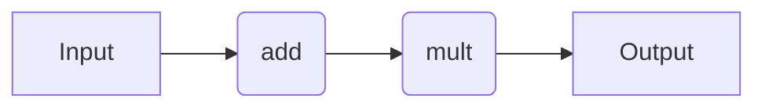

# Workflow Syntax

## Simple Workflow

Let's do the following:

1. Add two numbers (e.g. `#!Python 1 + 2`)
2. Multiply the output of Step 1 by a third number (e.g. `#!Python 3 * 3`)

In practice, we would want each of the two tasks to be their own compute job.



=== "Dask"

    !!! Important

        If you haven't done so yet, make sure you update the quacc `WORKFLOW_ENGINE` [configuration variable](../settings/settings.md) and load the default Dask client:

        ```bash
        quacc set WORKFLOW_ENGINE dask
        ```

        ```python title="python"
        from dask.distributed import Client

        client = Client()  #  (1)!
        ```

        1. It is necessary to instantiate a Dask client before running Dask workflows. This command loads the default (local) client and only needs to be done once.

    ```python
    from quacc import job


    @job  #  (1)!
    def add(a, b):
        return a + b


    @job
    def mult(a, b):
        return a * b


    def workflow(a, b, c):  #  (2)!
        output1 = add(a, b)
        output2 = mult(output1, c)
        return output2


    delayed = workflow(1, 2, 3)  #  (3)!
    result = client.compute(delayed).result()  #  (4)!
    print(result)  # 9
    ```

    1. The `#!Python @job` decorator will be transformed into a Dask `#!Python @delayed`.

    2. The `#!Python @flow` decorator doesn't actually do anything when using Dask, so we chose to not include it here for brevity.

    3. This returns a `Delayed` object. A reference is returned.

    4. There are multiple ways to resolve a `Delayed` object. Here, `#!Python client.compute(delayed)` will return a `Future` object, which can be resolved with `.result()`. The `.result()` call will block until the workflow is complete and return the result. As an alternative, you could also use `#!Python delayed.compute()` to dispatch and resolve the `Delayed` object in one command. Similarly, you could use `#!Python dask.compute(delayed)[0]`, where the `[0]` indexing is needed because `#!Python dask.compute()` always returns a tuple.

=== "Parsl"

    !!! Important

        If you haven't done so yet, make sure you update the quacc `WORKFLOW_ENGINE` [configuration variable](../settings/settings.md) and load the default Parsl configuration:

        ```bash
        quacc set WORKFLOW_ENGINE parsl
        ```

        ```python title="python"
        import parsl

        parsl.load()  #  (1)!
        ```

        1. It is necessary to instantiate a Parsl configuration before running Parsl workflows. This command loads the default (local) configuration and only needs to be done once.

    ```python
    from quacc import job


    @job  #  (1)!
    def add(a, b):
        return a + b


    @job
    def mult(a, b):
        return a * b


    def workflow(a, b, c):  #  (2)!
        output1 = add(a, b)
        output2 = mult(output1, c)
        return output2


    future = workflow(1, 2, 3)  #  (3)!
    result = future.result()  #  (4)!
    print(result)  # 9
    ```

    1. The `#!Python @job` decorator will be transformed into a Parsl `#!Python @python_app`.

    2. The `#!Python @flow` decorator doesn't actually do anything when using Parsl, so we chose to not include it here for brevity.

    3. This will create a `PythonApp` object that represents the workflow. At this point, the workflow has been dispatched, but only a reference is returned.

    4. Calling `.result()` will block until the workflow is complete and return the result.

=== "Prefect"

    !!! Important

        If you haven't done so yet, make sure you update the quacc `WORKFLOW_ENGINE` [configuration variable](../settings/settings.md).

        ```bash
        quacc set WORKFLOW_ENGINE prefect
        ```

    ```python
    from quacc import flow, job


    @job  #  (1)!
    def add(a, b):
        return a + b


    @job
    def mult(a, b):
        return a * b


    @flow
    def workflow(a, b, c):  #  (2)!
        output1 = add(a, b)
        output2 = mult(output1, c)
        return output2


    result = workflow(1, 2, 3)  #  (3)!
    print(result)  # 9
    ```

    1. The `#!Python @job` decorator will be transformed into a Prefect `#!Python @task`. It will also be launched via `.submit()` if `SETTINGS.PREFECT_AUTO_SUBMIT` is `True`.

    2. The `#!Python @flow` decorator will be transformed into a Prefect `#!Python @flow`.

    3. This will create and run the `Flow`. At this point, the workflow has been dispatched and the final results are returned.

=== "Redun"

    !!! Important

        If you haven't done so yet, make sure you update the quacc `WORKFLOW_ENGINE` [configuration variable](../settings/settings.md):

        ```bash
        quacc set WORKFLOW_ENGINE redun
        ```

        ```python title="python"
        from redun import Scheduler

        scheduler = Scheduler()  #  (1)!
        ```

        1. It is necessary to instantiate the scheduler before submitting calculations.

    ```python
    from quacc import flow, job


    @job  #  (1)!
    def add(a, b):
        return a + b


    @job
    def mult(a, b):
        return a * b


    @flow  #  (2)!
    def workflow(a, b, c):
        output1 = add(a, b)
        output2 = mult(output1, c)
        return output2


    result = scheduler.run(workflow(1, 2, 3))  # (3)!
    print(result)  # 9
    ```

    1. The `#!Python @job` decorator will be transformed into a Redun `#!Python @task`.

    2. The `#!Python @flow` decorator will also be transformed into a Redun `#!Python @task`. Everything in Redun is a `#!Python @task`, so it doesn't matter what quacc decorator you apply. We chose `#!Python @flow` simply for clarity.

    3. This command will submit the workflow to the Redun scheduler.

=== "Jobflow"

    !!! Important

        If you haven't done so yet, make sure you update the quacc `WORKFLOW_ENGINE` [configuration variable](../settings/settings.md):

        ```bash
        quacc set WORKFLOW_ENGINE jobflow
        ```

    ```python
    import jobflow as jf
    from quacc import job


    @job  #  (1)!
    def add(a, b):
        return a + b


    @job
    def mult(a, b):
        return a * b


    job1 = add(1, 2)
    job2 = mult(job1.output, 3)
    flow = jf.Flow([job1, job2])  #  (2)!

    responses = jf.run_locally(flow)  #  (3)!
    result = responses[job2.uuid][1].output  #  (4)!
    print(result)  # 9
    ```

    1. The `#!Python @job` decorator will be transformed into `#!Python @jf.job`.

    2. A `#!Python @jf.Flow` object is created to represent the workflow.

    3. The workflow is run locally and the result is returned in a dictionary.

    4. The result is extracted from the dictionary by using the UUID of the second job in the workflow.

??? Tip "Stripping the Decorator from a Job"

    If you ever want to strip the decorator from a pre-decorated `#!Python @job` (e.g. to test out a calculation locally without changing your quacc settings), you can do so with [quacc.wflow_tools.customizers.strip_decorator][] as follows:

    ```python
    from quacc import job, strip_decorator


    @job
    def add(a, b):
        return a + b


    original_add = strip_decorator(add)
    original_add(1, 2)  # 3
    ```

## Learn More

=== "Dask"

    If you want to learn more about Dask, you can read the [Dask Delayed documentation](https://docs.dask.org/en/stable/delayed.html) to read more about the decorators and the [Dask Distributed documentation](https://distributed.dask.org/en/stable/) to read more about the distributed Dask cluster. Please refer to the [Dask Discourse page](https://discourse.dask.org/) for Dask-specific questions.

=== "Parsl"

    If you want to learn more about Parsl, you can read the [Parsl Documentation](https://parsl.readthedocs.io/en/stable/#). Please refer to the [Parsl Slack Channel](http://parsl-project.org/support.html) for any Parsl-specific questions.

=== "Prefect"

    If you want to learn more about Prefect, you can read the [Prefect Documentation](https://docs.prefect.io/). Please refer to the [Prefect community resources](https://www.prefect.io/community) for any Prefect-specific questions.

=== "Redun"

    If you want to learn more about Redun, you can read the [Redun documentation](https://insitro.github.io/redun/index.html).

=== "Jobflow"

    If you want to learn more about Jobflow, you can read the [Jobflow Documentation](https://materialsproject.github.io/jobflow/). Please refer to the [Jobflow Discussions Board](https://github.com/materialsproject/jobflow/discussions) for Jobflow-specific questions.
