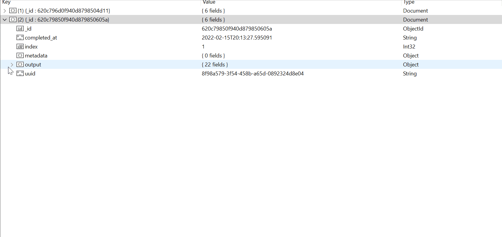

# Using a Database

Oftentimes, it is beneficial to store the results in a database for easy querying (like the example below). This is quite simple to do in quacc regardless of the workflow manager you are using by taking advantage of the numerous data store options in [maggma](https://github.com/materialsproject/maggma).



=== "General Purpose"

    **Automated Approach**

    For a given recipe, you can have quacc automatically store the final output summaries in your desired database by defining a [Maggma Data Store](https://materialsproject.github.io/maggma/reference/stores/) in the `RESULTS_STORE` quacc setting.

    For instance, let's pretend you have decided to make a `MontyStore` be your database of choice. After defining or loading your Maggma store, you would call `.as_dict()` to get a dictionary representation. You can then store this dictionary, formatted as a string, in the `RESULTS_STORE` global quacc setting.

    ```python
    from maggma.stores import MontyStore
    my_store = MontyStore("quacc_results", database_path=".")
    print(my_store.to_json())  # (1)
    ```

    ```yaml title="quacc.yaml"
    RESULTS_STORE: '{"@module": "maggma.stores.mongolike", "@class": "MontyStore", "@version": "0.51.19", "collection_name": "quacc_results", "database_path": ".", "database_name": "db", "storage": "sqlite", "storage_kwargs": {"use_bson": true, "monty_version": "4.0"}, "client_kwargs": {}}'
    ```

    1. This is the string you will store in the `RESULTS_STORE` quacc setting.

    **Manual Approach**

    If you would prefer to store results in your database manually (perhaps because you are limited in terms of how much data you can store), you can use the [`quacc.util.db.results_to_db`](https://quantum-accelerators.github.io/quacc/reference/quacc/util/db.html#quacc.util.db.results_to_db) function, as shown in the example below.

    ```python
    from maggma.stores import MontyStore
    from quacc.util.db import results_to_db

    # Let `results` be an output (or list of outputs) from quacc recipes

    # Define your database details
    store = MontyStore("quacc_results", database_path=".")

    # Store the results
    results_to_db(store, results)
    ```

=== "Covalent"

    Covalent automatically stores all the inputs and outputs in an SQLite database, which you can find at the `"db_path"` when you run `covalent config`, and the results can be queried using the `ct.get_result(<dispatch ID>)` syntax. However, if you want to store the results in a different database of your choosing, you can do so quite easily.

    An example is shown below for storing the results in your custom database via the [`quacc.util.db.covalent_to_db`](https://quantum-accelerators.github.io/quacc/reference/quacc/util/db.html#quacc.util.db.covalent_to_db) function.

    ```python
    from maggma.stores import MongoStore
    from quacc.util.db import covavlent_to_db

    # Define your database credentials
    store = MongoStore(
        "my_db_name",
        "my_collection_name",
        username="my_username",
        password="my_password",
        host="localhost",
        port=27017,
    )

    # Store the results
    covalent_to_db(store)
    ```

=== "Jobflow"

    If you are using Jobflow to construct your workflows, it will automatically store the results in the database you defined during the [setup process](../install/wflow_engines.md). No additional steps are needed.
