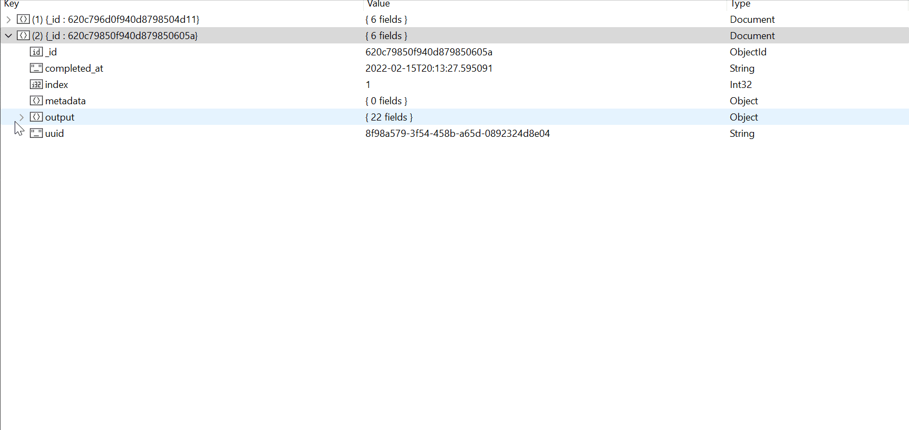

# Database Options

## Why Use a Database?

In most cases, it is beneficial to store the results in a database for easy querying (like the example below). This is quite simple to do in quacc regardless of the workflow manager you are using by taking advantage of the numerous data store options in [maggma](https://github.com/materialsproject/maggma).

## Choosing a Data Store Option

Some workflow engines supported by quacc, such as Jobflow and Prefect already involve a database for storing results. In these cases, you can simply use the database provided by the workflow engine. However, if you are using a workflow engine that does not provide a database or not using a workflow engine at all, you may wish to use one directly supported by quacc.

The supported data store options are all those [provided by maggma](https://materialsproject.github.io/maggma/getting_started/stores/#list-of-stores). At the time of writing, the most popular options is the [`MongoStore`](https://materialsproject.github.io/maggma/reference/stores/#maggma.stores.mongolike.MemoryStore) for interfacing with MongoDB.
