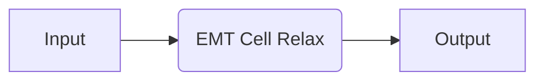
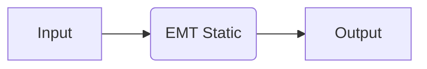
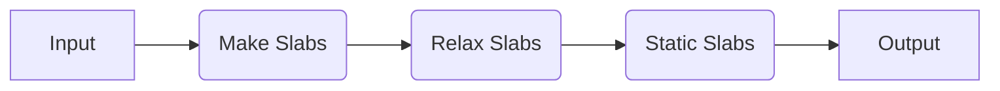
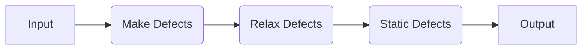

# EMT

🚧 Under Construction 🚧

Recipes based on the effective medium theory (EMT) calculator in ASE. This is primarily for demonstration purposes.

## Available Recipes

| Recipe                                                                                                                                                           | Description                                         | Calculator Parameters | Other Parameters                                                    |
| ---------------------------------------------------------------------------------------------------------------------------------------------------------------- | --------------------------------------------------- | --------------------- | ------------------------------------------------------------------- |
| [`emt.core.relax_job`](https://quantum-accelerators.github.io/quacc/reference/quacc/recipes/emt/core.html#quacc.recipes.emt.core.relax_job)                      | Relax a structure.                                  | `#!Python {}`         | Opt: `#!Pthon {"fmax": 0.01, "max_steps": 1000, "optimizer": FIRE}` |
| [`emt.core.static_job`](https://quantum-accelerators.github.io/quacc/reference/quacc/recipes/emt/core.html#quacc.recipes.emt.core.static_job)                    | Static calculation on a structure.                  | `#!Python {}`         | N/A                                                                 |
| [`emt.slabs.bulk_to_slabs_flow`](https://quantum-accelerators.github.io/quacc/reference/quacc/recipes/emt/slabs.html#quacc.recipes.emt.slabs.bulk_to_slabs_flow) | Generate, relax, and static calculations on slabs   | `#!Python {}`         | N/A                                                                 |
| [`emt.slabs.bulk_to_defects_flow`](https://quantum-accelerators.github.io/quacc/reference/quacc/recipes/emt/defects.html)                                        | Generate, relax, and static calculations on defects | `#!Python {}`         | N/A                                                                 |

## Examples

### Core Recipes



=== "No Workflow Engine"

    ```python
    from ase.build import bulk
    from quacc.recipes.emt.core import relax_job

    atoms = bulk("Cu")
    result = relax_job(atoms, relax_cell=True)
    ```

=== "Covalent"

    ```python
    import covalent as ct
    from ase.build import bulk
    from quacc import flow
    from quacc.recipes.emt.core import relax_job

    atoms = bulk("Cu")
    dispatch_id = flow(relax_job)(atoms, relax_cell=True)
    result = ct.get_result(dispatch_id, wait=True)
    ```

=== "Parsl"

    ```python
    from ase.build import bulk
    from quacc.recipes.emt.core import relax_job

    atoms = bulk("Cu")
    future = relax_job(atoms, relax_cell=True)
    result = future.result()
    ```



=== "No Workflow Engine"

    ```python
    from ase.build import bulk
    from quacc.recipes.emt.core import static_job

    atoms = bulk("Cu")
    result = static_job(atoms)
    ```

=== "Covalent"

    ```python
    import covalent as ct
    from ase.build import bulk
    from quacc import flow
    from quacc.recipes.emt.core import static_job

    atoms = bulk("Cu")
    dispatch_id = flow(static_job)(atoms)
    result = ct.get_result(dispatch_id, wait=True)
    ```

=== "Parsl"

    ```python
    from ase.build import bulk
    from quacc.recipes.emt.core import static_job

    atoms = bulk("Cu")
    future = static_job(atoms)
    result = future.result()
    ```

### Slab Recipes



=== "No Workflow Engine"

    ```python
    from ase.build import bulk
    from quacc.recipes.emt.slabs import bulk_to_slabs_flow

    atoms = bulk("Ni")
    result = bulk_to_slabs_flow(atoms)
    ```

=== "Covalent"

    ```python
    import covalent as ct
    from ase.build import bulk
    from quacc.recipes.emt.slabs import bulk_to_slabs_flow

    atoms = bulk("Ni")
    dispatch_id = bulk_to_slabs_flow(atoms)
    result = ct.get_result(dispatch_id, wait=True)
    ```

=== "Parsl"

    ```python
    from ase.build import bulk
    from quacc.recipes.emt.slabs import bulk_to_slabs_flow

    atoms = bulk("Ni")
    future = bulk_to_slabs_flow(atoms)
    result = future.result()
    ```

### Defect Recipes



=== "No Workflow Engine"

    ```python
    from ase.build import bulk
    from quacc.recipes.emt.defects import bulk_to_defects_flow

    atoms = bulk("Cu")
    result = bulk_to_defects_flow(atoms)
    ```

=== "Covalent"

    ```python
    import covalent as ct
    from ase.build import bulk
    from quacc.recipes.emt.slabs import bulk_to_slabs_flow

    atoms = bulk("Cu")
    dispatch_id = bulk_to_defects_flow(atoms)
    result = ct.get_result(dispatch_id, wait=True)
    ```

=== "Parsl"

    ```python
    from ase.build import bulk
    from quacc.recipes.emt.slabs import bulk_to_slabs_flow

    atoms = bulk("Cu")
    future = bulk_to_defects_flow(atoms)
    result = future.result()
    ```
