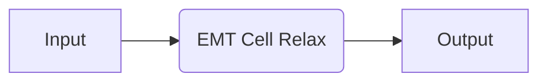
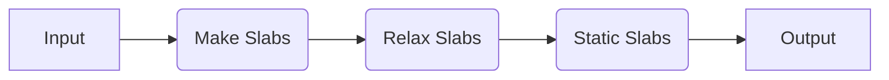
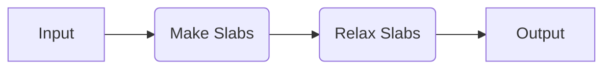

# EMT

Recipes based on the effective medium theory (EMT) calculator in ASE. This is primarily for demonstration purposes.

## Available Recipes

| Recipe                                                                                                                                                           | Description                                       |
| ---------------------------------------------------------------------------------------------------------------------------------------------------------------- | ------------------------------------------------- |
| [`emt.core.relax_job`](https://quantum-accelerators.github.io/quacc/reference/quacc/recipes/emt/core.html#quacc.recipes.emt.core.relax_job)                      | Relax a structure.                                |
| [`emt.core.static_job`](https://quantum-accelerators.github.io/quacc/reference/quacc/recipes/emt/core.html#quacc.recipes.emt.core.static_job)                    | Static calculation on a structure.                |
| [`emt.slabs.bulk_to_slabs_flow`](https://quantum-accelerators.github.io/quacc/reference/quacc/recipes/emt/slabs.html#quacc.recipes.emt.slabs.bulk_to_slabs_flow) | Generate, relax, and static calculations on slabs |

## Examples

### Core Recipes



=== "No Workflow Engine"

    ```python
    from ase.build import bulk
    from quacc.recipes.emt.core import relax_job, static_job

    atoms = bulk("Cu")
    output1 = relax_job(atoms, relax_cell=True)
    output2 = static_job(output1)
    ```

=== "Covalent"

    ```python
    import covalent as ct
    from ase.build import bulk
    from quacc import flow
    from quacc.recipes.emt.core import relax_job, static_job


    @flow
    def workflow(atoms):
        output1 = relax_job(atoms, relax_cell=True)
        output2 = static_job(output1)
        return output2


    atoms = bulk("Cu")

    dispatch_id = ct.dispatch(workflow)(atoms)
    ct.get_result(dispatch_id, wait=True)
    ```

=== "Parsl"

    ```python
    from ase.build import bulk
    from quacc.recipes.emt.core import relax_job, static_job

    atoms = bulk("Cu")
    future1 = relax_job(atoms, relax_cell=True)
    future2 = static_job(future1)
    future2.result()
    ```

### Slab Recipes



=== "No Workflow Engine"

    ```python
    from ase.build import bulk
    from quacc.recipes.emt.slabs import bulk_to_slabs_flow

    atoms = bulk("Ni")
    output = bulk_to_slabs_flow(atoms)
    ```

=== "Covalent"

    ```python
    import covalent as ct
    from ase.build import bulk
    from quacc import flow
    from quacc.recipes.emt.slabs import bulk_to_slabs_flow


    @flow
    def workflow(atoms):
        atoms = bulk("Ni")
        output = bulk_to_slabs_flow(atoms)
        return output


    dispatch_id = ct.dispatch(workflow)(atoms)
    ct.get_result(dispatch_id, wait=True)
    ```

=== "Parsl"

    ```python
    from ase.build import bulk
    from quacc.recipes.emt.slabs import bulk_to_slabs_flow

    atoms = bulk("Ni")
    future = bulk_to_slabs_flow(atoms)
    future.result()
    ```



=== "No Workflow Engine"

    ```python
    from ase.build import bulk
    from quacc.recipes.emt.slabs import bulk_to_slabs_flow

    atoms = bulk("Cu")
    output = bulk_to_slabs_flow(
        atoms, make_slabs_kwargs={"max_index": 2, "min_slab_size": 15.0}, slab_static=None
    )
    ```

=== "Covalent"

    ```python
    import covalent as ct
    from ase.build import bulk
    from quacc import flow
    from quacc.recipes.emt.slabs import bulk_to_slabs_flow


    @flow
    def workflow(atoms):
        output = bulk_to_slabs_flow(
            atoms,
            make_slabs_kwargs={"max_index": 2, "min_slab_size": 15.0},
            slab_static=None,
        )
        return output


    atoms = bulk("Cu")

    dispatch_id = ct.dispatch(workflow)(atoms)
    ct.get_result(dispatch_id, wait=True)
    ```

=== "Parsl"

    ```python
    from ase.build import bulk
    from quacc.recipes.emt.slabs import bulk_to_slabs_flow

    atoms = bulk("Cu")
    future = bulk_to_slabs_flow(
        atoms, make_slabs_kwargs={"max_index": 2, "min_slab_size": 15.0}, slab_static=None
    )
    future.result()
    ```
