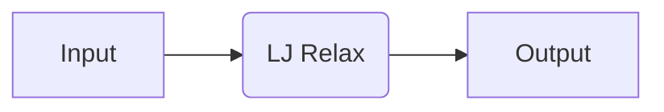
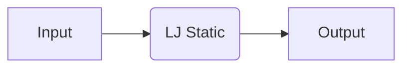
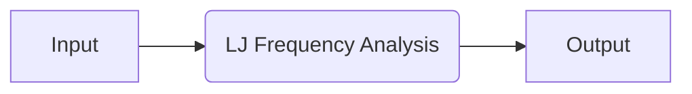

# Lennard-Jones

Recipes for a simple Lennard-Jones calculator. Primarily used for demonstration purposes.

## Available Recipes

| Recipes                                                                                                                                    | Description                          | Calculator Parameters | Other Parameters                                                |
| ------------------------------------------------------------------------------------------------------------------------------------------ | ------------------------------------ | --------------------- | --------------------------------------------------------------- |
| [`lj.core.relax_job`](https://quantum-accelerators.github.io/quacc/reference/quacc/recipes/lj/core.html#quacc.recipes.lj.core.relax_job)   | Relax a molecule.                    | `#!Python {}`         | `#!Python {"fmax": 0.01, "max_steps": 1000, "optimizer": FIRE}` |
| [`lj.core.static_job`](https://quantum-accelerators.github.io/quacc/reference/quacc/recipes/lj/core.html#quacc.recipes.lj.core.static_job) | Static calculation on a molecule.    | `#!Python {}`         | N/A                                                             |
| [`lj.core.freq_job`](https://quantum-accelerators.github.io/quacc/reference/quacc/recipes/lj/core.html#quacc.recipes.lj.core.freq_job)     | Frequency calculation on a molecule. | `#!Python {}`         | N/A                                                             |

## Examples

### Core Recipes



=== "No Workflow Engine"

    ```python
    from ase.build import molecule
    from quacc.recipes.lj.core import relax_job

    atoms = molecule("N2")
    result = relax_job(atoms)
    ```

=== "Covalent"

    ```python
    import covalent as ct
    from ase.build import molecule
    from quacc import flow
    from quacc.recipes.lj.core import relax_job

    atoms = molecule("N2")
    dispatch_id = flow(relax_job)(atoms)
    result = ct.get_result(dispatch_id, wait=True)
    ```

=== "Parsl"

    ```python
    from ase.build import molecule
    from quacc.recipes.lj.core import relax_job

    atoms = molecule("Cu")
    future = relax_job(atoms)
    result = future.result()
    ```



=== "No Workflow Engine"

    ```python
    from ase.build import molecule
    from quacc.recipes.lj.core import static_job

    atoms = molecule("N2")
    result = static_job(atoms)
    ```

=== "Covalent"

    ```python
    import covalent as ct
    from ase.build import molecule
    from quacc import flow
    from quacc.recipes.lj.core import static_job

    atoms = molecule("N2")
    dispatch_id = flow(static_job)(atoms)
    result = ct.get_result(dispatch_id, wait=True)
    ```

=== "Parsl"

    ```python
    from ase.build import molecule
    from quacc.recipes.lj.core import static_job

    atoms = molecule("Cu")
    future = static_job(atoms)
    result = future.result()
    ```



=== "No Workflow Engine"

    ```python
    from ase.build import molecule
    from quacc.recipes.lj.core import freq_job

    atoms = molecule("N2")
    result = freq_job(atoms)
    ```

=== "Covalent"

    ```python
    import covalent as ct
    from ase.build import molecule
    from quacc import flow
    from quacc.recipes.lj.core import freq_job

    atoms = molecule("N2")
    dispatch_id = flow(freq_job)(atoms)
    result = ct.get_result(dispatch_id, wait=True)
    ```

=== "Parsl"

    ```python
    from ase.build import molecule
    from quacc.recipes.lj.core import freq_job

    atoms = molecule("Cu")
    future = freq_job(atoms)
    result = future.result()
