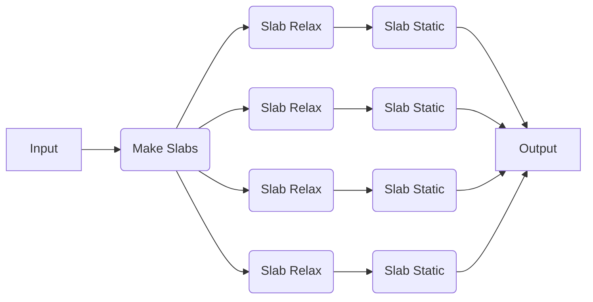

# Modifying Recipes

Oftentimes, you will want to modify a recipe to suit your specific needs. This can be done in a number of ways, which we will explore in this section.

## Modifying a Job in a Dynamic Workflow



In this example, we will run a pre-made workflow that generates a set of slabs from a bulk structure and then runs a structure relaxation and static calculation on each slab: [quacc.recipes.emt.slabs.bulk_to_slabs_flow][]. We will specifically highlight an example where we want to override the default parameters of one step in the recipe, in this case to tighten the force tolerance for the slab relaxation step.

!!! Tip

    Unsure what arguments a given function takes? Check out the [API documentation](https://quantum-accelerators.github.io/quacc/reference/quacc/recipes/emt/slabs.html).

```python
from ase.build import bulk
from quacc.recipes.emt.core import relax_job
from quacc.recipes.emt.slabs import bulk_to_slabs_flow

# Define the Atoms object
atoms = bulk("Cu")

# Define the workflow
result = bulk_to_slabs_flow(
    atoms, parameters={"relax_job": {"opt_params": {"fmax": 1e-4}}}  # (1)!
)

# Print the result
print(result)
```

Here, we have used the `parameters` keyword argument to override the default parameters only for the `relax_job` function called within `bulk_to_slabs_flow`. This is a convenient way to selectively modify the default behavior of a workflow without having to modify the source code itself.

## Modifying all the Jobs in a Dynamic Workflow

What if you wanted to modify a common parameters of all the jobs in the aforementioned recipe? Rather than enumerate each one, you can use the magic keyword `"all"`:

```python
from ase.build import bulk
from quacc.recipes.emt.core import relax_job
from quacc.recipes.emt.slabs import bulk_to_slabs_flow

# Define the Atoms object
atoms = bulk("Cu")

# Define the workflow
result = bulk_to_slabs_flow(
    atoms, parameters={"all": {"asap_cutoff": True}}
)

# Print the result
print(result)
```

!!! Note

    If you try to modify a parameter that doesn't exist in all the corresponding jobs, you will get an error.

## Concluding Comments

At this point, you now have the basic idea of how quacc recipes work!

If you don't care about using a workflow engine, feel free to write simple quacc-based Python scripts and submit them as-is using your favorite computing machine and scheduler. However, if you are looking to efficiently scale up and monitor large numbers of workflows, continue reading!
