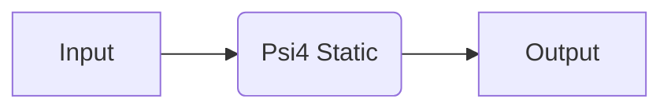

# Psi4

Recipes based on the [Psi4](https://psicode.org/) code.

## Available Recipes

| Recipe                                                                                                                                           | Description                       |
| ------------------------------------------------------------------------------------------------------------------------------------------------ | --------------------------------- |
| [`psi4.core.static_job`](https://quantum-accelerators.github.io/quacc/reference/quacc/recipes/psi4/core.html#quacc.recipes.psi4.core.static_job) | Static calculation on a molecule. |

## Examples

### Core Recipes



=== "No Workflow Engine"

    ```python
    from ase.build import molecule
    from quacc.recipes.psi4.core import static_job

    atoms = molecule("O2")
    output = static_job(atoms, charge=0, multiplicity=3, method="wb97m-v", basis="def2-svp")
    ```

=== "Covalent"

    ```python
    import covalent as ct
    from ase.build import molecule
    from quacc import flow
    from quacc.recipes.psi4.core import static_job

    workflow = flow(static_job)
    atoms = molecule("O2")

    dispatch_id = ct.dispatch(workflow)(
        atoms, charge=0, multiplicity=3, method="wb97m-v", basis="def2-svp"
    )
    ct.get_result(dispatch_id, wait=True)
    ```

=== "Parsl"

    ```python
    from ase.build import molecule
    from quacc.recipes.psi4.core import static_job

    atoms = molecule("O2")
    future = static_job(atoms, charge=0, multiplicity=3, method="wb97m-v", basis="def2-svp")
    future.result()
    ```
