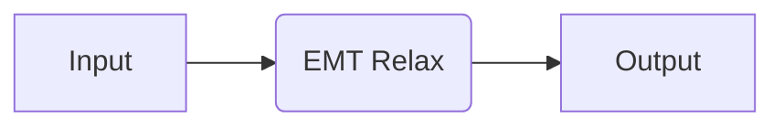
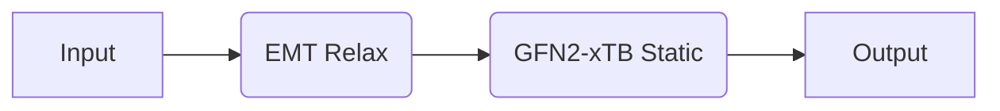

# Intro to Jobs

In quacc, each code comes with [pre-packaged jobs and workflows](recipes_list.md), which we collectively call recipes. This tutorial walks you through how to use these provided recipes to run simple calculations that can be tested out on your local machine. We'll start with an introduction to jobs, which are individual calculations that can be stitched together.

## Pre-Requisites

If you are not yet familiar with the ASE [`Atoms`](https://wiki.fysik.dtu.dk/ase/ase/atoms.html) object, you should read the [ASE tutorial](https://wiki.fysik.dtu.dk/ase/ase/atoms.html). Additionally, it is worthwhile to be familiar with the basics of an ASE [Calculator](https://wiki.fysik.dtu.dk/ase/ase/calculators/calculators.html). The ["Open Science with ASE: Core Tutorials"](https://ase-workshop-2023.github.io/tutorial/) is an excellent resource for learning about the basics of ASE.

!!! Note

    Since we are not using a workflow engine for these examples, run the following in the command line:

    ```bash
    quacc set WORKFLOW_ENGINE None
    ```

## Examples

### A Simple Calculation with EMT



Let's start with a simple example. Here, we will use a cheap calculator based on effective medium theory (EMT) to run a structure relaxation on a bulk structure of copper. We are interested in doing a structure relaxation, so we will use the [quacc.recipes.emt.core.relax_job][] recipe, as demonstrated below. Most recipes in quacc take an `Atoms` object as the first positional argument and will return a dictionary that summarizes the output.

```python
from ase.build import bulk
from quacc.recipes.emt.core import relax_job

# Make an Atoms object of a bulk Cu structure
atoms = bulk("Cu")

# Run a structure relaxation on the Atoms object
result = relax_job(atoms)
print(result)
```

??? Info "Printed Output"

    ```
    {'atoms': Atoms(symbols='Cu', pbc=True, cell=[[0.0, 1.805, 1.805], [1.805, 0.0, 1.805], [1.805, 1.805, 0.0]]),
    'builder_meta': {'build_date': datetime.datetime(2024, 6, 17, 18, 22, 22, 334535),
                    'emmet_version': '0.82.0',
                    'pymatgen_version': '2024.6.10'},
    'chemsys': 'Cu',
    'composition': Composition('Cu1'),
    'composition_reduced': Composition('Cu1'),
    'converged': True,
    'density': 8.971719800606017,
    'density_atomic': 11.761470249999999,
    'dir_name': '/mnt/c/Users/asros/Desktop/quacc-2024-06-17-18-22-22-249452-41421',
    'elements': [Element Cu],
    'formula_anonymous': 'A',
    'formula_pretty': 'Cu',
    'input_atoms': {'atoms': Atoms(symbols='Cu', pbc=True, cell=[[0.0, 1.805, 1.805], [1.805, 0.0, 1.805], [1.805, 1.805, 0.0]]),
                    'builder_meta': {'build_date': datetime.datetime(2024, 6, 17, 18, 22, 22, 333682),
                                    'emmet_version': '0.82.0',
                                    'pymatgen_version': '2024.6.10'},
                    'chemsys': 'Cu',
                    'composition': Composition('Cu1'),
                    'composition_reduced': Composition('Cu1'),
                    'density': 8.971719800606017,
                    'density_atomic': 11.761470249999999,
                    'elements': [Element Cu],
                    'formula_anonymous': 'A',
                    'formula_pretty': 'Cu',
                    'nelements': 1,
                    'nsites': 1,
                    'symmetry': {'crystal_system': <CrystalSystem.cubic: 'Cubic'>,
                                'number': 225,
                                'point_group': 'm-3m',
                                'symbol': 'Fm-3m',
                                'symprec': 0.1,
                                'version': '2.4.0'},
                    'volume': 11.761470249999999},
    'name': 'EMT Relax',
    'nelements': 1,
    'nid': 'rosen.',
    'nsites': 1,
    'parameters': {'asap_cutoff': False},
    'parameters_opt': {'alpha': 70.0,
                        'max_steps': 1000,
                        'maxstep': 0.2,
                        'optimizer': 'BFGS',
                        'type': 'optimization'},
    'quacc_version': '0.8.1',
    'results': {'energies': array([-0.00568151]),
                'energy': -0.005681511358581304,
                'forces': array([[-3.14977672e-16,  1.01949224e-15,  3.66995236e-16]]),
                'free_energy': -0.005681511358581304,
                'stress': array([1.36192652e-02, 1.36192652e-02, 1.36192652e-02, 0.00000000e+00,
        7.55159347e-17, 1.47492060e-19])},
    'structure': Structure Summary
    Lattice
        abc : 2.5526554800834367 2.5526554800834367 2.5526554800834367
    angles : 60.00000000000001 60.00000000000001 60.00000000000001
    volume : 11.761470249999999
        A : 0.0 1.805 1.805
        B : 1.805 0.0 1.805
        C : 1.805 1.805 0.0
        pbc : True True True
    PeriodicSite: Cu (0.0, 0.0, 0.0) [0.0, 0.0, 0.0],
    'symmetry': {'crystal_system': <CrystalSystem.cubic: 'Cubic'>,
                'number': 225,
                'point_group': 'm-3m',
                'symbol': 'Fm-3m',
                'symprec': 0.1,
                'version': '2.4.0'},
    'trajectory': [Atoms(symbols='Cu', pbc=True, cell=[[0.0, 1.805, 1.805], [1.805, 0.0, 1.805], [1.805, 1.805, 0.0]])],
    'trajectory_results': [{'energies': array([-0.00568151]),
                            'energy': -0.005681511358581304,
                            'forces': array([[-3.14977672e-16,  1.01949224e-15,  3.66995236e-16]]),
                            'free_energy': -0.005681511358581304,
                            'stress': array([1.36192652e-02, 1.36192652e-02, 1.36192652e-02, 0.00000000e+00,
        7.55159347e-17, 1.47492060e-19])}],
    'volume': 11.761470249999999}
    ```

!!! Note "Loading the JSON Output"

    A serialized version of the printed output above is also written to the filesystem with the name `quacc_results.json.gz`. It can be read back in as follows:

    ```python
    from monty.serialization import loadfn

    results = loadfn("quacc_results.json.gz")
    ```

### A Mixed-Code Workflow



Now let's add on a bit of complexity. Here, we will use EMT to run a relaxation on the bulk Cu structure and then use the output of this calculation as the input to a static calculation with the semi-empirical quantum mechanics method [GFN2-xTB](https://pubs.acs.org/doi/full/10.1021/acs.jctc.8b01176) as implemented in [quacc.recipes.tblite.core.static_job][].

This example highlights how there are no restrictions in terms of how many codes you can use in a single workflow. It also briefly demonstrates how you can specify optional parameters of a given job, as we will elaborate further in the next example.

!!! Note

    Some codes require additional setup, including `tblite`. Refer to the [Calculator Setup](../../install/codes.md) section for details.

```python
from ase.build import bulk
from quacc.recipes.emt.core import relax_job
from quacc.recipes.tblite.core import static_job

# Make an Atoms object of a bulk Cu structure
atoms = bulk("Cu")

# Run a structure relaxation with EMT
result1 = relax_job(atoms)

# Run a static calculation with GFN2-xTB
result2 = static_job(result1["atoms"], method="GFN2-xTB")  # (1)!
print(result2)
```

1. We have to pass an `Atoms` object to the `static_job` recipe, so we parse it from `result1` output dictionary. We also have specified an optional parameter, `method`. Refer to the [function signature](https://quantum-accelerators.github.io/quacc/reference/quacc/recipes/tblite/core.html#quacc.recipes.tblite.core.static_job) for the `static_job` recipe to see the full list of parameters that can be specified.

??? Info "Printed Output"

    ```
    {'atoms': Atoms(symbols='Cu', pbc=True, cell=[[0.0, 1.805, 1.805], [1.805, 0.0, 1.805], [1.805, 1.805, 0.0]]),
    'builder_meta': {'build_date': datetime.datetime(2024, 6, 17, 18, 25, 25, 853559),
                    'emmet_version': '0.83.6',
                    'pymatgen_version': '2024.6.10'},
    'chemsys': 'Cu',
    'composition': Composition('Cu1'),
    'composition_reduced': Composition('Cu1'),
    'density': 8.971719800606017,
    'density_atomic': 11.761470249999999,
    'dir_name': '/mnt/c/Users/asros/github/quacc/quacc-2024-06-17-18-25-25-482739-76656',
    'elements': [Element Cu],
    'formula_anonymous': 'A',
    'formula_pretty': 'Cu',
    'input_atoms': {'atoms': Atoms(symbols='Cu', pbc=True, cell=[[0.0, 1.805, 1.805], [1.805, 0.0, 1.805], [1.805, 1.805, 0.0]]),
                    'builder_meta': {'build_date': datetime.datetime(2024, 6, 17, 18, 25, 25, 852522),
                                    'emmet_version': '0.83.6',
                                    'pymatgen_version': '2024.6.10'},
                    'chemsys': 'Cu',
                    'composition': Composition('Cu1'),
                    'composition_reduced': Composition('Cu1'),
                    'density': 8.971719800606017,
                    'density_atomic': 11.761470249999999,
                    'elements': [Element Cu],
                    'formula_anonymous': 'A',
                    'formula_pretty': 'Cu',
                    'nelements': 1,
                    'nsites': 1,
                    'symmetry': {'crystal_system': <CrystalSystem.cubic: 'Cubic'>,
                                'number': 225,
                                'point_group': 'm-3m',
                                'symbol': 'Fm-3m',
                                'symprec': 0.1,
                                'version': '2.4.0'},
                    'volume': 11.761470249999999},
    'name': 'TBLite Static',
    'nelements': 1,
    'nid': 'rosen.',
    'nsites': 1,
    'parameters': {'accuracy': 1.0,
                    'cache_api': True,
                    'electronic_temperature': 300.0,
                    'max_iterations': 250,
                    'method': 'GFN2-xTB',
                    'verbosity': 1},
    'quacc_version': '0.9.6',
    'results': {'charges': array([-4.66053862e-11]),
                'dipole': array([-8.02234177e-08,  1.96331282e-07, -5.14078572e-08]),
                'energy': -318.8584605831615,
                'forces': array([[5.44452313e-20, 5.39007790e-19, 2.45003541e-19]]),
                'free_energy': -318.8584605831615,
                'stress': array([14.65181119, 14.65181119, 14.65181119,  1.40704868,  1.01943286,
            0.63181703])},
    'structure': Structure Summary
    Lattice
        abc : 2.5526554800834367 2.5526554800834367 2.5526554800834367
    angles : 60.00000000000001 60.00000000000001 60.00000000000001
    volume : 11.761470249999999
        A : 0.0 1.805 1.805
        B : 1.805 0.0 1.805
        C : 1.805 1.805 0.0
        pbc : True True True
    PeriodicSite: Cu (0.0, 0.0, 0.0) [0.0, 0.0, 0.0],
    'symmetry': {'crystal_system': <CrystalSystem.cubic: 'Cubic'>,
                'number': 225,
                'point_group': 'm-3m',
                'symbol': 'Fm-3m',
                'symprec': 0.1,
                'version': '2.4.0'},
    'volume': 11.761470249999999}
    ```

### Modifying Parameters of a Job

As demonstrated in the previous example, each recipe accepts optional keyword arguments to modify the default parameters. To identify the possible parameters a function takes, you'll want to check out the function signature and corresponding documentation, like that for [quacc.recipes.emt.core.relax_job][]. Go ahead; click it! Once you do, you'll see from the docstring that there is one required positional argument for the recipe (the `Atoms` object) and several optional keyword arguments.

#### Setting Custom ASE Calculator Parameters

All recipes in quacc allow you to pass in a custom set of keyword arguments to the underlying ASE calculator so that you have full control over the parameters (as specified via `**calc_kwargs` in the function signature). For instance, ASE's [`EMT` calculator](https://wiki.fysik.dtu.dk/ase/ase/calculators/emt.html#ase.calculators.emt.EMT) can take an optional parameter `asap_cutoff`. We show how to pass this parameter to the `relax_job` recipe in the example below.

```python
from ase.build import bulk
from quacc.recipes.emt.core import relax_job

# Make an Atoms object of a bulk Cu structure
atoms = bulk("Cu")

# Run a structure relaxation with modified EMT calculator parameters
result = relax_job(atoms, asap_cutoff=True)
print(result)
```

??? Info "Printed Output"

    ```
    {'atoms': Atoms(symbols='Cu', pbc=True, cell=[[0.0, 1.805, 1.805], [1.805, 0.0, 1.805], [1.805, 1.805, 0.0]]),
    'builder_meta': {'build_date': datetime.datetime(2024, 6, 17, 18, 20, 40, 231408),
                    'emmet_version': '0.82.0',
                    'pymatgen_version': '2024.6.10'},
    'chemsys': 'Cu',
    'composition': Composition('Cu1'),
    'composition_reduced': Composition('Cu1'),
    'converged': True,
    'density': 8.971719800606017,
    'density_atomic': 11.761470249999999,
    'dir_name': '/mnt/c/Users/asros/Desktop/quacc-2024-06-17-18-20-40-132724-86476',
    'elements': [Element Cu],
    'formula_anonymous': 'A',
    'formula_pretty': 'Cu',
    'input_atoms': {'atoms': Atoms(symbols='Cu', pbc=True, cell=[[0.0, 1.805, 1.805], [1.805, 0.0, 1.805], [1.805, 1.805, 0.0]]),
                    'builder_meta': {'build_date': datetime.datetime(2024, 6, 17, 18, 20, 40, 229796),
                                    'emmet_version': '0.82.0',
                                    'pymatgen_version': '2024.6.10'},
                    'chemsys': 'Cu',
                    'composition': Composition('Cu1'),
                    'composition_reduced': Composition('Cu1'),
                    'density': 8.971719800606017,
                    'density_atomic': 11.761470249999999,
                    'elements': [Element Cu],
                    'formula_anonymous': 'A',
                    'formula_pretty': 'Cu',
                    'nelements': 1,
                    'nsites': 1,
                    'symmetry': {'crystal_system': <CrystalSystem.cubic: 'Cubic'>,
                                'number': 225,
                                'point_group': 'm-3m',
                                'symbol': 'Fm-3m',
                                'symprec': 0.1,
                                'version': '2.4.0'},
                    'volume': 11.761470249999999},
    'name': 'EMT Relax',
    'nelements': 1,
    'nid': 'rosen.',
    'nsites': 1,
    'parameters': {'asap_cutoff': True},
    'parameters_opt': {'alpha': 70.0,
                        'max_steps': 1000,
                        'maxstep': 0.2,
                        'optimizer': 'BFGS',
                        'type': 'optimization'},
    'quacc_version': '0.8.1',
    'results': {'energies': array([-0.00060116]),
                'energy': -0.0006011628239370737,
                'forces': array([[1.18655086e-15, 1.15706056e-15, 3.16066617e-15]]),
                'free_energy': -0.0006011628239370737,
                'stress': array([0.01169831, 0.01169831, 0.01169831, 0.        , 0.        ,
        0.        ])},
    'structure': Structure Summary
    Lattice
        abc : 2.5526554800834367 2.5526554800834367 2.5526554800834367
    angles : 60.00000000000001 60.00000000000001 60.00000000000001
    volume : 11.761470249999999
        A : 0.0 1.805 1.805
        B : 1.805 0.0 1.805
        C : 1.805 1.805 0.0
        pbc : True True True
    PeriodicSite: Cu (0.0, 0.0, 0.0) [0.0, 0.0, 0.0],
    'symmetry': {'crystal_system': <CrystalSystem.cubic: 'Cubic'>,
                'number': 225,
                'point_group': 'm-3m',
                'symbol': 'Fm-3m',
                'symprec': 0.1,
                'version': '2.4.0'},
    'trajectory': [Atoms(symbols='Cu', pbc=True, cell=[[0.0, 1.805, 1.805], [1.805, 0.0, 1.805], [1.805, 1.805, 0.0]])],
    'trajectory_results': [{'energies': array([-0.00060116]),
                            'energy': -0.0006011628239370737,
                            'forces': array([[1.18655086e-15, 1.15706056e-15, 3.16066617e-15]]),
                            'free_energy': -0.0006011628239370737,
                            'stress': array([0.01169831, 0.01169831, 0.01169831, 0.        , 0.        ,
        0.        ])}],
    'volume': 11.761470249999999}
    ```

#### Specifying Keyword Arguments to the Job

One of these optional keyword arguments for [quacc.recipes.emt.core.relax_job][] is `relax_cell`, which sets whether the cell should be relaxed. By default, this parameter is set to `False`. We will go ahead and set it to `True` in the example below.

```python
from ase.build import bulk
from quacc.recipes.emt.core import relax_job

# Make an Atoms object of a bulk Cu structure
atoms = bulk("Cu")

# Run a structure relaxation, including cell relaxation
result = relax_job(atoms, relax_cell=True)
print(result)
```

??? Info "Printed Output"

    ```text
    {'atoms': Atoms(symbols='Cu', pbc=True, cell=[[3.237103763481748e-17, 1.7947995601681468, 1.794799560168147], [1.7947995601681463, 1.6830370083537554e-16, 1.7947995601681468], [1.7947995601681463, 1.7947995601681466, 2.5911916198566743e-16]]),
    'builder_meta': {'build_date': datetime.datetime(2024, 6, 17, 18, 18, 43, 595725),
                    'emmet_version': '0.82.0',
                    'pymatgen_version': '2024.6.10'},
    'chemsys': 'Cu',
    'composition': Composition('Cu1'),
    'composition_reduced': Composition('Cu1'),
    'converged': True,
    'density': 9.125558571548108,
    'density_atomic': 11.563195249785407,
    'dir_name': '/mnt/c/Users/asros/Desktop/quacc-2024-06-17-18-18-43-397414-52347',
    'elements': [Element Cu],
    'formula_anonymous': 'A',
    'formula_pretty': 'Cu',
    'input_atoms': {'atoms': Atoms(symbols='Cu', pbc=True, cell=[[0.0, 1.805, 1.805], [1.805, 0.0, 1.805], [1.805, 1.805, 0.0]]),
                    'builder_meta': {'build_date': datetime.datetime(2024, 6, 17, 18, 18, 43, 588430),
                                    'emmet_version': '0.82.0',
                                    'pymatgen_version': '2024.6.10'},
                    'chemsys': 'Cu',
                    'composition': Composition('Cu1'),
                    'composition_reduced': Composition('Cu1'),
                    'density': 8.971719800606017,
                    'density_atomic': 11.761470249999999,
                    'elements': [Element Cu],
                    'formula_anonymous': 'A',
                    'formula_pretty': 'Cu',
                    'nelements': 1,
                    'nsites': 1,
                    'symmetry': {'crystal_system': <CrystalSystem.cubic: 'Cubic'>,
                                'number': 225,
                                'point_group': 'm-3m',
                                'symbol': 'Fm-3m',
                                'symprec': 0.1,
                                'version': '2.4.0'},
                    'volume': 11.761470249999999},
    'name': 'EMT Relax',
    'nelements': 1,
    'nid': 'rosen.',
    'nsites': 1,
    'parameters': {'asap_cutoff': False},
    'parameters_opt': {'alpha': 70.0,
                        'max_steps': 1000,
                        'maxstep': 0.2,
                        'optimizer': 'BFGS',
                        'type': 'optimization'},
    'quacc_version': '0.8.1',
    'results': {'energies': array([-0.00703632]),
                'energy': -0.007036318158828436,
                'forces': array([[-1.59440590e-15,  2.41710031e-15,  8.65930422e-15]]),
                'free_energy': -0.007036318158828436,
                'stress': array([-1.58924696e-04, -1.58924696e-04, -1.58924696e-04,  2.30432437e-16,
            7.68108123e-17,  1.89824193e-17])},
    'structure': Structure Summary
    Lattice
        abc : 2.538229879731059 2.538229879731059 2.5382298797310585
    angles : 59.99999999999999 59.99999999999999 59.99999999999999
    volume : 11.563195249785407
        A : 3.237103763481748e-17 1.7947995601681468 1.794799560168147
        B : 1.7947995601681463 1.6830370083537554e-16 1.7947995601681468
        C : 1.7947995601681463 1.7947995601681466 2.5911916198566743e-16
        pbc : True True True
    PeriodicSite: Cu (1.426e-17, 4.785e-18, 2.908e-17) [5.462e-18, 1.074e-17, -2.796e-18],
    'symmetry': {'crystal_system': <CrystalSystem.cubic: 'Cubic'>,
                'number': 225,
                'point_group': 'm-3m',
                'symbol': 'Fm-3m',
                'symprec': 0.1,
                'version': '2.4.0'},
    'trajectory': [Atoms(symbols='Cu', pbc=True, cell=[[0.0, 1.805, 1.805], [1.805, 0.0, 1.805], [1.805, 1.805, 0.0]]),
                    Atoms(symbols='Cu', pbc=True, cell=[[-2.2894595839080307e-17, 1.800874299952309, 1.800874299952309], [1.8008742999523093, -4.462884179157955e-20, 1.800874299952309], [1.8008742999523093, 1.800874299952309, -2.2849966997288728e-17]]),
                    Atoms(symbols='Cu', pbc=True, cell=[[3.237103763481748e-17, 1.7947995601681468, 1.794799560168147], [1.7947995601681463, 1.6830370083537554e-16, 1.7947995601681468], [1.7947995601681463, 1.7947995601681466, 2.5911916198566743e-16]])],
    'trajectory_results': [{'energies': array([-0.00568151]),
                            'energy': -0.005681511358581304,
                            'forces': array([[-3.14977672e-16,  1.01949224e-15,  3.66995236e-16]]),
                            'free_energy': -0.005681511358581304,
                            'stress': array([1.36192652e-02, 1.36192652e-02, 1.36192652e-02, 0.00000000e+00,
        7.55159347e-17, 1.47492060e-19])},
                            {'energies': array([-0.00655972]),
                            'energy': -0.006559723374008897,
                            'forces': array([[ 5.33690684e-16, -2.55246602e-16,  6.79425456e-16]]),
                            'free_energy': -0.006559723374008897,
                            'stress': array([ 8.17600510e-03,  8.17600510e-03,  8.17600510e-03, -2.28108398e-16,
        -7.60361327e-17,  1.22198354e-18])},
                            {'energies': array([-0.00703632]),
                            'energy': -0.007036318158828436,
                            'forces': array([[-1.59440590e-15,  2.41710031e-15,  8.65930422e-15]]),
                            'free_energy': -0.007036318158828436,
                            'stress': array([-1.58924696e-04, -1.58924696e-04, -1.58924696e-04,  2.30432437e-16,
            7.68108123e-17,  1.89824193e-17])}],
    'volume': 11.563195249785407}
    ```

You will also see that [quacc.recipes.emt.core.relax_job][] takes an `opt_params` keyword argument that allows you to pass in a dictionary of parameters to the optimizer. That may look something like the following.

```python
from ase.build import bulk
from ase.optimize import LBFGS
from quacc.recipes.emt.core import relax_job

# Make an Atoms object of a bulk Cu structure
atoms = bulk("Cu")

# Run a structure relaxation with modified optimizer parameters
result = relax_job(atoms, opt_params={"fmax": 1e-3, "optimizer": LBFGS})
print(result)
```

??? Info "Printed Output"

    ```text
    {'atoms': Atoms(symbols='Cu', pbc=True, cell=[[0.0, 1.805, 1.805], [1.805, 0.0, 1.805], [1.805, 1.805, 0.0]]),
    'builder_meta': {'build_date': datetime.datetime(2024, 6, 17, 18, 47, 36, 394332),
                    'emmet_version': '0.83.6',
                    'pymatgen_version': '2024.6.10'},
    'chemsys': 'Cu',
    'composition': Composition('Cu1'),
    'composition_reduced': Composition('Cu1'),
    'converged': True,
    'density': 8.971719800606017,
    'density_atomic': 11.761470249999999,
    'dir_name': '/mnt/c/Users/asros/github/quacc/quacc-2024-06-17-18-47-36-174854-98734',
    'elements': [Element Cu],
    'formula_anonymous': 'A',
    'formula_pretty': 'Cu',
    'input_atoms': {'atoms': Atoms(symbols='Cu', pbc=True, cell=[[0.0, 1.805, 1.805], [1.805, 0.0, 1.805], [1.805, 1.805, 0.0]]),
                    'builder_meta': {'build_date': datetime.datetime(2024, 6, 17, 18, 47, 36, 393460),
                                    'emmet_version': '0.83.6',
                                    'pymatgen_version': '2024.6.10'},
                    'chemsys': 'Cu',
                    'composition': Composition('Cu1'),
                    'composition_reduced': Composition('Cu1'),
                    'density': 8.971719800606017,
                    'density_atomic': 11.761470249999999,
                    'elements': [Element Cu],
                    'formula_anonymous': 'A',
                    'formula_pretty': 'Cu',
                    'nelements': 1,
                    'nsites': 1,
                    'symmetry': {'crystal_system': <CrystalSystem.cubic: 'Cubic'>,
                                'number': 225,
                                'point_group': 'm-3m',
                                'symbol': 'Fm-3m',
                                'symprec': 0.1,
                                'version': '2.4.0'},
                    'volume': 11.761470249999999},
    'name': 'EMT Relax',
    'nelements': 1,
    'nid': 'rosen.',
    'nsites': 1,
    'parameters': {'asap_cutoff': False},
    'parameters_opt': {'fmax': 0.001,
                        'max_steps': 1000,
                        'maxstep': 0.2,
                        'optimizer': 'LBFGS',
                        'type': 'optimization'},
    'quacc_version': '0.9.6',
    'results': {'energies': array([-0.00568151]),
                'energy': -0.005681511358581304,
                'forces': array([[-3.14977672e-16,  1.01949224e-15,  3.66995236e-16]]),
                'free_energy': -0.005681511358581304,
                'stress': array([1.36192652e-02, 1.36192652e-02, 1.36192652e-02, 0.00000000e+00,
        7.55159347e-17, 1.47492060e-19])},
    'structure': Structure Summary
    Lattice
        abc : 2.5526554800834367 2.5526554800834367 2.5526554800834367
    angles : 60.00000000000001 60.00000000000001 60.00000000000001
    volume : 11.761470249999999
        A : 0.0 1.805 1.805
        B : 1.805 0.0 1.805
        C : 1.805 1.805 0.0
        pbc : True True True
    PeriodicSite: Cu (0.0, 0.0, 0.0) [0.0, 0.0, 0.0],
    'symmetry': {'crystal_system': <CrystalSystem.cubic: 'Cubic'>,
                'number': 225,
                'point_group': 'm-3m',
                'symbol': 'Fm-3m',
                'symprec': 0.1,
                'version': '2.4.0'},
    'trajectory': [Atoms(symbols='Cu', pbc=True, cell=[[0.0, 1.805, 1.805], [1.805, 0.0, 1.805], [1.805, 1.805, 0.0]])],
    'trajectory_results': [{'energies': array([-0.00568151]),
                            'energy': -0.005681511358581304,
                            'forces': array([[-3.14977672e-16,  1.01949224e-15,  3.66995236e-16]]),
                            'free_energy': -0.005681511358581304,
                            'stress': array([1.36192652e-02, 1.36192652e-02, 1.36192652e-02, 0.00000000e+00,
        7.55159347e-17, 1.47492060e-19])}],
    'volume': 11.761470249999999}
    ```
