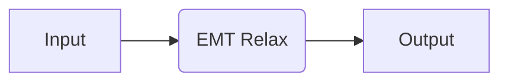
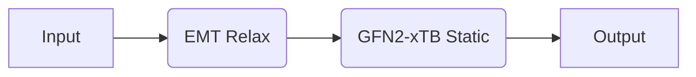

# Intro to Recipes

In quacc, each code comes with [pre-packaged jobs and workflows](recipes_list.md), which we call recipes for short. This tutorial walks you through how to use these provided recipes to run simple calculations that can be tested out on your local machine.

## Pre-Requisites

If you are not yet familiar with the ASE [`Atoms`](https://wiki.fysik.dtu.dk/ase/ase/atoms.html) object, you should read the [ASE tutorial](https://wiki.fysik.dtu.dk/ase/ase/atoms.html). Additionally, it is worthwhile to be familiar with the basics of an ASE [Calculator](https://wiki.fysik.dtu.dk/ase/ase/calculators/calculators.html). The ["Open Science with ASE: Core Tutorials"](https://ase-workshop-2023.github.io/tutorial/) is also an excellent resource for learning about the basics of ASE.

!!! Note

    Since we are not using a workflow engine for these examples, run the following in the command line:

    ```bash
    quacc set WORKFLOW_ENGINE None
    ```

## Examples

### A Simple Calculation with EMT



Let's start with a simple example. Here, we will use a cheap calculator based on effective medium theory (EMT) to run a structure relaxation on a bulk structure of copper. We are interested in doing a structure relaxation, so we will use the [quacc.recipes.emt.core.relax_job][] recipe, as demonstrated below.

```python
from ase.build import bulk
from quacc.recipes.emt.core import relax_job

# Make an Atoms object of a bulk Cu structure
atoms = bulk("Cu")

# Run a structure relaxation on the Atoms object
result = relax_job(atoms)
print(result)
```

??? Info "Printed Output"

    ```python
    {'atoms': Atoms(symbols='Cu', pbc=True, cell=[[0.0, 1.805, 1.805], [1.805, 0.0, 1.805], [1.805, 1.805, 0.0]], initial_magmoms=...),
    'atoms_info': {'\_id': 'f8d53f110f524872f30a5cc20e8befb1'},
    'builder_meta': {'build_date': datetime.datetime(2024, 1, 22, 6, 53, 30, 342389),
    'emmet_version': '0.76.2',
    'pymatgen_version': '2023.12.18'},
    'chemsys': 'Cu',
    'composition': Composition('Cu1'),
    'composition_reduced': Composition('Cu1'),
    'converged': True,
    'density': 8.971719800606017,
    'density_atomic': 11.761470249999999,
    'dir_name': '/home/rosen/test/quacc-2024-01-22-06-53-30-305561-70901',
    'elements': [Element Cu],
    'fmax': 0.01,
    'formula_anonymous': 'A',
    'formula_pretty': 'Cu',
    'input_atoms': {'atoms': Atoms(symbols='Cu', pbc=True, cell=[[0.0, 1.805, 1.805], [1.805, 0.0, 1.805], [1.805, 1.805, 0.0]], calculator=SinglePointCalculator(...)),
    'atoms_info': {},
    'builder_meta': {'build_date': datetime.datetime(2024, 1, 22, 6, 53, 30, 330220),
    'emmet_version': '0.76.2',
    'pymatgen_version': '2023.12.18'},
    'chemsys': 'Cu',
    'composition': Composition('Cu1'),
    'composition_reduced': Composition('Cu1'),
    'density': 8.971719800606017,
    'density_atomic': 11.761470249999999,
    'elements': [Element Cu],
    'formula_anonymous': 'A',
    'formula_pretty': 'Cu',
    'nelements': 1,
    'nsites': 1,
    'symmetry': {'crystal_system': <CrystalSystem.cubic: 'Cubic'>,
    'number': 225,
    'point_group': 'm-3m',
    'symbol': 'Fm-3m',
    'symprec': 0.1,
    'version': '2.2.0'},
    'volume': 11.761470249999999},
    'name': 'EMT Relax',
    'nelements': 1,
    'nid': 'rosen.',
    'nsites': 1,
    'nsteps': 0,
    'parameters': {'asap_cutoff': False},
    'parameters_opt': {'max_steps': 1000,
    'maxstep': 0.2,
    'optimizer': 'FIRE',
    'type': 'optimization'},
    'quacc_version': '0.6.2',
    'results': {'energies': array([-0.00568151]),
    'energy': -0.005681511358588409,
    'forces': array([[0., 0., 0.]]),
    'free_energy': -0.005681511358588409},
    'structure': Structure Summary
    Lattice
    abc : 2.5526554800834367 2.5526554800834367 2.5526554800834367
    angles : 60.00000000000001 60.00000000000001 60.00000000000001
    volume : 11.761470249999999
    A : 0.0 1.805 1.805
    B : 1.805 0.0 1.805
    C : 1.805 1.805 0.0
    pbc : True True True
    PeriodicSite: Cu (0.0, 0.0, 0.0) [0.0, 0.0, 0.0],
    'symmetry': {'crystal_system': <CrystalSystem.cubic: 'Cubic'>,
    'number': 225,
    'point_group': 'm-3m',
    'symbol': 'Fm-3m',
    'symprec': 0.1,
    'version': '2.2.0'},
    'trajectory': [Atoms(symbols='Cu', pbc=True, cell=[[0.0, 1.805, 1.805], [1.805, 0.0, 1.805], [1.805, 1.805, 0.0]], calculator=SinglePointCalculator(...))],
    'trajectory_results': [{'energy': -0.005681511358588409,
    'forces': array([[0., 0., 0.]]),
    'free_energy': -0.005681511358588409,
    'energies': array([-0.00568151])}],
    'volume': 11.761470249999999}
    ```

### A Mixed-Code Workflow



Now let's return to our bulk Cu example from above and start adding on some complexity. Here, we will use EMT to run a relaxation on the bulk Cu structure and then use the output of this calculation as the input to a static calculation with the semi-empirical quantum mechanics method GFN2-xTB as implemented in [quacc.recipes.tblite.core.static_job][].

This example highlights how there are no restrictions in terms of how many codes you can use in a single workflow. It also highlights how you can directly specify optional parameters of a given job.

!!! Note

    Some codes require additional setup, including `tblite` (which can only be `pip` installed on Linux). Refer to the [Calculator Setup](../../install/codes.md) section for details.

```python
from ase.build import bulk
from quacc.recipes.emt.core import relax_job
from quacc.recipes.tblite.core import static_job

# Make an Atoms object of a bulk Cu structure
atoms = bulk("Cu")

# Run a structure relaxation with EMT
result1 = relax_job(atoms)

# Run a static calculation with GFN2-xTB
result2 = static_job(result1["atoms"], method="GFN2-xTB")
print(result2)
```

??? Info "Printed Output"

    ```python
    {'atoms': Atoms(symbols='Cu', pbc=True, cell=[[0.0, 1.805, 1.805], [1.805, 0.0, 1.805], [1.805, 1.805, 0.0]], initial_magmoms=...),
     'atoms_info': {'_id': 'f8d53f110f524872f30a5cc20e8befb1',
      '_old_ids': ['f8d53f110f524872f30a5cc20e8befb1']},
     'builder_meta': {'build_date': datetime.datetime(2024, 1, 22, 7, 7, 50, 448307),
      'emmet_version': '0.76.2',
      'pymatgen_version': '2023.12.18'},
     'chemsys': 'Cu',
     'composition': Composition('Cu1'),
     'composition_reduced': Composition('Cu1'),
     'density': 8.971719800606017,
     'density_atomic': 11.761470249999999,
     'dir_name': '/mnt/c/Users/asros/github/quacc/quacc-2024-01-22-07-07-48-973444-54105',
     'elements': [Element Cu],
     'formula_anonymous': 'A',
     'formula_pretty': 'Cu',
     'input_atoms': {'atoms': Atoms(symbols='Cu', pbc=True, cell=[[0.0, 1.805, 1.805], [1.805, 0.0, 1.805], [1.805, 1.805, 0.0]], initial_magmoms=..., calculator=TBLite(...)),
      'atoms_info': {'_id': 'f8d53f110f524872f30a5cc20e8befb1'},
      'builder_meta': {'build_date': datetime.datetime(2024, 1, 22, 7, 7, 50, 444783),
       'emmet_version': '0.76.2',
       'pymatgen_version': '2023.12.18'},
      'chemsys': 'Cu',
      'composition': Composition('Cu1'),
      'composition_reduced': Composition('Cu1'),
      'density': 8.971719800606017,
      'density_atomic': 11.761470249999999,
      'elements': [Element Cu],
      'formula_anonymous': 'A',
      'formula_pretty': 'Cu',
      'nelements': 1,
      'nsites': 1,
      'symmetry': {'crystal_system': <CrystalSystem.cubic: 'Cubic'>,
       'number': 225,
       'point_group': 'm-3m',
       'symbol': 'Fm-3m',
       'symprec': 0.1,
       'version': '2.2.0'},
      'volume': 11.761470249999999},
     'name': 'TBLite Static',
     'nelements': 1,
     'nid': 'rosen.',
     'nsites': 1,
     'parameters': {'accuracy': 1.0,
      'cache_api': True,
      'electronic_temperature': 300.0,
      'max_iterations': 250,
      'method': 'GFN2-xTB',
      'verbosity': 1},
     'quacc_version': '0.6.2',
     'results': {'charges': array([-4.63868943e-11]),
      'dipole': array([-8.03135613e-08,  1.96843643e-07, -5.14599908e-08]),
      'energy': -318.8584605831394,
      'forces': array([[5.44452313e-20, 5.39007790e-19, 2.45003541e-19]]),
      'free_energy': -318.8584605831394,
      'stress': array([14.65181119, 14.65181119, 14.65181119,  1.40704868,  1.01943286,
              0.63181703])},
     'structure': Structure Summary
     Lattice
         abc : 2.5526554800834367 2.5526554800834367 2.5526554800834367
      angles : 60.00000000000001 60.00000000000001 60.00000000000001
      volume : 11.761470249999999
           A : 0.0 1.805 1.805
           B : 1.805 0.0 1.805
           C : 1.805 1.805 0.0
         pbc : True True True
     PeriodicSite: Cu (0.0, 0.0, 0.0) [0.0, 0.0, 0.0],
     'symmetry': {'crystal_system': <CrystalSystem.cubic: 'Cubic'>,
      'number': 225,
      'point_group': 'm-3m',
      'symbol': 'Fm-3m',
      'symprec': 0.1,
      'version': '2.2.0'},
     'volume': 11.761470249999999}
    ```
