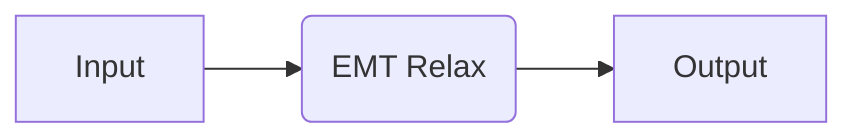
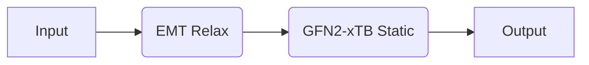

# Intro to Recipes

In quacc, each code comes with pre-packaged jobs and workflows, which we call recipes for short. This tutorial walks you through how to use these provided recipes to run simple calculations that can be tested out on your local machine.

## Pre-Requisites

If you are not yet familiar with the ASE [`Atoms`](https://wiki.fysik.dtu.dk/ase/ase/atoms.html) object, you should read the [ASE tutorial](https://wiki.fysik.dtu.dk/ase/ase/atoms.html). Additionally, it is worthwhile to be familiar with the basics of an ASE [Calculator](https://wiki.fysik.dtu.dk/ase/ase/calculators/calculators.html). The ["Open Science with ASE: Core Tutorials"](https://ase-workshop-2023.github.io/tutorial/) is also an excellent resource for learning about the basics of ASE.

!!! Note

    Since we are not using a workflow engine for these examples, run the following in the command line:

    ```bash
    quacc set WORKFLOW_ENGINE local
    ```

## Examples

### A Simple Calculation with EMT



Let's start with a simple example. Here, we will use a cheap calculator based on effective medium theory (EMT) to run a structure relaxation on a bulk structure of copper. We are interested in doing a structure relaxation, so we will use the [quacc.recipes.emt.core.relax_job][] recipe, as demonstrated below.

```python
from ase.build import bulk
from quacc.recipes.emt.core import relax_job

# Make an Atoms object of a bulk Cu structure
atoms = bulk("Cu")

# Run a structure relaxation on the Atoms object
result = relax_job(atoms)
print(result)
```

??? Info

    ```python
    {
        'atoms': Atoms(symbols='Cu', pbc=True, cell=[[0.0, 1.805, 1.805], [1.805, 0.0, 1.805], [1.805, 1.805, 0.0]], initial_magmoms=...),
        'atoms_info': {'_id': 'f8d53f110f524872f30a5cc20e8befb1'},
        'builder_meta': {
            'build_date': '2023-09-05 23:41:21.241450',
            'database_version': None,
            'emmet_version': '0.67.5',
            'pull_request': None,
            'pymatgen_version': '2023.9.2',
        },
        'chemsys': 'Cu',
        'composition': Composition('Cu1'),
        'composition_reduced': Composition('Cu1'),
        'density': 8.971719800606017,
        'density_atomic': 11.761470249999999,
        'dir_name': '/home/rosen',
        'elements': [Element Cu],
        'formula_anonymous': 'A',
        'formula_pretty': 'Cu',
        'input_structure': {
            'atoms': Atoms(symbols='Cu', pbc=True, cell=[[0.0, 1.805, 1.805], [1.805, 0.0, 1.805], [1.805, 1.805, 0.0]], calculator=SinglePointCalculator(...)),
            'atoms_info': {},
            'builder_meta': {
                'build_date': '2023-09-05 23:41:21.230016',
                'database_version': None,
                'emmet_version': '0.67.5',
                'pull_request': None,
                'pymatgen_version': '2023.9.2',
            },
            'chemsys': 'Cu',
            'composition': Composition('Cu1'),
            'composition_reduced': Composition('Cu1'),
            'density': 8.971719800606017,
            'density_atomic': 11.761470249999999,
            'elements': [Element Cu],
            'formula_anonymous': 'A',
            'formula_pretty': 'Cu',
            'nelements': 1,
            'nsites': 1,
            'structure': Structure Summary
            Lattice
                abc : 2.5526554800834367 2.5526554800834367 2.5526554800834367
            angles : 60.00000000000001 60.00000000000001 60.00000000000001
            volume : 11.761470249999999
                A : 0.0 1.805 1.805
                B : 1.805 0.0 1.805
                C : 1.805 1.805 0.0
                pbc : True True True
            PeriodicSite: Cu (0.0, 0.0, 0.0) [0.0, 0.0, 0.0],
            'symmetry': {
                'crystal_system': <CrystalSystem.cubic: 'Cubic'>,
                'number': 225,
                'point_group': 'm-3m',
                'symbol': 'Fm-3m',
                'symprec': 0.1,
                'version': '2.0.2',
            },
            'volume': 11.761470249999999,
        },
        'name': 'EMT Relax',
        'nelements': 1,
        'nid': 'rosen.',
        'nsites': 1,
        'parameters': {'asap_cutoff': False},
        'parameters_opt': {
            'fmax': 0.01,
            'max_steps': 1000,
            'maxstep': 0.2,
            'optimizer': 'FIRE',
            'restart': None,
            'type': 'optimization',
        },
        'results': {
            'converged': True,
            'energies': array([-0.00568151]),
            'energy': -0.005681511358588409,
            'forces': array([[0., 0., 0.]]),
            'free_energy': -0.005681511358588409,
            'nsteps': 0,
        },
        'structure': Structure Summary
        Lattice
            abc : 2.5526554800834367 2.5526554800834367 2.5526554800834367
        angles : 60.00000000000001 60.00000000000001 60.00000000000001
        volume : 11.761470249999999
            A : 0.0 1.805 1.805
            B : 1.805 0.0 1.805
            C : 1.805 1.805 0.0
            pbc : True True True
        PeriodicSite: Cu (0.0, 0.0, 0.0) [0.0, 0.0, 0.0],
        'symmetry': {
            'crystal_system': <CrystalSystem.cubic: 'Cubic'>,
            'number': 225,
            'point_group': 'm-3m',
            'symbol': 'Fm-3m',
            'symprec': 0.1,
            'version': '2.0.2',
        },
        'trajectory': [
            {
                'atoms': Atoms(symbols='Cu', pbc=True, cell=[[0.0, 1.805, 1.805], [1.805, 0.0, 1.805], [1.805, 1.805, 0.0]], calculator=SinglePointCalculator(...)),
                'atoms_info': {},
                'builder_meta': {
                    'build_date': '2023-09-05 23:41:21.227911',
                    'database_version': None,
                    'emmet_version': '0.67.5',
                    'pull_request': None,
                    'pymatgen_version': '2023.9.2',
                },
                'chemsys': 'Cu',
                'composition': Composition('Cu1'),
                'composition_reduced': Composition('Cu1'),
                'density': 8.971719800606017,
                'density_atomic': 11.761470249999999,
                'elements': [Element Cu],
                'formula_anonymous': 'A',
                'formula_pretty': 'Cu',
                'nelements': 1,
                'nsites': 1,
                'structure': Structure Summary
                Lattice
                    abc : 2.5526554800834367 2.5526554800834367 2.5526554800834367
                angles : 60.00000000000001 60.00000000000001 60.00000000000001
                volume : 11.761470249999999
                    A : 0.0 1.805 1.805
                    B : 1.805 0.0 1.805
                    C : 1.805 1.805 0.0
                    pbc : True True True
                PeriodicSite: Cu (0.0, 0.0, 0.0) [0.0, 0.0, 0.0],
                'symmetry': {
                    'crystal_system': <CrystalSystem.cubic: 'Cubic'>,
                    'number': 225,
                    'point_group': 'm-3m',
                    'symbol': 'Fm-3m',
                    'symprec': 0.1,
                    'version': '2.0.2',
                },
                'volume': 11.761470249999999,
            },
        ],
        'trajectory_results': [
            {
                'energies': array([-0.00568151]),
                'energy': -0.005681511358588409,
                'forces': array([[0., 0., 0.]]),
                'free_energy': -0.005681511358588409,
            },
        ],
        'volume': 11.761470249999999,
    }
    ```

### A Simple Mixed-Code Workflow



Now let's return to our bulk Cu example from above and start adding on some complexity. Here, we will use EMT to run a relaxation on the bulk Cu structure and then use the output of this calculation as the input to a static calculation with the semi-empirical quantum mechanics method GFN2-xTB as implemented in [quacc.recipes.tblite.core.static_job][]. This example highlights how there are no restrictions in terms of how many codes you can use in a single workflow.

!!! Note

    Some codes require additional setup, including `tblite` (which can only be `pip` installed on Linux). Refer to the [Calculator Setup](../../install/codes.md) section for details.

```python
from ase.build import bulk
from quacc.recipes.emt.core import relax_job
from quacc.recipes.tblite.core import static_job

# Make an Atoms object of a bulk Cu structure
atoms = bulk("Cu")

# Run a structure relaxation with EMT
result1 = relax_job(atoms)

# Run a static calculation with GFN2-xTB
result2 = static_job(result1, method="GFN2-xTB")
print(result2)
```

??? Info

    ```python
    {
        'atoms': Atoms(symbols='Cu', pbc=True, cell=[[0.0, 1.805, 1.805], [1.805, 0.0, 1.805], [1.805, 1.805, 0.0]], initial_magmoms=...),
        'atoms_info': {
            '_id': 'f8d53f110f524872f30a5cc20e8befb1',
            '_old_ids': ['f8d53f110f524872f30a5cc20e8befb1'],
        },
        'builder_meta': {
            'build_date': '2023-09-05 23:42:04.661663',
            'database_version': None,
            'emmet_version': '0.67.5',
            'pull_request': None,
            'pymatgen_version': '2023.9.2',
        },
        'chemsys': 'Cu',
        'composition': Composition('Cu1'),
        'composition_reduced': Composition('Cu1'),
        'density': 8.971719800606017,
        'density_atomic': 11.761470249999999,
        'dir_name': '/home/rosen',
        'elements': [Element Cu],
        'formula_anonymous': 'A',
        'formula_pretty': 'Cu',
        'input_atoms': {
            'atoms': Atoms(symbols='Cu', pbc=True, cell=[[0.0, 1.805, 1.805], [1.805, 0.0, 1.805], [1.805, 1.805, 0.0]], initial_magmoms=..., calculator=TBLite(...)),
            'atoms_info': {'_id': 'f8d53f110f524872f30a5cc20e8befb1'},
            'builder_meta': {
                'build_date': '2023-09-05 23:42:04.659582',
                'database_version': None,
                'emmet_version': '0.67.5',
                'pull_request': None,
                'pymatgen_version': '2023.9.2',
            },
            'chemsys': 'Cu',
            'composition': Composition('Cu1'),
            'composition_reduced': Composition('Cu1'),
            'density': 8.971719800606017,
            'density_atomic': 11.761470249999999,
            'elements': [Element Cu],
            'formula_anonymous': 'A',
            'formula_pretty': 'Cu',
            'nelements': 1,
            'nsites': 1,
            'structure': Structure Summary
            Lattice
                abc : 2.5526554800834367 2.5526554800834367 2.5526554800834367
            angles : 60.00000000000001 60.00000000000001 60.00000000000001
            volume : 11.761470249999999
                A : 0.0 1.805 1.805
                B : 1.805 0.0 1.805
                C : 1.805 1.805 0.0
                pbc : True True True
            PeriodicSite: Cu (0.0, 0.0, 0.0) [0.0, 0.0, 0.0],
            'symmetry': {
                'crystal_system': <CrystalSystem.cubic: 'Cubic'>,
                'number': 225,
                'point_group': 'm-3m',
                'symbol': 'Fm-3m',
                'symprec': 0.1,
                'version': '2.0.2',
            },
            'volume': 11.761470249999999,
        },
        'name': 'TBLite Static',
        'nelements': 1,
        'nid': 'rosen.',
        'nsites': 1,
        'parameters': {
            'accuracy': 1.0,
            'cache_api': True,
            'electronic_temperature': 300.0,
            'max_iterations': 250,
            'method': 'GFN2-xTB',
            'verbosity': 1,
        },
        'results': {
            'charges': array([-4.63948879e-11]),
            'dipole': array([-7.99564819e-08,  1.96234891e-07, -5.12273395e-08]),
            'energy': -318.8584605831406,
            'forces': array([[5.44452313e-20, 5.39007790e-19, 2.45003541e-19]]),
            'free_energy': -318.8584605831406,
            'stress': array([14.65181119, 14.65181119, 14.65181119,  1.40704868,  1.01943286,
                    0.63181703]),
        },
        'structure': Structure Summary
        Lattice
            abc : 2.5526554800834367 2.5526554800834367 2.5526554800834367
        angles : 60.00000000000001 60.00000000000001 60.00000000000001
        volume : 11.761470249999999
            A : 0.0 1.805 1.805
            B : 1.805 0.0 1.805
            C : 1.805 1.805 0.0
            pbc : True True True
        PeriodicSite: Cu (0.0, 0.0, 0.0) [0.0, 0.0, 0.0],
        'symmetry': {
            'crystal_system': <CrystalSystem.cubic: 'Cubic'>,
            'number': 225,
            'point_group': 'm-3m',
            'symbol': 'Fm-3m',
            'symprec': 0.1,
            'version': '2.0.2',
        },
        'volume': 11.761470249999999,
    }
    ```

## Concluding Comments

At this point, you now have the basic idea of how quacc recipes work!

If you don't care about using a workflow engine, feel free to write simple quacc-based Python scripts and submit them as-is using your favorite computing machine and scheduler. However, if you are looking to efficiently scale up and monitor large numbers of workflows, continue reading!
