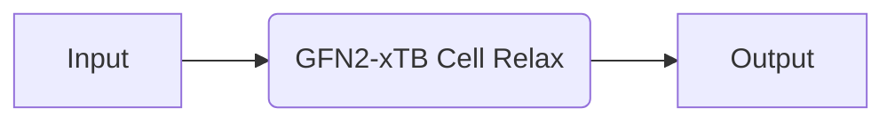
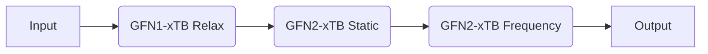

# TBLite

Recipes based on the [TBLite](https://github.com/tblite/tblite) code, which has a Python interface to the [xtb](https://github.com/grimme-lab/xtb) library for semi-empirical tight-binding calculations.

## Available Recipes

| Recipe                                                                                                                                                 | Description                                     |
| ------------------------------------------------------------------------------------------------------------------------------------------------------ | ----------------------------------------------- |
| [`tblie.core.relax_job`](https://quantum-accelerators.github.io/quacc/reference/quacc/recipes/tblite/core.html#quacc.recipes.tblite.core.relax_job)    | Relax a molecule or crystal.                    |
| [`tblite.core.static_job`](https://quantum-accelerators.github.io/quacc/reference/quacc/recipes/tblite/core.html#quacc.recipes.tblite.core.static_job) | Static calculation on a molecule or crystal.    |
| [`tblite.core.freq_job`](https://quantum-accelerators.github.io/quacc/reference/quacc/recipes/tblite/core.html#quacc.recipes.tblite.core.freq_job)     | Frequency calculation on a molecule or crystal. |

## Examples

### Core Recipes



=== "No Workflow Engine"

    ```python
    from ase.build import bulk
    from quacc.recipes.tblite.core import relax_job

    atoms = bulk("C")
    output = relax_job(atoms, relax_cell=True)
    ```

=== "Covalent"

    ```python
    import covalent as ct
    from ase.build import bulk
    from quacc import flow
    from quacc.recipes.tblite.core import relax_job


    @flow
    def workflow(atoms):
        output = relax_job(atoms, relax_cell=True)
        return output


    atoms = bulk("C")

    dispatch_id = ct.dispatch(workflow)(atoms)
    ct.get_result(dispatch_id, wait=True)
    ```

=== "Parsl"

    ```python
    from ase.build import bulk
    from quacc.recipes.tblite.core import relax_job

    atoms = bulk("C")
    future = relax_job(atoms, relax_cell=True)
    future.result()
    ```



=== "No Workflow Engine"

    ```python
    from ase.build import molecule
    from ase.optimize import BFGS
    from quacc.recipes.tblite.core import freq_job, relax_job, static_job

    atoms = molecule("CH4")
    output1 = relax_job(atoms, method="GFN1-xTB", opt_swaps={"optimizer": BFGS})
    output2 = static_job(output1)
    output3 = freq_job(
        atoms, energy=output2["results"]["energy"], temperature=300.0, pressure=2.0
    )
    ```

=== "Covalent"

    ```python
    import covalent as ct
    from ase.build import molecule
    from ase.optimize import BFGS
    from quacc import flow
    from quacc.recipes.tblite.core import freq_job, relax_job, static_job


    @flow
    def workflow(atoms):
        output1 = relax_job(atoms, method="GFN1-xTB", opt_swaps={"optimizer": BFGS})
        output2 = static_job(output1)
        output3 = freq_job(
            atoms, energy=output2["results"]["energy"], temperature=300.0, pressure=2.0
        )
        return outpu3


    atoms = molecule("CH4")

    dispatch_id = ct.dispatch(workflow)(atoms)
    ct.get_result(dispatch_id, wait=True)
    ```

=== "Parsl"

    ```python
    from ase.build import molecule
    from ase.optimize import BFGS
    from quacc.recipes.tblite.core import freq_job, relax_job, static_job

    atoms = molecule("CH4")
    future1 = relax_job(atoms, method="GFN1-xTB", opt_swaps={"optimizer": BFGS})
    future2 = static_job(future1)
    future3 = freq_job(
        atoms, energy=future2.result()["results"]["energy"], temperature=300.0, pressure=2.0
    )
    future3.result()
    ```
