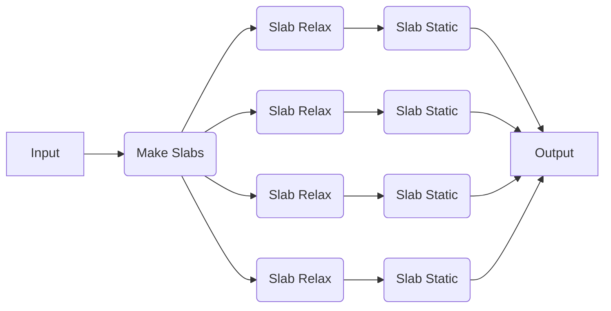

# Pre-Defined Workflows

In addition to individual jobs, quacc ships with a variety of pre-made workflows. Here, we will run the following pre-made workflow with EMT, defined by [quacc.recipes.emt.slabs.bulk_to_slabs_flow][].



Since we are running everything locally for now, every calculation will be run serially. As discussed in the following sections, using a workflow manager will allow us to run these calculations in parallel on one or more remote machines.

## A Representative Example

Like before, we import the pre-made recipe, pass it the `Atoms` object, and then print the results.

```python
from ase.build import bulk
from quacc.recipes.emt.slabs import bulk_to_slabs_flow

# Define the Atoms object
atoms = bulk("Cu")

# Define the workflow
result = bulk_to_slabs_flow(atoms)

# Print the result
print(result)
```

??? Tip "Modifying the Parameters for Jobs in a Pre-Made Flow"

    To modify the default parameters of a subset of jobs in a pre-made workflow, you can pass a dictionary of parameters to the `job_params` keyword argument of the workflow function. For example, to tighten the force tolerance of the `relax_job` step in the aforementioned recipe, you can do the following:

    ```python
    bulk_to_slabs_flow(atoms, job_params={"relax_job": {"opt_params": {"fmax": 1e-4}}})
    ```

    To modify the default parameters of all the jobs in a pre-made workflow, such as the EMT calculator's `asap_cutoff` paramter, you can use the "all" keyword as a shorthand:

    ```python
    bulk_to_slabs_flow(atoms, job_params={"all": {"asap_cutoff": True}})
    ```

## Concluding Comments

At this point, you now have the basic idea of how quacc recipes work!

If you don't care about using a workflow engine, feel free to write simple quacc-based Python scripts and submit them as-is using your favorite computing machine and scheduler. However, if you are looking to efficiently scale up and monitor large numbers of workflows, continue reading!
