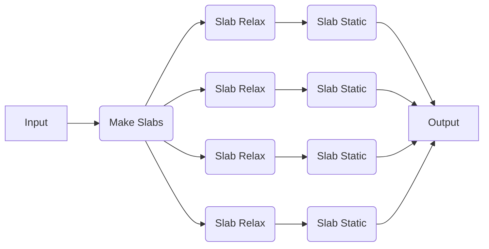

# Intro to Flows

In addition to individual jobs, quacc ships with a variety of pre-made workflows, which we call flows for short. Here, we will run a pre-made flow with EMT, defined by [quacc.recipes.emt.slabs.bulk_to_slabs_flow][] and described by the following graph representation:



Since we are running everything locally for now, every calculation will be run serially. As discussed in the following sections, using a workflow manager will allow us to run these calculations in parallel on one or more remote machines.

## A Representative Example

Like before, we import the pre-made recipe, pass it the `Atoms` object, and then print the results.

```python
from ase.build import bulk
from quacc.recipes.emt.slabs import bulk_to_slabs_flow

# Define the Atoms object
atoms = bulk("Cu")

# Define the workflow
result = bulk_to_slabs_flow(atoms)

# Print the result
print(result)
```

## Modifying Jobs in a Pre-Made Flow

### Modifying a Subset of Jobs

To modify the default parameters of a subset of jobs in a pre-made workflow, you can pass a dictionary of parameters to the `job_params` keyword argument of the workflow function (note: the name and `@job` definition for each step in the pre-made workflow is specified in the flow's docstring). The example below sets `fmax=1e-4` for the `relax_job` called within `bulk_to_slabs_flow`:

```python
from ase.build import bulk
from quacc.recipes.emt.slabs import bulk_to_slabs_flow

# Define the Atoms object
atoms = bulk("Cu")

# Define the workflow with modified parameters for the `relax_job` step
result = bulk_to_slabs_flow(atoms, job_params={"relax_job": {"fmax": 1e-4}})

# Print the result
print(result)
```

### Modifying All Jobs

To modify the default parameters of all the jobs in a pre-made workflow, you can use the "all" keyword as a shorthand. The example below modifies the EMT calculator's `asap_cutoff` parameter for all jobs in the `bulk_to_slabs_flow`:

```python
from ase.build import bulk
from quacc.recipes.emt.slabs import bulk_to_slabs_flow

# Define the Atoms object
atoms = bulk("Cu")

# Define the workflow with modified parameters for all jobs in the flow
result = bulk_to_slabs_flow(atoms, job_params={"all": {"asap_cutoff": True}})

# Print the result
print(result)
```

## Concluding Comments

At this point, you now have the basic idea of how quacc recipes work!

If you don't care about using a workflow engine, feel free to write simple quacc-based Python scripts and submit them as-is using your favorite computing machine and scheduler. However, if you are looking to efficiently scale up and monitor large numbers of workflows, continue reading!
