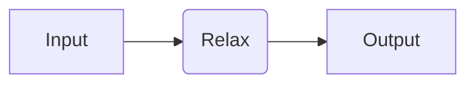
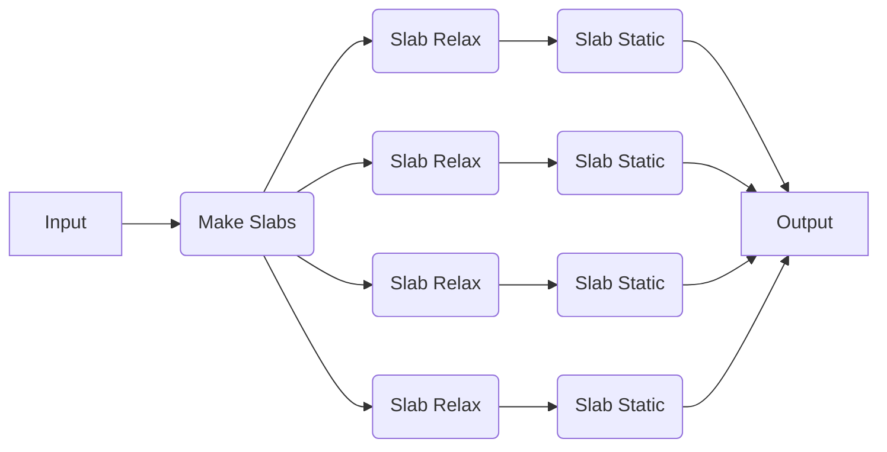

# Pre-Defined Recipes

Here, we will show how to use quacc with one of a variety of workflow engines to construct, dispatch, and monitor your calculations. If you haven't installed your workflow engine dependencies yet, refer to the [Worfklow Engine Setup guide](../../install/wflow_engines.md).

In quacc, there are two types of recipes:

1. Individual compute jobs with the suffix `_job` that have been pre-defined with a `#!Python @job` decorator.
2. Multi-step workflows with the suffix `_flow` that have been pre-defined with a `#!Python @flow` decorator.

## Running a Pre-Defined Job

We will now try running a pre-defined job where we relax a bulk Cu structure using EMT, which is pre-defined in quacc as [`quacc.recipes.emt.core.relax_job`](https://quantum-accelerators.github.io/quacc/reference/quacc/recipes/emt/core.html#quacc.recipes.emt.core.relax_job).



=== "Covalent"

    !!! Important

        If you haven't done so yet, make sure you started the Covalent server with `covalent start` in the command-line.

        Also tell quacc that you wish to use Covalent by running `quacc use covalent` in the command-line.

    ```python
    import covalent as ct
    from ase.build import bulk
    from quacc import flow
    from quacc.recipes.emt.core import relax_job

    # Make an Atoms object of a bulk Cu structure
    atoms = bulk("Cu")

    # Define the workflow
    workflow = flow(relax_job)  # (1)!

    # Dispatch the workflow to the Covalent server
    # with the bulk Cu Atoms object as the input
    dispatch_id = workflow(atoms)  # (2)!

    # Fetch the result from the server
    result = ct.get_result(dispatch_id, wait=True)  # (3)!
    print(result)
    ```

    1. This is shorthand for the following:

        ```python
        @flow
        def workflow(atoms):
            return relax_job(atoms)
        ```

        Also note that the `relax_job` function was pre-defined in quacc with a `#!Python @job` decorator, which is why we did not need to include it here.

    2. Because the workflow was defined as a `#!Python Flow`, it will be sent to the Covalent server and a dispatch ID will be returned.

    3. You don't need to set `wait=True` in practice. Once you dispatch the workflow, it will begin running (if the resources are available). The `ct.get_result` function is used to fetch the workflow status and results from the server.

=== "Parsl"

    !!! Important

        If you haven't done so yet, make sure you have loaded a Parsl configuration in your Python script. An example for running on your local machine is included below.

        ```python
        import parsl

        parsl.load()
        ```

        Also tell quacc that you wish to use Parsl by running `quacc use parsl` in the command-line.

    ```python
    from ase.build import bulk
    from quacc.recipes.emt.core import relax_job

    # Make an Atoms object of a bulk Cu structure
    atoms = bulk("Cu")

    # Call the PythonApp
    future = relax_job(atoms)  # (1)!

    # Print result
    print(future.result())  # (2)!
    ```

    1. The `relax_job` function was pre-defined in quacc with a `#!Python @job` decorator, which is why we did not need to include it here. We also did not need to use a `#!Python @flow` decorator because Parsl does not have an analogous decorator.

    2. The use of `.result()` serves to block any further calculations from running until it is resolved. Calling `.result()` also returns the function output as opposed to the `AppFuture` object.

=== "Jobflow"

    !!! Important

        Tell quacc that you wish to use Parsl by running `quacc use jobflow` in the command-line.

    ```python
    import jobflow as jf
    from ase.build import bulk
    from quacc.recipes.emt.core import relax_job

    # Make an Atoms object of a bulk Cu structure
    atoms = bulk("Cu")

    # Define the Job
    job = relax_job(atoms)  # (1)!

    # Run the job locally
    responses = jf.run_locally(job, create_folders=True)  # (2)!

    # Get the result
    result = responses[job.uuid][1].output
    print(result)
    ```

    1. The `relax_job` function was pre-defined in quacc with a `#!Python @job` decorator, which is why we did not need to include it here.

    2. We chose to run the job locally, but other workflow managers supported by Jobflow can be imported and used.

## Running a Pre-Defined Workflow

We will now try running a pre-defined workflow where we carve all possible slabs from a given structure, run a new relaxation calculation on each slab, and then a static calculation for each relaxed slab. This is implemented in [`quacc.recipes.emt.slabs.bulk_to_slabs_flow`](https://quantum-accelerators.github.io/quacc/reference/quacc/recipes/emt/slabs.html#quacc.recipes.emt.slabs.bulk_to_slabs_flow).



=== "Covalent"

    ```python
    import covalent as ct
    from ase.build import bulk
    from quacc.recipes.emt.slabs import bulk_to_slabs_flow

    # Define the Atoms object
    atoms = bulk("Cu")

    # Dispatch the workflow
    dispatch_id = bulk_to_slabs_flow(atoms)  # (1)!

    # Print the results
    result = ct.get_result(dispatch_id, wait=True)
    print(result)
    ```

    1. We didn't need to wrap `bulk_to_slabs_flow` with a decorator because it is already pre-decorated with a `@flow` decorator.

=== "Parsl"

    ```python
    from ase.build import bulk
    from quacc.recipes.emt.slabs import bulk_to_slabs_flow

    # Define the Atoms object
    atoms = bulk("Cu")

    # Define the workflow
    future = bulk_to_slabs_flow(atoms)  # (1)!

    # Print the results
    print(future.result())
    ```

    1. We didn't need to wrap `bulk_to_slabs_flow` with a decorator because it is already pre-decorated with a `@flow` decorator.

=== "Jobflow"

    Due to the difference in how Jobflow handles dynamic workflows compared to Covalent and Parsl, any quacc recipes that have been pre-defined with a `#!Python @flow` decorator (i.e. those with `_flow` in the name) cannot be used with Jobflow directly.

    That said, quacc fully supports custom Jobflow-based workflows to resolve this limitation. For example, instead of using [`.emt.slabs.bulk_to_slabs_flow`](https://quantum-accelerators.github.io/quacc/reference/quacc/recipes/emt/slabs.html#quacc.recipes.emt.slabs.bulk_to_slabs_flow), this workflow can be equivalently run as follows using the Jobflow-specific [`.emt._jobflow.slabs.bulk_to_slabs_flow`](https://quantum-accelerators.github.io/quacc/reference/quacc/recipes/emt/_jobflow/slabs.html#quacc.recipes.emt._jobflow.slabs.bulk_to_slabs_flow) function.

    ```python
    import jobflow as jf
    from ase.build import bulk
    from quacc.recipes.emt._jobflow.slabs import bulk_to_slabs_flow

    # Define the Atoms object
    atoms = bulk("Cu")

    # Construct the Flow
    flow = bulk_to_slabs_flow(atoms)

    # Run the workflow locally
    jf.run_locally(flow, create_folders=True)
    ```

    In the case of the Jobflow-specific `bulk_to_slabs_flow`, it returns a [`Response(replace)`](<https://materialsproject.github.io/jobflow/tutorials/5-dynamic-flows.html#The-Response(replace)-option>) object that dynamically replaces the `Flow` with several downstream jobs.
