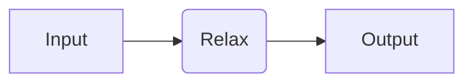
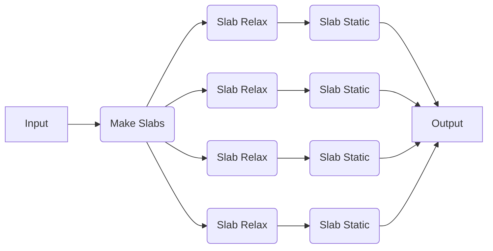

# Pre-Defined Recipes

Here, we will show how to use quacc with one of a variety of workflow engines to construct, dispatch, and monitor your calculations. In quacc, there are two types of recipes:

1. Individual compute jobs with the suffix `_job` that have been pre-defined with a `#!Python @job` decorator.
2. Multi-step workflows with the suffix `_flow` that have been pre-defined with a `#!Python @flow` decorator.

## Running a Pre-Defined Job

We will now try running a job where we relax a bulk Cu structure using EMT, which is pre-defined in quacc as [quacc.recipes.emt.core.relax_job][].



=== "Dask"

    !!! Important

        If you haven't done so yet, make sure you update the quacc `WORKFLOW_ENGINE` [configuration variable](../settings/settings.md) and load the default Dask cluster:

        ```bash title="terminal"
        quacc set WORKFLOW_ENGINE dask
        ```

        ```python title="python"
        from dask.distributed import Client

        client = Client()
        ```

    ```python
    from ase.build import bulk
    from quacc.recipes.emt.core import relax_job

    # Make an Atoms object of a bulk Cu structure
    atoms = bulk("Cu")

    # Call the PythonApp
    delayed = relax_job(atoms)  # (1)!

    # Print result
    result = client.compute(delayed).result()  #  (2)!
    print(result)
    ```

    1. The `relax_job` function was pre-defined in quacc with a `#!Python @job` decorator, which is why we did not need to include it here. We also did not need to use a `#!Python @flow` decorator because Dask does not have an analogous decorator. At this point, we have a `Delayed` object.

    2. Calling `client.compute(delayed)` dispatches the compute job to the active Dask cluster and returns a `Future`. The use of `.result()` serves to block any further calculations from running and resolves the `Future`. You could also achieve the same result by doing `#!Python delayed.compute()`, which will dispatch and resolve the `Future` as one action. This is identical to `#!Python result = dask.compute(delayed)[0]`, where the `[0]` indexing is needed because `#!Python dask.compute` always returns a tuple.

=== "Parsl"

    !!! Important

        If you haven't done so yet, make sure you update the quacc `WORKFLOW_ENGINE` [configuration variable](../settings/settings.md) and load the default Parsl configuration:

        ```bash title="terminal"
        quacc set WORKFLOW_ENGINE parsl
        ```

        ```python title="python"
        import parsl

        parsl.load()
        ```

    ```python
    from ase.build import bulk
    from quacc.recipes.emt.core import relax_job

    # Make an Atoms object of a bulk Cu structure
    atoms = bulk("Cu")

    # Call the PythonApp
    future = relax_job(atoms)  # (1)!

    # Print result
    print(future.result())  # (2)!
    ```

    1. The `relax_job` function was pre-defined in quacc with a `#!Python @job` decorator, which is why we did not need to include it here. We also did not need to use a `#!Python @flow` decorator because Parsl does not have an analogous decorator.

    2. The use of `.result()` serves to block any further calculations from running until it is resolved. Calling `.result()` also returns the function output as opposed to the `AppFuture` object.

=== "Prefect"

    !!! Important

        If you haven't done so yet, make sure you update the quacc `WORKFLOW_ENGINE` [configuration variable](../settings/settings.md):

        ```bash title="terminal"
        quacc set WORKFLOW_ENGINE prefect
        ```

    ```python
    from ase.build import bulk
    from quacc import flow
    from quacc.recipes.emt.core import relax_job

    # Make an Atoms object of a bulk Cu structure
    atoms = bulk("Cu")


    # Define the workflow
    @flow
    def workflow(atoms):
        return relax_job(atoms)  # (1)!


    # Dispatch the workflow
    result = workflow(atoms)  # (2)!

    print(result)
    ```

    1. The `relax_job` function was pre-defined in quacc with a `#!Python @job` decorator, which is why we did not need to include it here.

    2. The workflow has been dispatched to the Prefect server at this point and the result returned.

=== "Redun"

    !!! Important

        If you haven't done so yet, make sure you update the quacc `WORKFLOW_ENGINE` [configuration variable](../settings/settings.md):

        ```bash
        quacc set WORKFLOW_ENGINE redun
        ```

    ```python
    from ase.build import bulk
    from redun import Scheduler
    from quacc.recipes.emt.core import relax_job

    # Instantiate the scheduler
    scheduler = Scheduler()

    # Make an Atoms object of a bulk Cu structure
    atoms = bulk("Cu")

    # Dispatch the workflow
    result = scheduler.run(relax_job(atoms))  # (1)!
    print(result)
    ```

    1. The `relax_job` function was pre-defined in quacc with a `#!Python @job` decorator, which is why we did not need to include it here.

=== "Jobflow"

    !!! Important

        If you haven't done so yet, make sure you update the quacc `WORKFLOW_ENGINE` [configuration variable](../settings/settings.md):

        ```bash
        quacc set WORKFLOW_ENGINE jobflow
        ```

    ```python
    import jobflow as jf
    from ase.build import bulk
    from quacc.recipes.emt.core import relax_job

    # Make an Atoms object of a bulk Cu structure
    atoms = bulk("Cu")

    # Define the Job
    job = relax_job(atoms)  # (1)!

    # Run the job locally
    responses = jf.run_locally(job, ensure_success=True, create_folders=True)  # (2)!

    # Get the result
    result = responses[job.uuid][1].output
    print(result)
    ```

    1. The `relax_job` function was pre-defined in quacc with a `#!Python @job` decorator, which is why we did not need to include it here.

    2. We chose to run the job locally, but other workflow managers supported by Jobflow can be imported and used.

## Running a Pre-Defined Workflow

We will now try running a pre-defined workflow where we carve all possible slabs from a given structure, run a new relaxation calculation on each slab, and then a static calculation for each relaxed slab. This is implemented in [quacc.recipes.emt.slabs.bulk_to_slabs_flow][].



=== "Dask"

    ```python
    from ase.build import bulk
    from quacc.recipes.emt.slabs import bulk_to_slabs_flow

    # Define the Atoms object
    atoms = bulk("Cu")

    # Define the workflow
    delayed = bulk_to_slabs_flow(atoms)

    # Print the results
    result = client.compute(delayed).result()
    print(result)
    ```

=== "Parsl"

    ```python
    from ase.build import bulk
    from quacc.recipes.emt.slabs import bulk_to_slabs_flow

    # Define the Atoms object
    atoms = bulk("Cu")

    # Define the workflow
    future = bulk_to_slabs_flow(atoms)

    # Print the results
    print(future.result())
    ```

=== "Prefect"

    ```python
    from ase.build import bulk
    from quacc.recipes.emt.slabs import bulk_to_slabs_flow

    # Define the Atoms object
    atoms = bulk("Cu")

    # Dispatch the workflow and get results
    results = bulk_to_slabs_flow(atoms)

    # Print the results
    print(results)
    ```

=== "Redun"

    ```python
    from ase.build import bulk
    from redun import Scheduler
    from quacc.recipes.emt.slabs import bulk_to_slabs_flow

    # Instantiate the scheduler
    scheduler = Scheduler()

    # Define the Atoms object
    atoms = bulk("Cu")

    # Define the workflow
    result = scheduler.run(bulk_to_slabs_flow(atoms))  # (1)!

    # Print the results
    print(result)
    ```

    1. We didn't need to wrap `bulk_to_slabs_flow` with a decorator because it is already pre-decorated with a `#!Python @flow` decorator.

=== "Jobflow"

    !!! Warning

        Due to the difference in how Jobflow handles workflows (particularly dynamic ones) compared to other supported workflow engines, any quacc recipes that have been pre-defined with a `#!Python @flow` decorator (i.e. have `_flow` in the name) cannot be run directly with Jobflow. Rather, a Jobflow-specific `Flow` needs to be constructed by the user.
