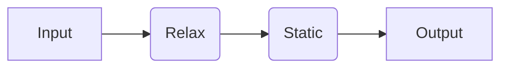
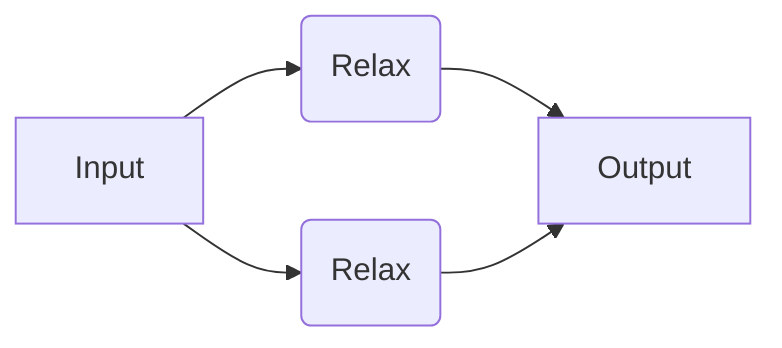
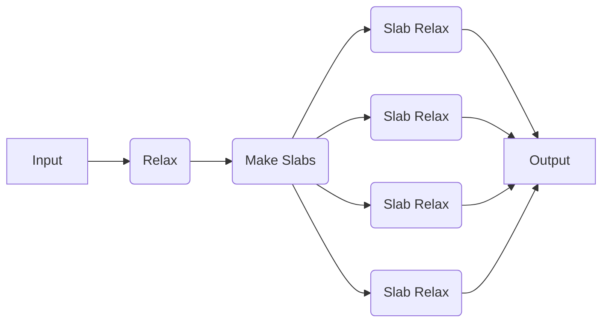

# User-Constructed Workflows

Here, we will show how to use combine quacc jobs and workflows into your own custom workflows that can be run with your chosen workflow engine.

## Running a User-Constructed Serial Workflow

We will now try running a simple workflow where we relax a bulk Cu structure using EMT and take the output of that calculation as the input to a follow-up static calculation with EMT.



=== "Covalent"

    !!! Important

        If you haven't done so yet, make sure you started the Covalent server with `covalent start` in the command-line.

        Also make sure you have specified `"covalent"` as the `WORKFLOW_ENGINE` in your [quacc settings](../settings.md).

    ```python
    import covalent as ct
    from ase.build import bulk
    from quacc import flow
    from quacc.recipes.emt.core import relax_job, static_job


    # Define the workflow
    @flow  # (1)!
    def workflow(atoms):
        # Define Job 1
        result1 = relax_job(atoms)  # (2)!

        # Define Job 2, which takes the output of Job 1 as input
        result2 = static_job(result1)

        return result2


    # Make an Atoms object of a bulk Cu structure
    atoms = bulk("Cu")

    # Dispatch the workflow to the Covalent server
    # with the bulk Cu Atoms object as the input
    dispatch_id = ct.dispatch(workflow)(atoms)  # (3)!

    # Fetch the result from the server
    result = ct.get_result(dispatch_id, wait=True)  # (4)!
    print(result)
    ```

    1. The `#!Python @flow` decorator defines the workflow that will be executed.

    2. The `relax_job` function was pre-defined in quacc with a `#!Python @job` decorator, which is why did not need to include it here.

    3. Because the workflow is only sent to the server with `ct.dispatch`, calling `workflow(atoms)` would run the workflow as if Covalent were not being used at all.

    4. You don't need to set `wait=True` in practice. Once you call `ct.dispatch`, the workflow will begin running. The `ct.get_result` function is used to fetch the workflow status and results from the server.

    With Covalent as the workflow engine, quacc will automatically construct a directed acyclic graph of the inputs and outputs for each calculation to determine which jobs are dependent on one another and the order the jobs should be run. In this example, Covalent will know not to run `static_job` until `relax_job` has completed successfully.

    

=== "Parsl"

    !!! Important

        If you haven't done so yet, make sure you have loaded a Parsl configuration in your Python script. An example for running on your local machine is included below.

        ```python
        import parsl

        parsl.load()
        ```

        Also make sure you have specified `"parsl"` as the `WORKFLOW_ENGINE` in your [quacc settings](../settings.md).

    ```python
    from ase.build import bulk
    from quacc.recipes.emt.core import relax_job, static_job

    # Make an Atoms object of a bulk Cu structure
    atoms = bulk("Cu")

    # Call App 1
    future1 = relax_job(atoms)  # (1)!

    # Call App 2, which takes the output of App 1 as input
    future2 = static_job(future1)

    # Print result
    print(future2.result())  # (2)!
    ```

    1. The `relax_job` function was pre-defined in quacc with a `#!Python @job` decorator, which is why did not need to include it here.

    2. The use of `.result()` serves to block any further calculations from running until it is resolved. Calling `.result()` also returns the function output as opposed to the `AppFuture` object.

    !!! Note

        Parsl `PythonApp`/`JoinApp` objects will implicitly know to call `.result()` on any `AppFuture` it receives. As such, you should avoid calling `.result()` within a `PythonApp`/`JoinApp` definition or between `PythonApp`/`JoinApp` objects if possible.

=== "Jobflow"

    !!! Important

        Make sure you have specified `"jobflow"` as the `WORKFLOW_ENGINE` in your [quacc settings](../settings.md).

    ```python
    import jobflow as jf
    from ase.build import bulk
    from quacc.recipes.emt.core import relax_job, static_job

    # Make an Atoms object of a bulk Cu structure
    atoms = bulk("Cu")

    # Define Job 1
    job1 = relax_job(atoms)  # (1)!

    # Define Job 2, which takes the output of Job 1 as input
    job2 = static_job(job1.output)  # (2)!

    # Define the workflow
    workflow = jf.Flow([job1, job2])  # (3)!

    # Run the workflow locally
    responses = jf.run_locally(workflow, create_folders=True)  # (4)!

    # Get the result
    result = responses[job2.uuid][1].output
    print(result)
    ```

    1. The `relax_job` function was pre-defined in quacc with a `#!Python @job` decorator, which is why did not need to include it here.

    2. In Jobflow, each `Job` is only a reference and so the `.output` must be explicitly passed between jobs.

    3. We must stitch the individual `Job` objects together into a `jf.Flow`, which can be easily achieved by passing them as a list to the `jf.Flow()` constructor.

    4. We chose to run the job locally, but other workflow managers supported by Jobflow can be imported and used.

### Running a User-Constructed Parallel Workflow

Now let's consider a similar but nonetheless distinct example. Here, we will define a workflow where we will carry out two EMT structure relaxations, but the two jobs are not dependent on one another. In this example, Covalent will know that it can run the two jobs separately, and even if Job 1 were to fail, Job 2 would still progress.



=== "Covalent"

    ```python
    from ase.build import bulk, molecule
    from quacc import flow
    from quacc.recipes.emt.core import relax_job


    # Define workflow
    @flow
    def workflow(atoms1, atoms2):
        # Define two independent relaxation jobs
        result1 = relax_job(atoms1)
        result2 = relax_job(atoms2)

        return {"result1": result1, "result2": result2}


    # Define two Atoms objects
    atoms1 = bulk("Cu")
    atoms2 = molecule("N2")

    # Dispatch the workflow to the Covalent server
    dispatch_id = ct.dispatch(workflow)(atoms1, atoms2)

    # Fetch the results from the server
    result = ct.get_result(dispatch_id, wait=True)
    print(result)
    ```

    

=== "Parsl"

    ```python
    from ase.build import bulk, molecule
    from quacc.recipes.emt.core import relax_job

    # Define two Atoms objects
    atoms1 = bulk("Cu")
    atoms2 = molecule("N2")

    # Define two independent relaxation jobs
    future1 = relax_job(atoms1)
    future2 = relax_job(atoms2)

    # Print the results
    print(future1.result(), future2.result())
    ```

=== "Jobflow"

    ```python
    import jobflow as jf
    from ase.build import bulk, molecule
    from quacc.recipes.emt.core import relax_job

    # Define two Atoms objects
    atoms1 = bulk("Cu")
    atoms2 = molecule("N2")

    # Define two independent relaxation jobs
    job1 = relax_job(atoms1)
    job2 = relax_job(atoms2)

    # Define the workflow
    workflow = jf.Flow([job1, job2])

    # Run the workflow locally
    responses = jf.run_locally(workflow, create_folders=True)

    # Get the result
    result = responses[job2.uuid][1].output
    print(result)
    ```

## Running a User-Constructed Dynamic Workflow

For this example, let's consider a toy scenario where we wish to relax a bulk Cu structure, carve all possible slabs, and then run a new relaxation calculation on each slab (with no static calculation at the end).



=== "Covalent"

    ```python
    import covalent as ct
    from ase.build import bulk
    from quacc import flow
    from quacc.recipes.emt.core import relax_job
    from quacc.recipes.emt.slabs import bulk_to_slabs_flow


    @flow
    def workflow(atoms):
        relaxed_bulk = relax_job(atoms)
        relaxed_slabs = bulk_to_slabs_flow(relaxed_bulk, slab_static=None)  # (1)!

        return relaxed_slabs


    atoms = bulk("Cu")
    dispatch_id = ct.dispatch(workflow)(atoms)
    result = ct.get_result(dispatch_id, wait=True)
    print(result)
    ```

    

=== "Parsl"

    ```python
    from ase.build import bulk
    from quacc.recipes.emt.core import relax_job
    from quacc.recipes.emt.slabs import bulk_to_slabs_flow

    # Define the Atoms object
    atoms = bulk("Cu")

    # Define the workflow
    future1 = relax_job(atoms)
    future2 = bulk_to_slabs_flow(future1, slab_static=None)  # (1)!

    # Print the results
    print(future2.result())
    ```

=== "Jobflow"

    Due to the difference in how Jobflow handles dynamic workflows compared to Covalent and Parsl, any quacc recipes with `#!Python @subflow` decorators cannot be used with Jobflow directly.

    That said, quacc fully supports custom Jobflow-based workflows to resolve this limitation. For example, instead of using [`.emt.slabs.bulk_to_slabs_flow`](https://quantum-accelerators.github.io/quacc/reference/quacc/recipes/emt/slabs.html#quacc.recipes.emt.slabs.bulk_to_slabs_flow), this workflow can be equivalently run as follows using the Jobflow-specific [`.emt._jobflow.slabs.bulk_to_slabs_flow`](https://quantum-accelerators.github.io/quacc/reference/quacc/recipes/emt/_jobflow/slabs.html#quacc.recipes.emt._jobflow.slabs.bulk_to_slabs_flow) function:

    ```python
    import jobflow as jf
    from ase.build import bulk
    from quacc.recipes.emt.core import relax_job
    from quacc.recipes.emt._jobflow.slabs import bulk_to_slabs_flow

    # Define the Atoms object
    atoms = bulk("Cu")

    # Construct the Flow
    job1 = relax_job(atoms)
    job2 = bulk_to_slabs_flow(job1.output, slab_static=None)
    workflow = jf.Flow([job1, job2])

    # Run the workflow locally
    jf.run_locally(workflow, create_folders=True)
    ```

    In the case of the Jobflow-specific `bulk_to_slabs_flow`, it returns a [`Response(replace)`](<https://materialsproject.github.io/jobflow/tutorials/5-dynamic-flows.html#The-Response(replace)-option>) object that dynamically replaces the `Flow` with several downstream jobs.

## Learn More

=== "Covalent"

    If you want to learn more about Covalent, you can read the [Covalent Documentation](https://docs.covalent.xyz/docs/). Please refer to the Covalent [Discussion Board](https://github.com/AgnostiqHQ/covalent/discussions) for any Covalent-specific questions.

=== "Parsl"

    If you want to learn more about Parsl, you can read the [Parsl Documentation](https://parsl.readthedocs.io/en/stable/#). Please refer to the [Parsl Slack Channel](http://parsl-project.org/support.html) for any Parsl-specific questions.

=== "Jobflow"

    If you want to learn more about Jobflow, you can read the [Jobflow Documentation](https://materialsproject.github.io/jobflow/). Please refer to the [Jobflow Discussions Board](https://github.com/materialsproject/jobflow/discussions) for Jobflow-specific questions.
