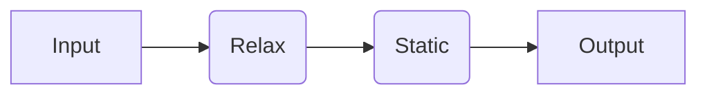
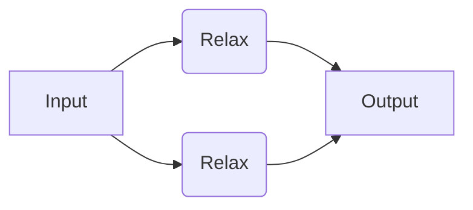
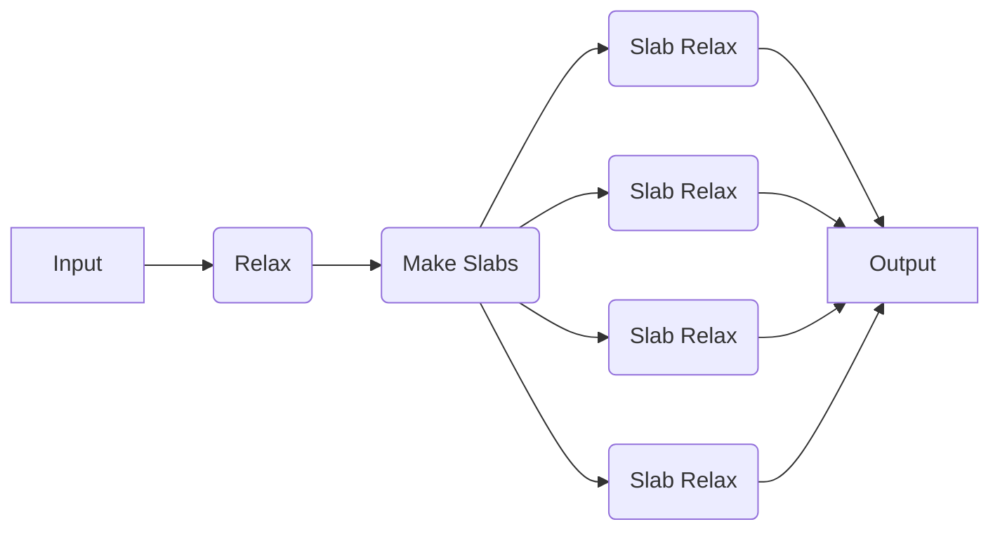

# Combining Recipes

Here, we will show how to use combine quacc jobs and workflows into your own custom workflows that can be run with your chosen workflow engine.

## Running a User-Constructed Serial Workflow

We will now try running a simple workflow where we relax a bulk Cu structure using EMT and take the output of that calculation as the input to a follow-up static calculation with EMT.



=== "Parsl"

    !!! Important

        If you haven't done so yet, make sure you update the quacc `WORKFLOW_ENGINE` [configuration variable](../settings/settings.md) and load the default Parsl configuration:

        ```bash title="terminal"
        quacc set WORKFLOW_ENGINE parsl
        ```

        ```python title="python"
        import parsl

        parsl.load()
        ```

    ```python
    from ase.build import bulk
    from quacc.recipes.emt.core import relax_job, static_job


    # Define the workflow
    def workflow(atoms):
        # Define Job 1
        future1 = relax_job(atoms)  # (1)!

        # Define Job 2, which takes the output of Job 1 as input
        future2 = static_job(future1["atoms"])

        return future2


    # Make an Atoms object of a bulk Cu structure
    atoms = bulk("Cu")

    # Dispatch the workflow
    future = workflow(atoms)

    # Fetch the result
    result = future.result()  # (2)!
    print(result)
    ```

    1. The `relax_job` function was pre-defined in quacc with a `#!Python @job` decorator, which is why we did not need to include it here.

    2. The use of `.result()` serves to block any further calculations from running until it is resolved. Calling `.result()` also returns the function output as opposed to the `AppFuture` object.

    !!! Note

        Parsl `PythonApp` objects will implicitly know to call `.result()` on any `AppFuture` it receives, and it is good to rely on this fact to avoid unnecessary blocking.

=== "Covalent"

    !!! Important

        If you haven't done so yet, make sure you update the quacc `WORKFLOW_ENGINE` [configuration variable](../settings/settings.md) and start the Covalent server:

        ```bash
        quacc set WORKFLOW_ENGINE covalent
        covalent start
        ```

    ```python
    import covalent as ct
    from ase.build import bulk
    from quacc import flow
    from quacc.recipes.emt.core import relax_job, static_job


    # Define the workflow
    @flow  # (1)!
    def workflow(atoms):
        # Define Job 1
        result1 = relax_job(atoms)  # (2)!

        # Define Job 2, which takes the output of Job 1 as input
        result2 = static_job(result1["atoms"])

        return result2


    # Make an Atoms object of a bulk Cu structure
    atoms = bulk("Cu")

    # Dispatch the workflow to the Covalent server
    # with the bulk Cu Atoms object as the input
    dispatch_id = ct.dispatch(workflow)(atoms)  # (3)!

    # Fetch the result from the server
    result = ct.get_result(dispatch_id, wait=True)  # (4)!
    print(result)
    ```

    1. The `#!Python @flow` decorator defines the workflow that will be executed. It is the same as calling `#!Python ct.lattice` in Covalent.

    2. The `relax_job` function was pre-defined in quacc with a `#!Python @job` decorator, which is why we did not need to include it here.

    3. Because the workflow was defined with a `#!Python @flow` decorator, it will be sent to the Covalent server and a dispatch ID will be returned.

    4. You don't need to set `wait=True` in practice. Once you dispatch the workflow, it will begin running (if the resources are available). The `ct.get_result` function is used to fetch the workflow status and results from the server.

=== "Redun"

    !!! Important

        If you haven't done so yet, make sure you update the quacc `WORKFLOW_ENGINE` [configuration variable](../settings/settings.md):

        ```bash
        quacc set WORKFLOW_ENGINE redun
        ```

    ```python
    from ase.build import bulk
    from redun import Scheduler
    from quacc import flow
    from quacc.recipes.emt.core import relax_job, static_job

    # Instantiate the scheduler
    scheduler = Scheduler()


    # Define the workflow
    @flow  # (1)!
    def workflow(atoms):
        # Define Job 1
        result1 = relax_job(atoms)  # (2)!

        # Define Job 2, which takes the output of Job 1 as input
        result2 = static_job(result1["atoms"])

        return result2


    # Make an Atoms object of a bulk Cu structure
    atoms = bulk("Cu")

    # Dispatch the workflow
    result = scheduler.run(workflow(atoms))
    print(result)
    ```

    1. The `#!Python @flow` decorator defines the workflow that will be executed. It is the same as the `#!Python @task` decorator in Redun.

    2. The `relax_job` function was pre-defined in quacc with a `#!Python @job` decorator, which is why we did not need to include it here.

=== "Jobflow"

    !!! Important

        If you haven't done so yet, make sure you update the quacc `WORKFLOW_ENGINE` [configuration variable](../settings/settings.md):

        ```bash
        quacc set WORKFLOW_ENGINE jobflow
        ```

    ```python
    import jobflow as jf
    from ase.build import bulk
    from quacc.recipes.emt.core import relax_job, static_job

    # Make an Atoms object of a bulk Cu structure
    atoms = bulk("Cu")

    # Define Job 1
    job1 = relax_job(atoms)  # (1)!

    # Define Job 2, which takes the output of Job 1 as input
    job2 = static_job(job1.output["atoms"])  # (2)!

    # Define the workflow
    workflow = jf.Flow([job1, job2])  # (3)!

    # Run the workflow locally
    responses = jf.run_locally(workflow, create_folders=True)  # (4)!

    # Get the result
    result = responses[job2.uuid][1].output
    print(result)
    ```

    1. The `relax_job` function was pre-defined in quacc with a `#!Python @job` decorator, which is why we did not need to include it here.

    2. In Jobflow, each `Job` is only a reference and so the `.output` must be explicitly passed between jobs.

    3. We must stitch the individual `Job` objects together into a `jf.Flow`, which can be easily achieved by passing them as a list to the `jf.Flow()` constructor.

    4. We chose to run the job locally, but other workflow managers supported by Jobflow can be imported and used.

## Running a User-Constructed Parallel Workflow

Now we will define a workflow where we will carry out two EMT structure relaxations, but the two jobs are not dependent on one another. In this example, the workflow manager will know that it can run the two jobs separately, and even if Job 1 were to fail, Job 2 would still progress.



=== "Parsl"

    ```python
    from ase.build import bulk, molecule
    from quacc.recipes.emt.core import relax_job


    # Define workflow
    def workflow(atoms1, atoms2):
        # Define two independent relaxation jobs
        result1 = relax_job(atoms1)
        result2 = relax_job(atoms2)

        return {"result1": result1, "result2": result2}


    # Define two Atoms objects
    atoms1 = bulk("Cu")
    atoms2 = molecule("N2")

    # Define two independent relaxation jobs
    futures = workflow(atoms1, atoms2)

    # Fetch the results
    result1 = futures["result1"].result()
    result2 = futures["result2"].result()
    print(result1, result2)
    ```

=== "Covalent"

    ```python
    from ase.build import bulk, molecule
    from quacc import flow
    from quacc.recipes.emt.core import relax_job


    # Define workflow
    @flow
    def workflow(atoms1, atoms2):
        # Define two independent relaxation jobs
        result1 = relax_job(atoms1)
        result2 = relax_job(atoms2)

        return {"result1": result1, "result2": result2}


    # Define two Atoms objects
    atoms1 = bulk("Cu")
    atoms2 = molecule("N2")

    # Dispatch the workflow to the Covalent server
    dispatch_id = ct.dispatch(workflow)(atoms1, atoms2)

    # Fetch the results from the server
    result = ct.get_result(dispatch_id, wait=True)
    print(result)
    ```

=== "Redun"

    ```python
    from ase.build import bulk, molecule
    from redun import Scheduler
    from quacc import flow
    from quacc.recipes.emt.core import relax_job

    # Instantiate the scheduler
    scheduler = Scheduler()


    # Define workflow
    @flow
    def workflow(atoms1, atoms2):
        # Define two independent relaxation jobs
        result1 = relax_job(atoms1)
        result2 = relax_job(atoms2)

        return {"result1": result1, "result2": result2}


    # Define two Atoms objects
    atoms1 = bulk("Cu")
    atoms2 = molecule("N2")

    # Dispatch the workflow
    result = scheduler.run(workflow(atoms1, atoms2))
    print(result)
    ```

=== "Jobflow"

    ```python
    import jobflow as jf
    from ase.build import bulk, molecule
    from quacc.recipes.emt.core import relax_job

    # Define two Atoms objects
    atoms1 = bulk("Cu")
    atoms2 = molecule("N2")

    # Define two independent relaxation jobs
    job1 = relax_job(atoms1)
    job2 = relax_job(atoms2)

    # Define the workflow
    workflow = jf.Flow([job1, job2])

    # Run the workflow locally
    responses = jf.run_locally(workflow, create_folders=True)

    # Get the result
    result = responses[job2.uuid][1].output
    print(result)
    ```

## Running a User-Constructed Dynamic Workflow

For this example, let's consider a toy scenario where we wish to relax a bulk Cu structure, carve all possible slabs, and then run a new relaxation calculation on each slab (with no static calculation at the end).



=== "Parsl"

    ```python
    from ase.build import bulk
    from quacc.recipes.emt.core import relax_job
    from quacc.recipes.emt.slabs import bulk_to_slabs_flow


    # Define the workflow
    def workflow(atoms):
        relaxed_bulk = relax_job(atoms)
        relaxed_slabs = bulk_to_slabs_flow(relaxed_bulk["atoms"], run_static=False)  # (1)!

        return relaxed_slabs


    # Define the Atoms object
    atoms = bulk("Cu")

    # Dispatch the workflow
    future = workflow(atoms)

    # Fetch the results
    result = future.result()
    print(result)
    ```

    1. We chose to set `#!Python run_static=False` here to disable the static calculation that is normally carried out in this workflow.

=== "Covalent"

    ```python
    import covalent as ct
    from ase.build import bulk
    from quacc import flow
    from quacc.recipes.emt.core import relax_job
    from quacc.recipes.emt.slabs import bulk_to_slabs_flow


    # Define the workflow
    @flow
    def workflow(atoms):
        relaxed_bulk = relax_job(atoms)
        relaxed_slabs = bulk_to_slabs_flow(relaxed_bulk["atoms"], run_static=False)  # (1)!

        return relaxed_slabs


    # Define the Atoms object
    atoms = bulk("Cu")

    # Dispatch the workflow and retrieve result
    dispatch_id = ct.dispatch(workflow)(atoms)
    result = ct.get_result(dispatch_id, wait=True)
    print(result)
    ```

    1. We didn't need to wrap `bulk_to_slabs_flow` with a decorator because it is already pre-decorated with a `#!Python @flow` decorator. We also chose to set `#!Python run_static=False` here to disable the static calculation that is normally carried out in this workflow.

=== "Redun"

    ```python
    from ase.build import bulk
    from redun import Scheduler
    from quacc import flow
    from quacc.recipes.emt.core import relax_job
    from quacc.recipes.emt.slabs import bulk_to_slabs_flow

    scheduler = Scheduler()


    # Define the workflow
    @flow
    def workflow(atoms):
        relaxed_bulk = relax_job(atoms)
        relaxed_slabs = bulk_to_slabs_flow(relaxed_bulk["atoms"], run_static=False)  # (1)!

        return relaxed_slabs


    # Define the Atoms object
    atoms = bulk("Cu")

    # Run the workflow
    result = scheduler.run(workflow(atoms))
    print(result)
    ```

    1. We didn't need to wrap `bulk_to_slabs_flow` with a decorator because it is already pre-decorated with a `#!Python @flow` decorator. We also chose to set `#!Python run_static=False` here to disable the static calculation that is normally carried out in this workflow.

=== "Jobflow"

    !!! Warning "Limitations"

        Due to the difference in how Jobflow handles workflows (particularly dynamic ones) compared to other supported workflow engines, any quacc recipes that have been pre-defined with a `#!Python @flow` decorator (i.e. have `_flow` in the name) cannot be run directly with Jobflow. Rather, a Jobflow-specific `Flow` needs to be constructed by the user.
