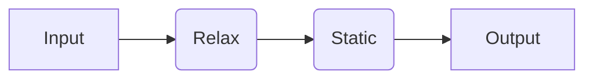
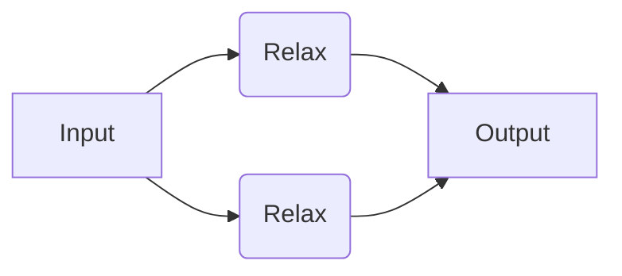
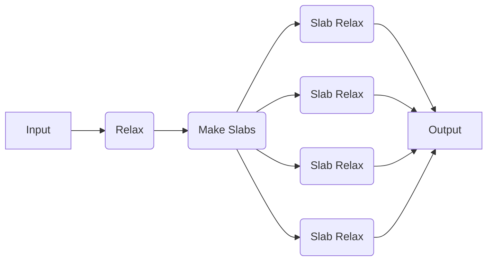

# Combining Recipes

Here, we will show how to use combine quacc jobs and workflows into your own custom workflows that can be run with your chosen workflow engine.

## Running a User-Constructed Serial Workflow

We will now try running a simple workflow where we relax a bulk Cu structure using EMT and take the output of that calculation as the input to a follow-up static calculation with EMT.



=== "Dask"

    !!! Important

        If you haven't done so yet, make sure you update the quacc `WORKFLOW_ENGINE` [configuration variable](../settings/settings.md) and load the default Dask cluster:

        ```bash title="terminal"
        quacc set WORKFLOW_ENGINE dask
        ```

        ```python title="python"
        from dask.distributed import Client

        client = Client()
        ```

    ```python
    from ase.build import bulk
    from quacc.recipes.emt.core import relax_job, static_job


    # Define the workflow
    def workflow(atoms):
        # Define Job 1
        delayed1 = relax_job(atoms)

        # Define Job 2, which takes the output of Job 1 as input
        delayed2 = static_job(delayed1["atoms"])

        return delayed2


    # Make an Atoms object of a bulk Cu structure
    atoms = bulk("Cu")

    # Dispatch the workflow
    delayed = workflow(atoms)

    # Fetch the result
    result = client.compute(delayed).result()
    print(result)
    ```

    !!! Tip "Modifying the Decorator of a Pre-Made Job"

        If you want to modify the decorator of a pre-made job for any reason, you can use the [quacc.wflow_tools.customizers.redecorate][] function:

        ```python
        from quacc import redecorate

        relax_job_ = redecorate(relax_job, job(name="my_custom_name"))  # (1)!
        ```

        1. This is the same as simply re-decorating it directly and using this new function instead:

            ```python
            from quacc import job


            @job(name="my_custom_name")
            def relax_job_(*args, **kwargs):
                return relax_job(*args, **kwargs)
            ```

=== "Parsl"

    !!! Important

        If you haven't done so yet, make sure you update the quacc `WORKFLOW_ENGINE` [configuration variable](../settings/settings.md) and load the default Parsl configuration:

        ```bash title="terminal"
        quacc set WORKFLOW_ENGINE parsl
        ```

        ```python title="python"
        import parsl

        parsl.load()
        ```

    ```python
    from ase.build import bulk
    from quacc.recipes.emt.core import relax_job, static_job


    # Define the workflow
    def workflow(atoms):
        # Define Job 1
        future1 = relax_job(atoms)

        # Define Job 2, which takes the output of Job 1 as input
        future2 = static_job(future1["atoms"])  # (1)!

        return future2


    # Make an Atoms object of a bulk Cu structure
    atoms = bulk("Cu")

    # Dispatch the workflow
    future = workflow(atoms)

    # Fetch the result
    result = future.result()
    print(result)
    ```

    1. Parsl `PythonApp` objects will implicitly know to call `.result()` on any `AppFuture` it receives, and it is good to rely on this fact to avoid unnecessary blocking.

    !!! Tip "Modifying the Decorator of a Pre-Made Job"

        If you want to modify the decorator of a pre-made job, such as to modify the allowed executors of a given function, you can use the [quacc.wflow_tools.customizers.redecorate][] function:

        ```python
        from quacc import redecorate

        relax_job_ = redecorate(relax_job, job(executors=["all"]))  # (1)!
        ```

        1. This is the same as simply re-decorating it directly and using this new function instead:

            ```python
            from quacc import job


            @job(executors=["all"])
            def relax_job_(*args, **kwargs):
                return relax_job(*args, **kwargs)
            ```

=== "Prefect"

    !!! Important

        If you haven't done so yet, make sure you update the quacc `WORKFLOW_ENGINE` [configuration variable](../settings/settings.md):

        ```bash title="terminal"
        quacc set WORKFLOW_ENGINE prefect
        ```

    ```python
    from ase.build import bulk
    from quacc import flow
    from quacc.recipes.emt.core import relax_job, static_job


    # Define the workflow
    @flow
    def workflow(atoms):
        # Call Task 1
        future1 = relax_job(atoms)

        # Call Task 2, which takes the output of Task 1 as input
        return static_job(future1["atoms"])  # (1)!


    # Make an Atoms object of a bulk Cu structure
    atoms = bulk("Cu")

    # Run the workflow with Prefect tracking
    result = workflow(atoms)
    print(result)
    ```

    1. Prefect `Task` objects will implicitly know to call `.result()` on any `PrefectFuture` it receives, and it is good to rely on this fact to avoid unnecessary blocking.

    !!! Tip "Modifying the Decorator of a Pre-Made Job"

        If you want to modify the decorator of a pre-made job, such as to modify the number of retries, you can use the [quacc.wflow_tools.customizers.redecorate][] function:

        ```python
        from quacc import redecorate

        relax_job_ = redecorate(relax_job, job(retries=2))  # (1)!
        ```

        1. This is the same as simply re-decorating it directly and using this new function instead:

            ```python
            from quacc import job


            @job(retries=2)
            def relax_job_(*args, **kwargs):
                return relax_job(*args, **kwargs)
            ```

=== "Redun"

    !!! Important

        If you haven't done so yet, make sure you update the quacc `WORKFLOW_ENGINE` [configuration variable](../settings/settings.md):

        ```bash
        quacc set WORKFLOW_ENGINE redun
        ```

    ```python
    from ase.build import bulk
    from redun import Scheduler
    from quacc import flow
    from quacc.recipes.emt.core import relax_job, static_job

    # Instantiate the scheduler
    scheduler = Scheduler()


    # Define the workflow
    @flow  # (1)!
    def workflow(atoms):
        # Define Job 1
        result1 = relax_job(atoms)

        # Define Job 2, which takes the output of Job 1 as input
        result2 = static_job(result1["atoms"])

        return result2


    # Make an Atoms object of a bulk Cu structure
    atoms = bulk("Cu")

    # Dispatch the workflow
    result = scheduler.run(workflow(atoms))
    print(result)
    ```

    1. The `#!Python @flow` decorator defines the workflow that will be executed. It is the same as the `#!Python @task` decorator in Redun.


    !!! Tip "Modifying the Decorator of a Pre-Made Job"

        If you want to modify the decorator of a pre-made job for any reason, you can use the [quacc.wflow_tools.customizers.redecorate][] function:

        ```python
        from quacc import redecorate

        relax_job_ = redecorate(relax_job, job(name="my_custom_name"))  # (1)!
        ```

        1. This is the same as simply re-decorating it directly and using this new function instead:

            ```python
            from quacc import job


            @job(name="my_custom_name")
            def relax_job_(*args, **kwargs):
                return relax_job(*args, **kwargs)
            ```

=== "Jobflow"

    !!! Important

        If you haven't done so yet, make sure you update the quacc `WORKFLOW_ENGINE` [configuration variable](../settings/settings.md):

        ```bash
        quacc set WORKFLOW_ENGINE jobflow
        ```

    ```python
    import jobflow as jf
    from ase.build import bulk
    from quacc.recipes.emt.core import relax_job, static_job

    # Make an Atoms object of a bulk Cu structure
    atoms = bulk("Cu")

    # Define Job 1
    job1 = relax_job(atoms)

    # Define Job 2, which takes the output of Job 1 as input
    job2 = static_job(job1.output["atoms"])  # (1)!

    # Define the workflow
    workflow = jf.Flow([job1, job2])  # (2)!

    # Run the workflow locally
    responses = jf.run_locally(workflow)

    # Get the result
    result = responses[job2.uuid][1].output
    print(result)
    ```

    1. In Jobflow, each `Job` is only a reference and so the `.output` must be explicitly passed between jobs.

    2. We must stitch the individual `Job` objects together into a `jf.Flow`, which can be easily achieved by passing them as a list to the `jf.Flow()` constructor.

## Running a User-Constructed Parallel Workflow

Now we will define a workflow where we will carry out two EMT structure relaxations, but the two jobs are not dependent on one another. In this example, the workflow manager will know that it can run the two jobs separately, and even if Job 1 were to fail, Job 2 would still progress.



=== "Dask"

    ```python
    from ase.build import bulk, molecule
    from quacc.recipes.emt.core import relax_job


    # Define workflow
    def workflow(atoms1, atoms2):
        # Define two independent relaxation jobs
        result1 = relax_job(atoms1)
        result2 = relax_job(atoms2)

        return [result1, result2]


    # Define two Atoms objects
    atoms1 = bulk("Cu")
    atoms2 = molecule("N2")

    # Define two independent relaxation jobs
    delayed = workflow(atoms1, atoms2)

    # Fetch the results
    results = client.gather(client.compute(delayed))
    print(results)
    ```

=== "Parsl"

    ```python
    from ase.build import bulk, molecule
    from quacc.recipes.emt.core import relax_job


    # Define workflow
    def workflow(atoms1, atoms2):
        # Define two independent relaxation jobs
        result1 = relax_job(atoms1)
        result2 = relax_job(atoms2)

        return {"result1": result1, "result2": result2}


    # Define two Atoms objects
    atoms1 = bulk("Cu")
    atoms2 = molecule("N2")

    # Define two independent relaxation jobs
    futures = workflow(atoms1, atoms2)

    # Fetch the results
    result1 = futures["result1"].result()
    result2 = futures["result2"].result()
    print(result1, result2)
    ```

=== "Prefect"

    ```python
    from ase.build import bulk, molecule
    from quacc import flow
    from quacc.recipes.emt.core import relax_job


    # Define workflow
    @flow
    def workflow(atoms1, atoms2):
        # Define two independent relaxation jobs
        result1 = relax_job(atoms1)
        result2 = relax_job(atoms2)

        return {"result1": result1, "result2": result2}


    # Define two Atoms objects
    atoms1 = bulk("Cu")
    atoms2 = molecule("N2")

    # Dispatch the workflow
    results = workflow(atoms1, atoms2)

    # Fetch the results
    result1 = results["result1"]
    result2 = results["result2"]
    print(result1, result2)
    ```

=== "Redun"

    ```python
    from ase.build import bulk, molecule
    from redun import Scheduler
    from quacc import flow
    from quacc.recipes.emt.core import relax_job

    # Instantiate the scheduler
    scheduler = Scheduler()


    # Define workflow
    @flow
    def workflow(atoms1, atoms2):
        # Define two independent relaxation jobs
        result1 = relax_job(atoms1)
        result2 = relax_job(atoms2)

        return {"result1": result1, "result2": result2}


    # Define two Atoms objects
    atoms1 = bulk("Cu")
    atoms2 = molecule("N2")

    # Dispatch the workflow
    result = scheduler.run(workflow(atoms1, atoms2))
    print(result)
    ```

=== "Jobflow"

    ```python
    import jobflow as jf
    from ase.build import bulk, molecule
    from quacc.recipes.emt.core import relax_job

    # Define two Atoms objects
    atoms1 = bulk("Cu")
    atoms2 = molecule("N2")

    # Define two independent relaxation jobs
    job1 = relax_job(atoms1)
    job2 = relax_job(atoms2)

    # Define the workflow
    workflow = jf.Flow([job1, job2])

    # Run the workflow locally
    responses = jf.run_locally(workflow)

    # Get the result
    result = responses[job2.uuid][1].output
    print(result)
    ```

## Running a User-Constructed Dynamic Workflow

For this example, let's consider a toy scenario where we wish to relax a bulk Cu structure, carve all possible slabs, and then run a new relaxation calculation on each slab (with no static calculation at the end).



=== "Dask"

    ```python
    from ase.build import bulk
    from quacc.recipes.emt.core import relax_job
    from quacc.recipes.emt.slabs import bulk_to_slabs_flow


    # Define the workflow
    def workflow(atoms):
        relaxed_bulk = relax_job(atoms)
        relaxed_slabs = bulk_to_slabs_flow(relaxed_bulk["atoms"], run_static=False)

        return relaxed_slabs


    # Define the Atoms object
    atoms = bulk("Cu")

    # Dispatch the workflow
    delayed = workflow(atoms)

    # Fetch the results
    result = client.compute(delayed).result()
    print(result)
    ```

    !!! Tip "Selectively Modifying Job Decorators in a Pre-Made Flow"

        If you want to modify the decorators of select jobs in a pre-made workflow, such as to modify the allowed executors of a given function, you can use the `job_decorators` keyword argument:

        ```python
        bulk_to_slabs_flow(atoms, job_decorators={"static_job": job(name="my_custom_name")})
        ```

        As a shorthand, all of the decorators can be modified at once using the "all" key:

        ```python
        bulk_to_slabs_flow(atoms, job_decorators={"all": job(name="my_custom_name")})
        ```

=== "Parsl"

    ```python
    from ase.build import bulk
    from quacc.recipes.emt.core import relax_job
    from quacc.recipes.emt.slabs import bulk_to_slabs_flow


    # Define the workflow
    def workflow(atoms):
        relaxed_bulk = relax_job(atoms)
        relaxed_slabs = bulk_to_slabs_flow(relaxed_bulk["atoms"], run_static=False)

        return relaxed_slabs


    # Define the Atoms object
    atoms = bulk("Cu")

    # Dispatch the workflow
    future = workflow(atoms)

    # Fetch the results
    result = future.result()
    print(result)
    ```

    !!! Tip "Selectively Modifying Job Decorators in a Pre-Made Flow"

        If you want to modify the decorators of select jobs in a pre-made workflow, such as to modify the allowed executors of a given function, you can use the `job_decorators` keyword argument:

        ```python
        bulk_to_slabs_flow(
            atoms, job_decorators={"static_job": job(executors=["MyFavoriteExecutor"])}
        )
        ```

        As a shorthand, all of the decorators can be modified at once using the "all" key:

        ```python
        bulk_to_slabs_flow(atoms, job_decorators={"all": job(executors=["MyFavoriteExecutor"])})
        ```

=== "Prefect"

    ```python
    from ase.build import bulk
    from quacc import flow
    from quacc.recipes.emt.core import relax_job
    from quacc.recipes.emt.slabs import bulk_to_slabs_flow


    # Define the workflow
    @flow
    def workflow(atoms):
        relaxed_bulk = relax_job(atoms)
        relaxed_slabs = bulk_to_slabs_flow(relaxed_bulk["atoms"], run_static=False)

        return relaxed_slabs


    # Define the Atoms object
    atoms = bulk("Cu")

    # Dispatch the workflow
    results = workflow(atoms)

    # print the results
    print(results)
    ```

    !!! Tip "Selectively Modifying Job Decorators in a Pre-Made Flow"

        If you want to modify the decorators of select jobs in a pre-made workflow, such as to modify the number of retries, you can use the `job_decorators` keyword argument:

        ```python
        bulk_to_slabs_flow(atoms, job_decorators={"static_job": job(retries=2)})
        ```

        As a shorthand, all of the decorators can be modified at once using the "all" key:

        ```python
        bulk_to_slabs_flow(atoms, job_decorators={"all": job(retries=2)})
        ```

=== "Redun"

    ```python
    from ase.build import bulk
    from redun import Scheduler
    from quacc import flow
    from quacc.recipes.emt.core import relax_job
    from quacc.recipes.emt.slabs import bulk_to_slabs_flow

    scheduler = Scheduler()


    # Define the workflow
    @flow
    def workflow(atoms):
        relaxed_bulk = relax_job(atoms)
        relaxed_slabs = bulk_to_slabs_flow(relaxed_bulk["atoms"], run_static=False)

        return relaxed_slabs


    # Define the Atoms object
    atoms = bulk("Cu")

    # Run the workflow
    result = scheduler.run(workflow(atoms))
    print(result)
    ```

    !!! Tip "Selectively Modifying Job Decorators in a Pre-Made Flow"

        If you want to modify the decorators of select jobs in a pre-made workflow, such as to modify the allowed executors of a given function, you can use the `job_decorators` keyword argument:

        ```python
        bulk_to_slabs_flow(atoms, job_decorators={"static_job": job(name="my_custom_name")})
        ```

        As a shorthand, all of the decorators can be modified at once using the "all" key:

        ```python
        bulk_to_slabs_flow(atoms, job_decorators={"all": job(name="my_custom_name")})
        ```

=== "Jobflow"

    !!! Warning "Limitations"

        Due to the difference in how Jobflow handles workflows (particularly dynamic ones) compared to other supported workflow engines, any quacc recipes that have been pre-defined with a `#!Python @flow` decorator (i.e. have `_flow` in the name) cannot be run directly with Jobflow. Rather, a Jobflow-specific `Flow` needs to be constructed by the user.
