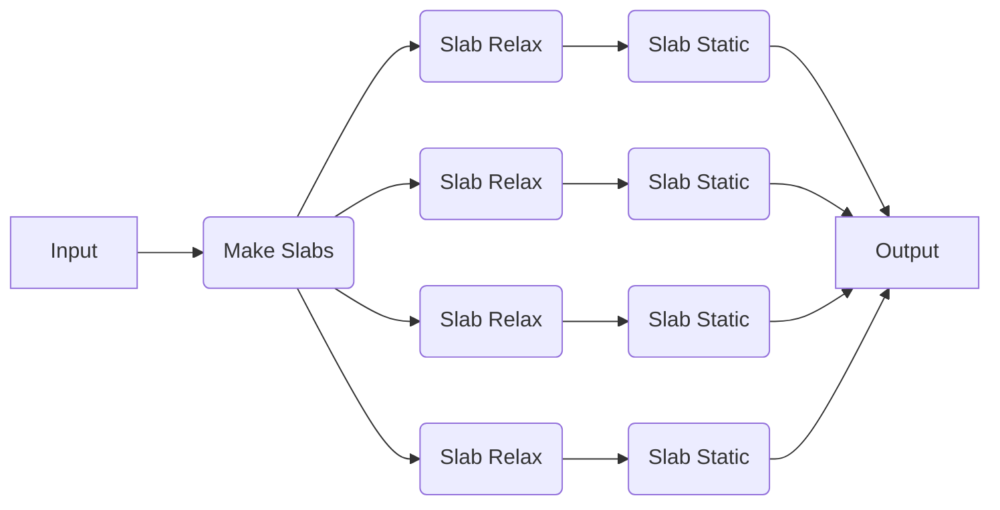

# Modifying Decorators

Occasionally, you may want to modify the decorators of select jobs in a workflow, such as to modify the executor of a given function. This can be done in an analagous way as in the [Modifying Recipes](../recipes/modifications.md) section except here we use the `decorators` keyword argument instead of the `parameters` keyword argument.

## Modifying a Job in a Dynamic Workflow



In this example, we will run a pre-made workflow that generates a set of slabs from a bulk structure and then runs a structure relaxation and static calculation on each slab. We will specifically highlight an example where we want to modify the applied decorator of only the static calculation.

!!! Tip

    Unsure what arguments a given function takes? Check out the [API documentation](https://quantum-accelerators.github.io/quacc/reference/quacc/recipes/emt/slabs.html).

```python
from ase.build import bulk
from quacc import job
from quacc.recipes.emt.core import relax_job
from quacc.recipes.emt.slabs import bulk_to_slabs_flow

# Define the Atoms object
atoms = bulk("Cu")

# Define the workflow
result = bulk_to_slabs_flow(
    atoms, decorators={"static_job": job(foo=bar)}  # (1)!
)

# Print the result
print(result)
```

1. See the documentation for [quacc.wflow_tools.customizers.customize_funcs][] for additional details.

!!! Note

    The `foo` argument and `bar` value are simply placeholders. You will need to replace them with the appropriate values for your workflow engine and use case.
