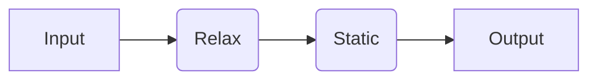
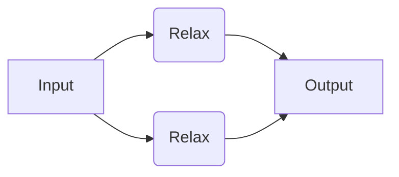
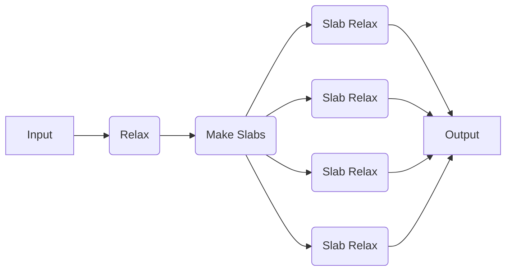
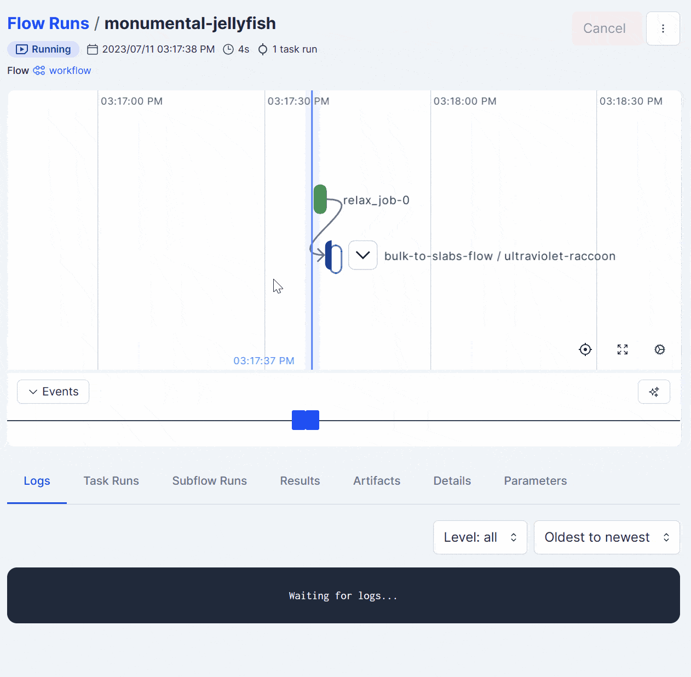

# Using a Workflow Engine

Here, we will show how to use quacc with one of a variety of workflow engines to construct, dispatch, and monitor your calculations.

!!! Tip

    Check out the ["Workflow Engines Overview"](wflow_overview.md) section of the documentation to identify which workflow engine is suitable for you.

## Unified Workflow Syntax

As described in the ["Workflow Syntax"](wflow_syntax.md) section, each workflow engine has its own unique syntax. To help streamline the process, quacc offers a unified set of decorators.

| Quacc               | Covalent                             | Parsl                  | Jobflow         | Prefect          |
| ------------------- | ------------------------------------ | ---------------------- | --------------- | ---------------- |
| [`#!Python @job`](https://quantum-accelerators.github.io/quacc/reference/quacc/util/wflows.html#quacc.util.wflows.job)     | [`#!Python @ct.electron`](https://docs.covalent.xyz/docs/user-documentation/concepts/covalent-basics#electron)              | [`#!Python @python_app`](https://parsl.readthedocs.io/en/stable/userguide/apps.html#python-apps) | [`#!Python @job`](https://materialsproject.github.io/jobflow/jobflow.core.html#module-jobflow.core.job) | [`#!Python @task`](https://docs.prefect.io/latest/tutorial/tasks/) |
| [`#!Python @flow`](https://quantum-accelerators.github.io/quacc/reference/quacc/util/wflows.html#quacc.util.wflows.flow)    | [`#!Python @ct.lattice`](https://docs.covalent.xyz/docs/user-documentation/concepts/covalent-basics#lattice)               | N/A                    | N/A             | [`#!Python @flow`](https://docs.prefect.io/latest/tutorial/flows/) |
| [`#!Python @subflow`](https://quantum-accelerators.github.io/quacc/reference/quacc/util/wflows.html#quacc.util.wflows.subflow) | [`#!Python @ct.electron(@ct.lattice)`](https://docs.covalent.xyz/docs/user-documentation/how-to/execution/execute-sublattice/) | [`#!Python @join_app`](https://parsl.readthedocs.io/en/latest/userguide/joins.html#join-apps)   | N/A             | [`#!Python @flow`](https://docs.prefect.io/latest/tutorial/flows/) |

The `#!Python @job` decorator indicates that the decorated function is a single step in a workflow. The `#!Python @flow` decorator indicates that the decorated function is a full workflow, consisting of many individual `#!Python @job`-decorated functions (and/or `#!Python @subflow`-decorated functions). The `#!Python @subflow` decorator indicates that the decorated function is a sub-workflow within a larger workflow and is often used to define dynamic workflows.

Based on the value for the `WORKFLOW_ENGINE` global variable in your [quacc settings](settings.md), the appropriate decorator will be automatically selected. If the `WORKFLOW_ENGINE` setting is set to `None`, the decorators will have no effect.

## Examples

### Running a Simple Serial Workflow

We will now try running a simple workflow where we relax a bulk Cu structure using EMT and take the output of that calculation as the input to a follow-up static calculation with EMT.



=== "Covalent"

    !!! Important

        If you haven't done so yet, make sure you started the Covalent server with `covalent start` in the command-line.

        Also make sure you have specified `"covalent"` as the `WORKFLOW_ENGINE` in your [quacc settings](settings.md).

    ```python
    import covalent as ct
    from ase.build import bulk
    from quacc import flow
    from quacc.recipes.emt.core import relax_job, static_job


    # Define the workflow
    @flow  # (1)!
    def workflow(atoms):
        # Define Job 1
        result1 = relax_job(atoms)  # (2)!

        # Define Job 2, which takes the output of Job 1 as input
        result2 = static_job(result1)

        return result2


    # Make an Atoms object of a bulk Cu structure
    atoms = bulk("Cu")

    # Dispatch the workflow to the Covalent server
    # with the bulk Cu Atoms object as the input
    dispatch_id = ct.dispatch(workflow)(atoms)  # (3)!

    # Fetch the result from the server
    result = ct.get_result(dispatch_id, wait=True)  # (4)!
    print(result)
    ```

    1. This will be automatically transformed into a `#!Python @ct.lattice` decorator.

    2. This was defined in quacc with a `#!Python @job` decorator already, which will be transformed into a `#!Python @ct.electron` decorator.

    3. Because the workflow is only sent to the server with `ct.dispatch`, calling `workflow(atoms)` would run the workflow as if Covalent were not being used at all.

    4. You don't need to set `wait=True` in practice. Once you call `ct.dispatch`, the workflow will begin running. The `ct.get_result` function is used to fetch the workflow status and results from the server.

    !!! Tip

        Covalent has several [configuration parameters](https://docs.covalent.xyz/docs/user-documentation/how-to/customization/) of its own that can influence runtime behavior. For instance, the `opt.traj` file containing the optimization trajectory that was written out by `relax_job` will be stored in Covalent's `workdir` location: `#!Python ct.get_config()["executors"]["dask"]["workdir"]`.

    You can see that it is quite trivial to set up a workflow using the recipes within quacc. We define the full workflow as a `#!Python @flow`-decorated function that stitches together the individual workflow steps. The [`quacc.recipes.emt.core.relax_job`](https://quantum-accelerators.github.io/quacc/reference/quacc/recipes/emt/core.html#quacc.recipes.emt.core.relax_job) and [`quacc.recipes.emt.core.static_job`](https://quantum-accelerators.github.io/quacc/reference/quacc/recipes/emt/core.html#quacc.recipes.emt.core.static_job) were both already defined with a `#!Python @job` decorator, which is why we did not need to specify that here. At runtime, quacc will automatically transform the `#!Python @flow` decorator into the Covalent-compatible `#!Python @ct.lattice` decorator and all `#!Python @job` decorators into the Covalent-compatible `#!Python @ct.electron` decorators.

    With Covalent as the workflow engine, quacc will also automatically construct a directed acyclic graph of the inputs and outputs for each calculation to determine which jobs are dependent on one another and the order the jobs should be run. In this example, Covalent will know not to run `job2` until `job1` has completed successfully.

    The job will be dispatched to the Covalent server with the [`ct.dispatch`](https://docs.covalent.xyz/docs/user-documentation/concepts/covalent-basics#dispatch) command, which takes in the workflow function and the input arguments to the workflow. The [`ct.get_result`](https://docs.covalent.xyz/docs/user-documentation/concepts/covalent-basics#result) command is used to fetch the results from the server.

    

=== "Parsl"

    !!! Important

        If you haven't done so yet, make sure you have loaded a Parsl configuration in your Python script. An example for running on your local machine is included below.

        ```python
        import parsl
        parsl.load()
        ```

        Also make sure you have specified `"parsl"` as the `WORKFLOW_ENGINE` in your [quacc settings](settings.md).

    ```python
    from ase.build import bulk
    from quacc.recipes.emt.core import relax_job, static_job

    # Make an Atoms object of a bulk Cu structure
    atoms = bulk("Cu")

    # Call App 1
    future1 = relax_job(atoms) # (1)!

    # Call App 2, which takes the output of App 1 as input
    future2 = static_job(future1)

    # Print result
    print(future2.result()) # (2)!
    ```

    1. This was defined in quacc with a `#!Python @job` decorator already, which will be transformed into a `#!Python @PythonApp` decorator since the `WORKFLOW_ENGINE` is set to `"parsl"`.

    2. The use of `.result()` serves to block any further calculations from running until it is resolved. Calling `.result()` also returns the function output as opposed to the `AppFuture` object.

    You can see that it is quite trivial to set up a Parsl workflow using the recipes within quacc. We define the full workflow as simply a collection of individual compute jobs. The [`quacc.recipes.emt.core.relax_job`](https://quantum-accelerators.github.io/quacc/reference/quacc/recipes/emt/core.html#quacc.recipes.emt.core.relax_job) and [`quacc.recipes.emt.core.static_job`](https://quantum-accelerators.github.io/quacc/reference/quacc/recipes/emt/core.html#quacc.recipes.emt.core.static_job) were both already defined with a `#!Python @job` decorator, which is why we did not need to specify that here. At runtime, quacc will automatically transform the `#!Python @job` decorator into the Parsl-compatible `#!Python @python_app` decorator.

    !!! Note

        Parsl `PythonApp`/`JoinApp` objects will implicitly know to call `.result()` on any `AppFuture` it receives. As such, you should avoid calling `.result()` within a `PythonApp`/`JoinApp` definition or between `PythonApp`/`JoinApp` objects if possible.

=== "Jobflow"

    !!! Important

        Make sure you have specified `"jobflow"` as the `WORKFLOW_ENGINE` in your [quacc settings](settings.md).

    ```python
    from ase.build import bulk
    from jobflow import Flow, run_locally
    from quacc.recipes.emt.core import relax_job, static_job

    # Make an Atoms object of a bulk Cu structure
    atoms = bulk("Cu")

    # Define Job 1
    job1 = relax_job(atoms)  # (1)!

    # Define Job 2, which takes the output of Job 1 as input
    job2 = static_job(job1.output)  # (2)!

    # Define the workflow
    workflow = Flow([job1, job2])

    # Run the workflow locally
    responses = run_locally(workflow, create_folders=True)

    # Get the result
    result = responses[job2.uuid][1].output
    print(result)
    ```

    1. This was defined in quacc with a `#!Python @job` decorator already, which will be transformed into a `Job` object since the `WORKFLOW_ENGINE` is set to `"jobflow"`.

    2. In Jobflow, each `Job` is only a reference and so the `.output` must be explicitly passed between jobs.

    You can see that it is quite trivial to set up a Jobflow workflow using the recipes within quacc. We define the full workflow as simply a collection of individual compute jobs. The [`quacc.recipes.emt.core.relax_job`](https://quantum-accelerators.github.io/quacc/reference/quacc/recipes/emt/core.html#quacc.recipes.emt.core.relax_job) and [`quacc.recipes.emt.core.static_job`](https://quantum-accelerators.github.io/quacc/reference/quacc/recipes/emt/core.html#quacc.recipes.emt.core.static_job) were both already defined with a `#!Python @job` decorator, which is why we did not need to specify that here. At runtime, quacc will automatically transform the `#!Python @job` decorator into the Jobflow-compatible `Job` object.

    The key aspect to note is that we must stitch the individual `Job` objects together into a `Flow`, which can be easily achieved by passing them to the `Flow()` constructor. The `Flow` object will automatically determine the order in which the jobs should be run based on the inputs and outputs of each job. In this case, it will know not to run `job2` until `job1` has completed.

    We chose to run the job locally, but other workflow managers supported by Jobflow can be imported and used.

=== "Prefect"

    !!! Important

        Make sure you have specified `"prefect"` as the `WORKFLOW_ENGINE` in your [quacc settings](settings.md).

    ```python
    from ase.build import bulk
    from quacc import flow
    from quacc.recipes.emt.core import relax_job, static_job


    # Define the workflow
    @flow  # (1)!
    def workflow(atoms):
        # Call Task 1
        future1 = relax_job.submit(atoms)  # (2)!

        # Call Task 2, which takes the output of Task 1 as input
        future2 = static_job.submit(future1)

        return future2


    # Make an Atoms object of a bulk Cu structure
    atoms = bulk("Cu")

    # Run the workflow with Prefect tracking
    result = workflow(atoms).result()  # (3)!
    print(result)
    ```

    1. This will be automatically transformed into a Prefect `#!Python @flow` decorator since `WORKFLOW_ENGINE="prefect"`.

    2. This was defined in quacc with a `#!Python @job` decorator already, which will be transformed into a `#!Python @task` decorator since the `WORKFLOW_ENGINE` is set to `"prefect"`. It's necessary to call `.submit` on all Prefect `Task` objects to ensure they are executed concurrently (if possible).

    3. The use of `.result()` serves to block any further calculations from running until it is resolved. Calling `.result()` also returns the function output as opposed to the `PrefectFuture` object.

    You can see that it is quite trivial to set up a Prefect workflow using the recipes within quacc. We define the full `Flow` as a function that stitches together the individual `Task` workflow steps.Calling `.submit()` enables concurrent execution of the tasks, and `.result()` blocks further calculations until the result is returned. Both `.submit()` and `.result()` aren't necessary when testing Prefect workflows locally, but we have included them here to make the transition to HPC environments more seamless.

    !!! Note

        Prefect will implicitly know to call `.result()` on any `PrefectFuture` in a `Flow`. As such, you should avoid calling `.result()` when passing the results of tasks to other tasks if possible.

    

### Running a Simple Parallel Workflow

Now let's consider a similar but nonetheless distinct example. Here, we will define a workflow where we will carry out two EMT structure relaxations, but the two jobs are not dependent on one another. In this example, Covalent will know that it can run the two jobs separately, and even if Job 1 were to fail, Job 2 would still progress.



=== "Covalent"

    ```python
    from ase.build import bulk, molecule
    from quacc import flow
    from quacc.recipes.emt.core import relax_job


    # Define workflow
    @flow
    def workflow(atoms1, atoms2):
        # Define two independent relaxation jobs
        result1 = relax_job(atoms1)
        result2 = relax_job(atoms2)

        return {"result1": result1, "result2": result2}


    # Define two Atoms objects
    atoms1 = bulk("Cu")
    atoms2 = molecule("N2")

    # Dispatch the workflow to the Covalent server
    dispatch_id = ct.dispatch(workflow)(atoms1, atoms2)

    # Fetch the results from the server
    result = ct.get_result(dispatch_id, wait=True)
    print(result)
    ```

    

=== "Parsl"

    ```python
    from ase.build import bulk, molecule
    from quacc.recipes.emt.core import relax_job

    # Define two Atoms objects
    atoms1 = bulk("Cu")
    atoms2 = molecule("N2")

    # Define two independent relaxation jobs
    future1 = relax_job(atoms1)
    future2 = relax_job(atoms2)

    # Print the results
    print(future1.result(), future2.result())
    ```

=== "Jobflow"

    ```python
    from ase.build import bulk, molecule
    from jobflow import Flow, run_locally
    from quacc.recipes.emt.core import relax_job

    # Define two Atoms objects
    atoms1 = bulk("Cu")
    atoms2 = molecule("N2")

    # Define two independent relaxation jobs
    job1 = relax_job(atoms1)
    job2 = relax_job(atoms2)

    # Define the workflow
    workflow = Flow([job1, job2])

    # Run the workflow locally
    responses = run_locally(workflow, create_folders=True)

    # Get the result
    result = responses[job2.uuid][1].output
    print(result)
    ```

=== "Prefect"

    ```python
    from ase.build import bulk, molecule
    from quacc import flow
    from quacc.recipes.emt.core import relax_job


    # Define workflow
    @flow
    def workflow(atoms1, atoms2):
        # Define two independent relaxation jobs
        future1 = relax_job.submit(atoms1)
        future2 = relax_job.submit(atoms2)

        return future1, future2


    # Define two Atoms objects
    atoms1 = bulk("Cu")
    atoms2 = molecule("N2")

    # Run the workflow with Prefect tracking
    future1, future2 = workflow(atoms1, atoms2)
    print(future1.result(), future2.result())
    ```
    As expected, the Prefect Cloud UI shows two jobs that are not dependent on one another.

    

### Running Workflows with Complex Connectivity

For this example, let's consider a toy scenario where we wish to relax a bulk Cu structure, carve all possible slabs, and then run a new relaxation calculation on each slab (with no static calculation at the end). This is an example of a dynamic workflow.



In quacc, there are two types of recipes: individual compute tasks with the suffix `_job` and pre-made multi-step workflows with the suffix `_flow`. Here, we are interested in importing a pre-made workflow. Refer to the example below:

=== "Covalent"

    ```python
    import covalent as ct
    from ase.build import bulk
    from quacc import flow
    from quacc.recipes.emt.core import relax_job
    from quacc.recipes.emt.slabs import bulk_to_slabs_flow


    @flow
    def workflow(atoms):
        relaxed_bulk = relax_job(atoms)
        relaxed_slabs = bulk_to_slabs_flow(relaxed_bulk, slab_static=None)  # (1)!

        return relaxed_slabs


    atoms = bulk("Cu")
    dispatch_id = ct.dispatch(workflow)(atoms)
    result = ct.get_result(dispatch_id, wait=True)
    print(result)
    ```

    1. We didn't need to wrap `bulk_to_slabs_flow` with a decorator because it is defined as a collection of `#!Python @ct.electron` objects within quacc.

    We have imported the [`quacc.recipes.emt.slabs.bulk_to_slabs_flow`](https://quantum-accelerators.github.io/quacc/reference/quacc/recipes/emt/slabs.html#quacc.recipes.emt.slabs.bulk_to_slabs_flow) function, which takes an `Atoms` object along with several optional parameters. For demonstration purposes, we specify the `slab_static=None` option to do a relaxation but disable the static calculation on each slab. All we have to do to define the workflow is wrap it inside a `#!Python @flow` decorator.

    

=== "Parsl"

    ```python
    from ase.build import bulk
    from quacc.recipes.emt.core import relax_job
    from quacc.recipes.emt.slabs import bulk_to_slabs_flow

    # Define the Atoms object
    atoms = bulk("Cu")

    # Define the workflow
    future1 = relax_job(atoms)
    future2 = bulk_to_slabs_flow(future1, slab_static=None)  # (1)!

    # Print the results
    print(future2.result())
    ```

    1. We didn't need to wrap `bulk_to_slabs_flow` with a decorator because it is defined as a collection of `PythonApp` objects within quacc and is already returning an `AppFuture`.

    We have imported the [`quacc.recipes.emt.slabs.bulk_to_slabs_flow`](https://quantum-accelerators.github.io/quacc/reference/quacc/recipes/emt/slabs.html#quacc.recipes.emt.slabs.bulk_to_slabs_flow) function, which takes an `Atoms` object along with several optional parameters. For demonstration purposes, we specify the `slab_static=None` option to do a relaxation but disable the static calculation on each slab.

=== "Jobflow"

    Due to the difference in how Jobflow handles dynamic workflows compared to Covalent and Parsl, any quacc recipes with `#!Python @subflow` decorators cannot be used with Jobflow directly.

    That said, quacc fully supports custom Jobflow-based workflows to resolve this limitation. For example, instead of using [`.emt.slabs.bulk_to_slabs_flow`](https://quantum-accelerators.github.io/quacc/reference/quacc/recipes/emt/slabs.html#quacc.recipes.emt.slabs.bulk_to_slabs_flow), this workflow can be equivalently run as follows using the Jobflow-specific [`.emt._jobflow.slabs.bulk_to_slabs_flow`](https://quantum-accelerators.github.io/quacc/reference/quacc/recipes/emt/_jobflow/slabs.html#quacc.recipes.emt._jobflow.slabs.bulk_to_slabs_flow) function:

    ```python
    from ase.build import bulk
    from jobflow import Flow, run_locally
    from quacc.recipes.emt.core import relax_job
    from quacc.recipes.emt._jobflow.slabs import bulk_to_slabs_flow

    # Define the Atoms object
    atoms = bulk("Cu")

    # Construct the Flow
    job1 = relax_job(atoms)
    job2 = bulk_to_slabs_flow(job1.output, slab_static=None)
    workflow = Flow([job1, job2])

    # Run the workflow locally
    run_locally(workflow, create_folders=True)
    ```

    In the case of the Jobflow-specific `bulk_to_slabs_flow`, it returns a [`Response(replace)`](<https://materialsproject.github.io/jobflow/tutorials/5-dynamic-flows.html#The-Response(replace)-option>) object that dynamically replaces the `Flow` with several downstream jobs.

=== "Prefect"

    As demonstrated in the above examples, Prefect requires all compute jobs to be called with `.submit()` in order to dispatch them appropriately. This means that any pre-made quacc recipe that contains a collection of `@job`-decorated functions will not work with Prefect directly.

    That said, quacc fully supports custom Prefect-based workflows to resolve this limitation. For example, instead of using [`.emt.slabs.bulk_to_slabs_flow`](https://quantum-accelerators.github.io/quacc/reference/quacc/recipes/emt/slabs.html#quacc.recipes.emt.slabs.bulk_to_slabs_flow), this workflow can be equivalently run as follows using the Prefect-specific [`.emt._prefect.slabs.bulk_to_slabs_flow`](https://quantum-accelerators.github.io/quacc/reference/quacc/recipes/emt/_prefect/slabs.html#quacc.recipes.emt._prefect.slabs.bulk_to_slabs_flow) function:

    ```python
    from ase.build import bulk
    from quacc import flow
    from quacc.recipes.emt.core import relax_job
    from quacc.recipes.emt._prefect.slabs import bulk_to_slabs_flow


    @flow
    def workflow(atoms):
        future1 = relax_job.submit(atoms)
        slab_futures = bulk_to_slabs_flow(future1, run_slab_static=False)  # (1)!

        return slab_futures


    # Define the Atoms object
    atoms = bulk("Cu")

    # Run the workflow
    slab_futures = workflow(atoms)
    result = [slab_future.result() for slab_future in slab_futures]  # (2)!
    print(result)
    ```

    1. Since `bulk_to_slabs_flow` is a `Flow` and not a `Task`, we do not call `.submit()` on it and did not need to wrap it with a `#!Python @task` decorator.

    2.  Since `bulk_to_slabs_flow` returns a list of `PrefectFuture` objects (one for each slab), we have to call `.result()` on each.

    

## Learn More

=== "Covalent"

    If you want to learn more about Covalent, you can read the [Covalent Documentation](https://docs.covalent.xyz/docs/). Please refer to the Covalent [Discussion Board](https://github.com/AgnostiqHQ/covalent/discussions) for any Covalent-specific questions.

=== "Parsl"

    If you want to learn more about Parsl, you can read the [Parsl Documentation](https://parsl.readthedocs.io/en/stable/#). Please refer to the [Parsl Slack Channel](http://parsl-project.org/support.html) for any Parsl-specific questions.

=== "Jobflow"

    If you want to learn more about Jobflow, you can read the [Jobflow Documentation](https://materialsproject.github.io/jobflow/). Please refer to the [Jobflow Discussions Board](https://github.com/materialsproject/jobflow/discussions) for Jobflow-specific questions.

=== "Prefect"

    If you want to learn more about Perfect, you can read the [Prefect Documentation](https://docs.prefect.io/). Please refer to the [Prefect Slack Channel](https://www.prefect.io/slack/) and/or [Prefect Community Discourse](https://discourse.prefect.io/) page for any Prefect-specific questions.
