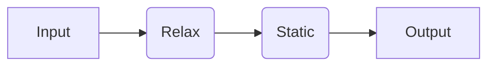
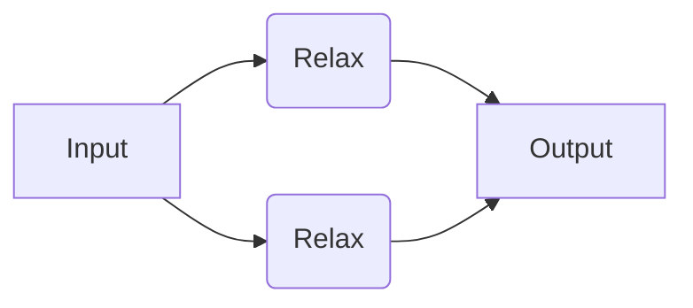
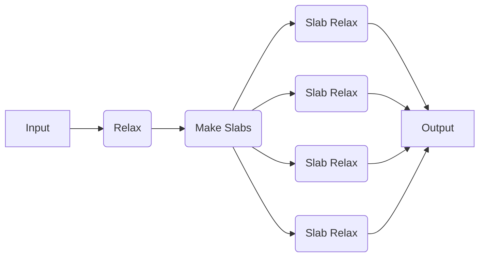

# Going High-Throughput

Here, we will show how to use quacc with one of a variety of workflow engines to construct, dispatch, and monitor your calculations.

!!! Tip

    If you are just getting started with workflow engines, we recommend first trying Covalent.

## Pre-Requisites

=== "Covalent"

    Take a moment to learn about the main [Covalent Concepts](https://docs.covalent.xyz/docs/user-documentation/concepts/concepts-index), namely the [`Electron`](https://docs.covalent.xyz/docs/user-documentation/concepts/covalent-basics#electron) and [`Lattice`](https://docs.covalent.xyz/docs/user-documentation/concepts/covalent-basics#lattice) objects, which describe individual compute tasks and workflows, respectively.

    In Covalent, the `@ct.lattice` decorator indicates that the function is a workflow, and the `@ct.electron` decorator indicates that the function is a job (i.e. an individual compute task). If you plan to use a job scheduling system like Slurm, you can think of each `Electron` as an individual Slurm job.

    All `Electron` and `Lattice` objects behave as normal Python functions when the necessary arguments are supplied. However, if the `ct.dispatch` command is used, the workflow will be dispatched to the Covalent server for execution and monitoring.

    !!! Info

        For a more detailed tutorial on how to use Covalent, refer to the ["Covalent Quick Start"](https://docs.covalent.xyz/docs/get-started/quick-start).

=== "Parsl"

    Take a moment to read Parsl documentation's ["Quick Start"](https://parsl.readthedocs.io/en/stable/quickstart.html) to get a sense of how Parsl works. Namely, you should understand the concept of a `@python_app` and `@join_app`, which describe individual compute tasks and dynamic job tasks, respectively.

    !!! Info

        For a more detailed tutorial on how to use Parsl, refer to the ["Parsl Tutorial"](https://parsl.readthedocs.io/en/stable/1-parsl-introduction.html) and the even more detailed ["Parsl User Guide"](https://parsl.readthedocs.io/en/stable/userguide/index.html).

=== "Jobflow"

    Take a moment to read the Jobflow documentation's [Quick Start](https://materialsproject.github.io/jobflow/tutorials/1-quickstart.html) to get a sense of how Jobflow works. Namely, you should understand the `Job` and `Flow` definitions, which describe individual compute tasks and workflows, respectively.

    !!! Info

        For a more detailed tutorial on how to use Jobflow, refer to the [Jobflow Tutorials](https://materialsproject.github.io/jobflow/tutorials) and [this helpful guide](https://github.com/JaGeo/Advanced_Jobflow_Tutorial) written by Dr. Janine George.

## Examples

### Running a Simple Serial Workflow

We will now try running a simple workflow where we relax a bulk Cu structure using EMT and take the output of that calculation as the input to a follow-up static calculation with EMT.



=== "Covalent"

    !!! Hint

        If you haven't done so yet, make sure you started the Covalent server with `covalent start` in the command-line.

    ```python
    import covalent as ct
    from ase.build import bulk
    from quacc.recipes.emt.core import relax_job, static_job

    # Define the workflow
    @ct.lattice
    def workflow(atoms):

        # Define Job 1
        result1 = relax_job(atoms)

        # Define Job 2, which takes the output of Job 1 as input
        result2 = static_job(result1)

        return result2

    # Make an Atoms object of a bulk Cu structure
    atoms = bulk("Cu")

    # Dispatch the workflow to the Covalent server
    # with the bulk Cu Atoms object as the input
    dispatch_id = ct.dispatch(workflow)(atoms)

    # Fetch the result from the server
    result = ct.get_result(dispatch_id, wait=True)
    print(result)
    ```

    You can see that it is quite trivial to set up a workflow using the recipes within quacc. We define the full workflow as a `Lattice` object that stitches together the individual workflow steps. The `.emt.core.relax_job` and `.emt.core.static_job` were both already defined with a `@ct.electron` decorator, so they will be interpreted by Covalent as `Electron` objects.

    Covalent will also automatically construct a directed acyclic graph of the inputs and outputs for each calculation to determine which jobs are dependent on one another and the order the jobs should be run. In this example, Covalent will know not to run `job2` until `job1` has completed successfully.

    The job will be dispatched to the Covalent server with the [`ct.dispatch`](https://docs.covalent.xyz/docs/user-documentation/concepts/covalent-basics#dispatch) command, which takes in the workflow function and the input arguments to the workflow. The [`ct.get_result`](https://docs.covalent.xyz/docs/user-documentation/concepts/covalent-basics#result) command is used to fetch the results from the server.

    !!! Note

        Because the workflow is only sent to the server with `ct.dispatch`, calling `workflow(atoms)` would run the workflow as if Covalent were not being used at all.

    

=== "Parsl"

    !!! Hint

        If you haven't done so yet, make sure you have loaded a Parsl configuration in your Python script. An example for running on your local machine is included below. Note that dynamic workflow recipes may fail if multi-threading is enabled, which is why we don't use the default `parsl.load()` configuration.

        ```python
        from parsl import Config
        from parsl.executors.threads import ThreadPoolExecutor
        parsl.load(config=Config(executors=[ThreadPoolExecutor(max_threads=1)]))
        ```

    ```python
    from parsl import python_app
    from ase.build import bulk

    # Define the Python apps
    @python_app
    def relax_app(atoms):
        from quacc.recipes.emt.core import relax_job

        return relax_job(atoms)

    @python_app
    def static_app(atoms):
        from quacc.recipes.emt.core import static_job

        return static_job(atoms)

    # Make an Atoms object of a bulk Cu structure
    atoms = bulk("Cu")

    # Call App 1
    future1 = relax_app(atoms)

    # Call App 2, which takes the output of App 1 as input
    future2 = static_app(future1.result())

    # Print result
    print(future2.result())
    ```

    You can see that it is quite trivial to set up a Parsl workflow using the recipes within quacc. We define the full workflow as a function that stitches together the individual `@python_app` workflow steps.

    The use of `.result()` serves to block any further calculations from running until it is resolved. Calling `.result()` also returns the function output as opposed to the `AppFuture` object. Technically, we did not need to call `future1.result()` because Parsl will automatically know that it cannot run `static_app` until `future1` is resolved. Nonetheless, we have included it here for clarity.

    !!! Note
        It is not considered good practice to include a `.result()` call in a `@python_app` or `@join_app` definition.

=== "Jobflow"

    ```python
    from jobflow import Flow, job, run_locally
    from ase.build import bulk
    from quacc.recipes.emt.core import relax_job, static_job

    # Make an Atoms object of a bulk Cu structure
    atoms = bulk("Cu")

    # Define Job 1
    job1 = job(relax_job)(atoms)

    # Define Job 2, which takes the output of Job 1 as input
    job2 = job(static_job)(job1.output)

    # Define the workflow
    workflow = Flow([job1, job2])

    # Run the workflow locally
    responses = run_locally(workflow, create_folders=True)

    # Get the result
    result = responses[job2.uuid][1].output
    print(result)
    ```

    The key thing to note is that we need to transform the quacc recipe, which is a normal function, into a `Job` object. This can be done using the `@job` decorator and a new function definition or, more compactly, via `job(<function>)`.

    We also must stitch the individual `Job` objects together into a `Flow`, which can be easily achieved by passing them to the `Flow()` constructor. The `Flow` object will automatically determine the order in which the jobs should be run based on the inputs and outputs of each job. In this case, it will know not to run `job2` until `job1` has completed.

    We chose to run the job locally, but other workflow managers supported by Jobflow can be imported and used.

### Running a Simple Parallel Workflow

Now let's consider a similar but nonetheless distinct example. Here, we will define a workflow where we will carry out two EMT structure relaxations, but the two jobs are not dependent on one another. In this example, Covalent will know that it can run the two jobs separately, and even if Job 1 were to fail, Job 2 would still progress.



=== "Covalent"

    ```python
    import covalent as ct
    from ase.build import bulk, molecule
    from quacc.recipes.emt.core import relax_job

    # Define workflow
    @ct.lattice
    def workflow(atoms1, atoms2):

        # Define two independent relaxation jobs
        result1 = relax_job(atoms1)
        result2 = relax_job(atoms2)

        return {"result1": result1, "result2": result2}

    # Define two Atoms objects
    atoms1 = bulk("Cu")
    atoms2 = molecule("N2")

    # Dispatch the workflow to the Covalent server
    dispatch_id = ct.dispatch(workflow)(atoms1, atoms2)

    # Fetch the results from the server
    result = ct.get_result(dispatch_id, wait=True)
    print(result)
    ```

    

=== "Parsl"

    ```python
    from parsl import python_app
    from ase.build import bulk, molecule

    # Define the Python app
    @python_app
    def relax_app(atoms):
        from quacc.recipes.emt.core import relax_job

        return relax_job(atoms)

    # Define two Atoms objects
    atoms1 = bulk("Cu")
    atoms2 = molecule("N2")

    # Define two independent relaxation jobs
    future1 = relax_app(atoms1)
    future2 = relax_app(atoms2)

    # Print the results
    print(future1.result(), future2.result())
    ```

=== "Jobflow"

    ```python
    from jobflow import job, Flow, run_locally
    from ase.build import bulk, molecule
    from quacc.recipes.emt.core import relax_job

    # Define two Atoms objects
    atoms1 = bulk("Cu")
    atoms2 = molecule("N2")

    # Define two independent relaxation jobs
    job1 = job(relax_job)(atoms1)
    job2 = job(relax_job)(atoms2)

    # Define the workflow
    workflow = Flow([job1, job2])

    # Run the workflow locally
    responses = run_locally(workflow, create_folders=True)

    # Get the result
    result = responses[job2.uuid][1].output
    print(result)
    ```

### Running Workflows with Complex Connectivity

For this example, let's consider a toy scenario where we wish to relax a bulk Cu structure, carve all possible slabs, and then run a new relaxation calculation on each slab (with no static calculation at the end). This is an example of a dynamic workflow.



In quacc, there are two types of recipes: individual compute tasks with the suffix `_job` and pre-made multi-step workflows with the suffix `_flow`. Here, we are interested in importing a pre-made workflow. Refer to the example below:

=== "Covalent"

    ```python
    import covalent as ct
    from ase.build import bulk
    from quacc.recipes.emt.core import relax_job
    from quacc.recipes.emt.slabs import bulk_to_slabs_flow

    @ct.lattice
    def workflow(atoms):
        relaxed_bulk = relax_job(atoms)
        relaxed_slabs = bulk_to_slabs_flow(relaxed_bulk, slab_static_electron=None)

        return relaxed_slabs

    atoms = bulk("Cu")
    dispatch_id = ct.dispatch(workflow)(atoms)
    result = ct.get_result(dispatch_id, wait=True)
    print(result)
    ```

    We have imported the `.emt.slabs.bulk_to_slabs_flow` function, which takes an `Atoms` object along with several optional parameters. For demonstration purposes, we specify the `slab_static_electron=None` option to do a relaxation but disable the static calculation on each slab. All we have to do to define the workflow is wrap it inside a `@ct.lattice` decorator.

    Due to the dynamic nature of `bulk_to_slabs_flow`, the number of returned slabs will be dependent on the input `Atoms` object. The pattern for creating a dynamic workflow in Covalent is called a ["sublattice"](https://docs.covalent.xyz/docs/user-documentation/concepts/covalent-arch/covalent-sdk#sublattice). The sublattice, which is really just a fancy name for a sub-workflow within a larger workflow, and its individual compute tasks can also be viewed in the Covalent UI.

    !!! Hint

        You don't need to set `wait=True` in practice. Once you call `ct.dispatch`, the workflow will begin running. The `ct.get_result` function is used to fetch the workflow status and results from the server.

    

=== "Parsl"

    **The Inefficient Way**

    ```python
    from parsl import python_app
    from ase.build import bulk

    @python_app
    def relax_app(atoms):
        from quacc.recipes.emt.core import relax_job

        return relax_job(atoms)

    @python_app
    def bulk_to_slabs_app(atoms):
        from quacc.recipes.emt.slabs import bulk_to_slabs_flow

        return bulk_to_slabs_flow(atoms, slab_static_electron=None)

    # Define the Atoms object
    atoms = bulk("Cu")

    # Define the workflow
    future1 = relax_app(atoms)
    future2 = bulk_to_slabs_app(future1.result())

    # Print the results
    print(future2.result())
    ```

    When running a Covalent-based workflow like `.emt.slabs.bulk_to_slabs_flow` above, the entire function will run as a single compute task even though it is composed of several individual sub-tasks. If these sub-tasks are compute-intensive, this might not be the most efficient use of resources.

    **The Efficient Way**

    Quacc fully supports Parsl-based workflows to resolve this limitation. For example, the workflow above can be equivalently run as follows using the Parsl-specific `.emt.parsl.slabs.bulk_to_slabs_flow` workflow:

    ```python
    from parsl import python_app
    from ase.build import bulk
    from quacc.recipes.emt.parsl.slabs import bulk_to_slabs_flow

    # Define the Python App
    @python_app
    def relax_app(atoms):
        from quacc.recipes.emt.core import relax_job

        return relax_job(atoms)

    # Define the Atoms object
    atoms = bulk("Cu")

    # Define the workflow
    future1 = relax_app(atoms)
    future2 = bulk_to_slabs_flow(future1.result(), slab_static_app=None)

    # Print the results
    print(future2.result())
    ```

    In this example, all the individual tasks and sub-tasks are run as separate jobs, which is more efficient. By comparing `.emt.parsl.slabs.bulk_to_slabs_flow` with its Covalent counterpart `.emt.slabs.bulk_to_slabs_flow`, you can see that the two are extremely similar such that it is often straightforward to [interconvert](wflow_syntax.md) between the two.

    !!! Note
        We didn't need to wrap `bulk_to_slabs_flow` with a `@python_app` decorator because it is simply a collection of `PythonApp` objects and is already returning an `AppFuture`.

=== "Jobflow"

    **The Inefficient Way**

    ```python
    from jobflow immport job, Flow, run_locally
    from ase.build import bulk
    from quacc.recipes.emt.core import relax_job
    from quacc.recipes.emt.slabs import bulk_to_slabs_flow

    # Define the Atoms object
    atoms = bulk("Cu")

    # Construct the Flow
    job1 = job(relax_job)(atoms)
    job2 = job(bulk_to_slabs_flow)(job1.output)
    workflow = Flow([job1, job2])

    # Run the workflow locally
    responses = run_locally(workflow, create_folders=True)

    # Get the result
    result = responses[job2.uuid][1].output
    print(result)
    ```

    We have imported the `.emt.slabs.bulk_to_slabs_flow` function, which takes an `Atoms` object along with several optional parameters. For demonstration purposes, we specify the `slab_static_electron=None` option to do a relaxation but disable the static calculation on each slab. All we have to do to define the workflow is stitch together the individual `@job` steps into a single `Flow` object.

    **The Efficient Way**

    Quacc fully supports Jobflow-based workflows to resolve this limitation. For example, the workflow above can be equivalently run as follows using the Jobflow-specific `.emt.jobflow.slabs.bulk_to_slabs_flow` workflow:

    ```python
    from jobflow import job, Flow, run_locally
    from ase.build import bulk
    from quacc.recipes.emt.core import relax_job
    from quacc.recipes.emt.jobflow.slabs import bulk_to_slabs_flow

    # Define the Atoms object
    atoms = bulk("Cu")

    # Construct the Flow
    job1 = job(relax_job)(atoms)
    job2 = job(bulk_to_slabs_flow)(job1.output)
    workflow = Flow([job1, job2])

    # Run the workflow locally
    run_locally(workflow, create_folders=True)
    ```

    In this example, all the individual tasks and sub-tasks are run as separate jobs, which is more efficient. By comparing `.emt.jobflow.slabs.bulk_to_slabs_flow` with its Covalent counterpart `.emt.slabs.bulk_to_slabs_flow`, you can see that the two are extremely similar such that it is often straightforward to [interconvert](wflow_syntax.md) between the two. In the case of `bulk_to_slabs_flow`, it actually returns a [`Response(replace)`](<https://materialsproject.github.io/jobflow/tutorials/5-dynamic-flows.html#The-Response(replace)-option>) object that dynamically replaces the `Flow` with several downstream jobs.

## Deploying Calculations

=== "Covalent"

    By default, Covalent will run all `Electron` tasks on your local machine using the [`DaskExecutor`](https://docs.covalent.xyz/docs/user-documentation/api-reference/executors/dask). This is a parameter that you can control. For instance, you may want to define the executor to be based on [Slurm](https://docs.covalent.xyz/docs/user-documentation/api-reference/executors/slurm) to submit a job to an HPC cluster. The example below highlights how one can change the executor.

    **Setting Executors via the Lattice Object**

    If you want to use the same executor for all the `Electron` objects in a `Lattice`, you can pass the `executor` keyword argument to the `@ct.lattice` decorator, as shown below.

    ```python
    import covalent as ct
    from ase.build import bulk
    from quacc.recipes.emt.core import relax_job, static_job

    @ct.lattice(executor="local")
    def workflow(atoms):

        result1 = relax_job(atoms)
        result2 = static_job(result1)

        return result2

    atoms = bulk("Cu")
    dispatch_id = ct.dispatch(workflow)(atoms)
    result = ct.get_result(dispatch_id, wait=True)
    print(result)
    ```

    **Setting Executors via the Electron Objects**

    The individual `Electron` executor options can be modified after they are imported as follows:

    ```python
    import covalent as ct
    from ase.build import bulk
    from quacc.recipes.emt.core import relax_job, static_job

    @ct.lattice
    def workflow(atoms):
        job1 = relax_job
        job1.electron_object.executor = "dask"

        job2 = static_job
        job2.electron_object.executor = "local"

        output1 = job1(atoms)
        output2 = job2(output1)
        return output2

    atoms = bulk("Cu")
    dispatch_id = ct.dispatch(workflow)(atoms)
    result = ct.get_result(dispatch_id, wait=True)
    print(result)
    ```

    !!! Hint

        If you are defining your own workflow functions to use, you can also set the executor for individual `Electron` objects by passing the `executor` keyword argument to the `@ct.electron` decorator.

    **Configuring Executors**

    Refer to the [executor documentation](https://docs.covalent.xyz/docs/features/executor-plugins/exe) for instructions on how to configure Covalent for your desired machines.

    By default, the `workdir` for the `Dask` (default) and `local` executors is set to `~/.cache/covalent/workdir`. This is where any files generated at runtime will be stored. You can change both of these parameters to the directories of your choosing by editing the Covalent configuration file directly or via the `ct.set_config()` command.

    For submitting jobs to [Perlmutter at NERSC](https://docs.nersc.gov/systems/perlmutter/) from your local machine, an example `SlurmExecutor` configuration with support for an [`sshproxy`](https://docs.nersc.gov/connect/mfa/#sshproxy)-based multi-factor authentication certificate might look like the following:

    ```python
    n_nodes = 1
    n_cores_per_node = 48

    executor = ct.executor.SlurmExecutor(
        username="YourUserName",
        address="perlmutter-p1.nersc.gov",
        ssh_key_file="~/.ssh/nersc",
        cert_file="~/.ssh/nersc-cert.pub",
        remote_workdir="$SCRATCH",
        conda_env="quacc",
        options={
            f"nodes": {n_nodes},
            "qos": "debug",
            "constraint": "cpu",
            "account": "YourAccountName",
            "job-name": "quacc",
            "time": "00:10:00",
        },
        prerun_commands=[
            "export COVALENT_CONFIG_DIR=$SCRATCH",
            f"export QUACC_VASP_PARALLEL_CMD='srun -N {n_nodes} --ntasks-per-node={n_cores_per_node} --cpu_bind=cores'",
        ],
        use_srun=False,
    )
    ```

    !!! Important

        The `SlurmExecutor` must have `use_srun=False` in order for ASE-based calculators to be launched appropriately.

=== "Parsl"

    Out-of-the-box, Parsl will run on your local machine. However, in practice you will probably want to run your Parsl workflows on HPC machines.

    !!! Note

        If you are just starting out, try running some test calculations locally first. Then come back and set up the relevant configuration files for your desired machines.

    **Configuring Executors**

    To configure Parsl for the high-performance computing environment of your choice, refer to the executor [Configuration](https://parsl.readthedocs.io/en/stable/userguide/configuring.html) page in the Parsl documentation.

    For [Perlmutter at NERSC](https://docs.nersc.gov/systems/perlmutter/), example `HighThroughputExecutor` configurations can be found in the [NERSC Documentation](https://docs.nersc.gov/jobs/workflow/parsl/). A simple one is reproduced below that allows for job submission from the login node. This example will create a single Slurm job that will run one `PythonApp` at a time on a single node and is good for testing out some of the examples above.

    ```python
    from parsl.config import Config
    from parsl.executors import HighThroughputExecutor
    from parsl.launchers import SimpleLauncher
    from parsl.providers import SlurmProvider

    config = Config(
        max_idletime=120,
        executors=[
            HighThroughputExecutor(
                label="quacc_HTEX",
                max_workers=1,
                provider=SlurmProvider(
                    account="MyAccountName",
                    nodes_per_block=1,
                    scheduler_options="#SBATCH -q debug -C cpu",
                    worker_init="source activate quacc",
                    walltime="00:10:00",
                    cmd_timeout=120,
                    launcher = SimpleLauncher(),
                ),
            )
        ],
    )
    ```

    The individual arguments are as follows:

    - `max_idletime`: The maximum amount of time (in seconds) to allow the executor to be idle before the Slurm job is cancelled.
    - `label`: A label for the executor instance, used during file I/O.
    - `max_workers`: Maximum number of workers to allow on a node.
    - `SlurmProvider()`: The provider to use for job submission. This can be changed to `LocalProvider()` if you wish to have the Parsl process run on a compute node rather than the login node.
    - `account`: Your NERSC account name.
    - `nodes_per_block`: The number of nodes to request per job. By default, all cores on the node will be requested (seetting `cores_per_node` will override this).
    - `scheduler_options`: Any additional `#SBATCH` options can be included here.
    - `worker_init`: Commands to run before the job starts, typically used for activating a given Python environment.
    - `walltime`: The maximum amount of time to allow the job to run in `HH:MM:SS` format.
    - `cmd_timeout`: The maximum time to wait (in seconds) for the job scheduler info to be retrieved/sent.
    - `launcher`: The type of Launcher to use. Note that `SimpleLauncher()` must be used instead of the commonly used `SrunLauncher()` to allow quacc subprocesses to launch their own `srun` commands.

    Unlike some other workflow engines, Parsl (by default) is built for "jobpacking" where the allocated nodes continually pull in new workers (until the walltime is reached). This makes it possible to request a large number of nodes that continually pull in new jobs rather than submitting a large number of small jobs to the scheduler, which can be more efficient. In other words, don't be surprised if the Slurm job continues to run even when your submitted task has completed.

    **Scaling Up**

    Now let's consider a more realistic scenario. Suppose we want to have a single Slurm job that reserves 8 nodes, and each `PythonApp` (e.g. VASP calculation) will run on 2 nodes (let's assume each node has 48 cores total, so that's a total of 96 cores for each calculation). Parsl will act as an orchestrator in the background of one of the nodes. Our config will now look like the following.

    ```python
    n_parallel_calcs = 4 # Number of quacc calculations to run in parallel
    n_nodes_per_calc = 2 # Number of nodes to reserve for each calculation
    n_cores_per_node = 48 # Number of CPU cores per node
    vasp_parallel_cmd = f"srun -N {n_nodes_per_calc} --ntasks-per-node={n_cores_per_node} --cpu_bind=cores"

    config = Config(
        max_idletime=300,
        executors=[
                HighThroughputExecutor(
                    label="quacc_HTEX",
                    max_workers=n_parallel_calcs,
                    cores_per_worker=1e-6,
                    provider=SlurmProvider(
                        account="MyAccountName",
                        nodes_per_block=n_nodes_per_calc*n_parallel_calcs,
                        scheduler_options="#SBATCH -q debug -C cpu",
                        worker_init=f"source activate quacc && module load vasp && export QUACC_VASP_PARALLEL_CMD={vasp_parallel_cmd}",
                        walltime="00:10:00",
                        launcher = SimpleLauncher(),
                        cmd_timeout=120,
                        init_blocks=0,
                        min_blocks=1,
                        max_blocks=1,
                    ),
                )
            ],
        )
    ```

    In addition to some modified parameters, there are some new ones here too. The most notable is the definition of `init_blocks`, `min_blocks`, and `max_blocks`, which set the number of active blocks (e.g. Slurm jobs) and can be modified to enable [elastic resource management](https://parsl.readthedocs.io/en/stable/userguide/execution.html#elasticity). We also set `cores_per_worker` to a small value so that the pilot job (e.g. the Parsl orchestrator) is allowed to be oversubscribed with scheduling processes.

    !!! Tip

        Dr. Logan Ward has a nice example on YouTube describing a very similar example [here](https://youtu.be/0V4Hs4kTyJs?t=398).


    !!! Warning

        By default, the [`ThreadPoolExecutor`](https://parsl.readthedocs.io/en/stable/stubs/parsl.executors.ThreadPoolExecutor.html#parsl.executors.ThreadPoolExecutor) (which is used when calling `parsl.load()`) is run in a multi-threaded mode, which may cause I/O errors when running multiple calculations simultaneously. We do not recommend using Parsl-based multi-threading at this time if there is any file I/O in your workflow.

=== "Jobflow"

    Out-of-the box, Jobflow can be used to run on your local machine. You will, however, need a "manager" to run your workflows on HPC machines. The currently recommended manager for Jobflow is FireWorks, which is described here.

    **Converting Between Jobflow and FireWorks**

    The `jobflow.managers.fireworks` module has all the tools you need to convert your Jobflow workflows to a format that is suitable for FireWorks.

    **Converting a Job to a Firework**

    To convert a `Job` to a `firework` and add it to your launch pad:

    ```python
    from fireworks import LaunchPad
    from jobflow.managers.fireworks import job_to_firework

    fw = job_to_firework(job)
    lpad = LaunchPad.auto_load()
    lpad.add_wf(fw)
    ```

    **Converting a Flow to a Workflow**

    To convert a `Flow` to a `workflow` and add it to your launch pad:

    ```python
    from fireworks import LaunchPad
    from jobflow.managers.fireworks import flow_to_workflow

    wf = flow_to_workflow(flow)
    lpad = LaunchPad.auto_load()
    lpad.add_wf(wf)
    ```

    **Dispatching Calculations**

    With a workflow added to your launch pad, on the desired machine of choice, you can run `qlaunch rapidfire --nlaunches <N>` (where `<N>` is the number of jobs to submit) in the command line to submit your workflows to the job scheduler. Running `qlaunch rapidfire -m <N>` will ensure that `<N>` jobs are always in the queue or running. To modify the order in which jobs are run, a priority can be set via `lpad set_priority <priority> -i <FWID>` where `<priority>` is a number.

    By default, `qlaunch` will launch Slurm jobs that then poll for work. This means that more Slurm jobs may be submitted than there are jobs to run. To modify the behavior of `qlaunch` to only submit a Slurm job for each "READY" FireWork in the launchpad, use the `-r` ("reserved") flag.

    **Monitoring the Launchpad**

    The easiest way to monitor the state of your launched FireWorks and workflows is through the GUI, which can be viewed with `lpad webgui`. To get the status of running fireworks from the command line, you can run `lpad get_fws -s RUNNING`. Other statuses can also be provided as well as individual FireWorks IDs.

    To rerun a specific FireWork, one can use the `rerun_fws` command like so: `lpad rerun_fws -i <FWID>` where `<FWID>` is the FireWork ID. Similarly, one can rerun all fizzled jobs via `lpad rerun_fws -s FIZZLED`. More complicated Mongo-style queries can also be carried out. Cancelling a workflow can be done with `lpad delete_wflows -i <FWID>`.

    Refer to the `lpad -h` help menu for more details.

    **Continuous Job Submission**

    To ensure that jobs are continually submitted to the queue you can use `tmux` to preserve the job submission process even when the SSH session is terminated. For example, running `tmux new -s launcher` will create a new `tmux` session named `launcher`. To exit the `tmux` session while still preserving any running tasks on the login node, press `ctrl+b` followed by `d`. To re-enter the tmux session, run `tmux attach -t launcher`. Additional `tmux` commands can be found on the [tmux cheatsheet](https://tmuxcheatsheet.com/).

## Learn More

=== "Covalent"

    That ends the Covalent section of the documentation. If you want to learn more about Covalent, you can read the [Covalent Documentation](https://docs.covalent.xyz/docs/). Please refer to the Covalent [Discussion Board](https://github.com/AgnostiqHQ/covalent/discussions) for any Covalent-specific questions.

=== "Parsl"

    That ends the Parsl section of the documentation. If you want to learn more about Parsl, you can read the [Parsl Documentation](https://parsl.readthedocs.io/en/stable/#). Please refer to the [Parsl Slack Channel](http://parsl-project.org/support.html) for any Parsl-specific questions.

=== "Jobflow"

    That ends the Jobflow section of the documentation. If you want to learn more about Jobflow, you can read the [Jobflow Documentation](https://materialsproject.github.io/jobflow/). Please refer to the [Jobflow Discussions Board](https://github.com/materialsproject/jobflow/discussions) for Jobflow-specific questions.
