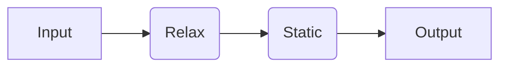
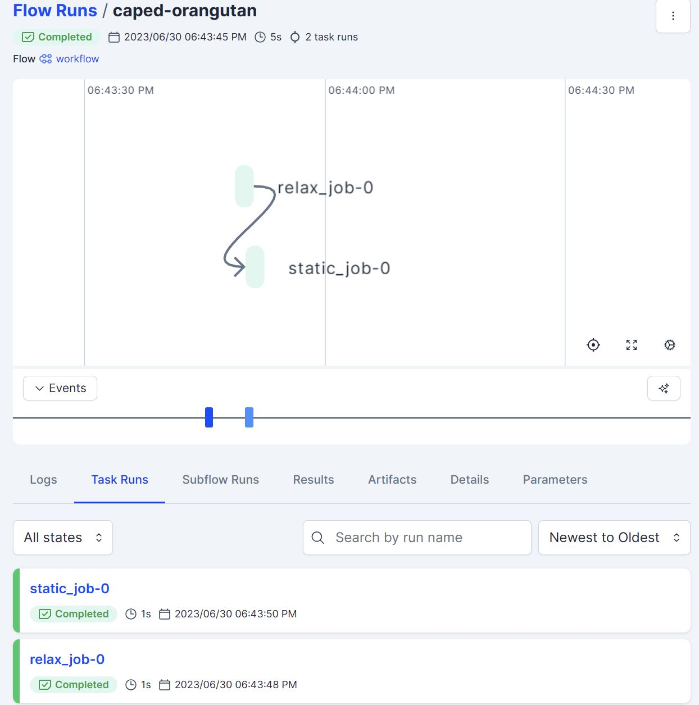
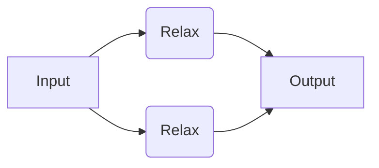
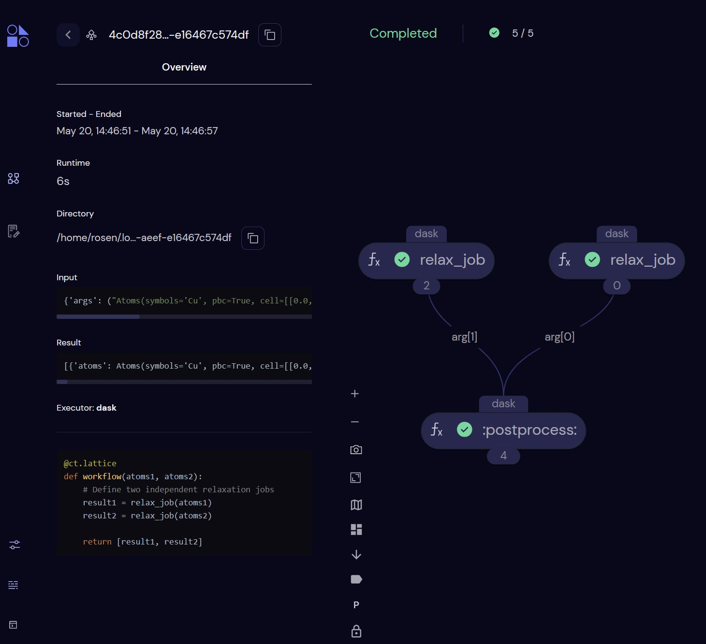
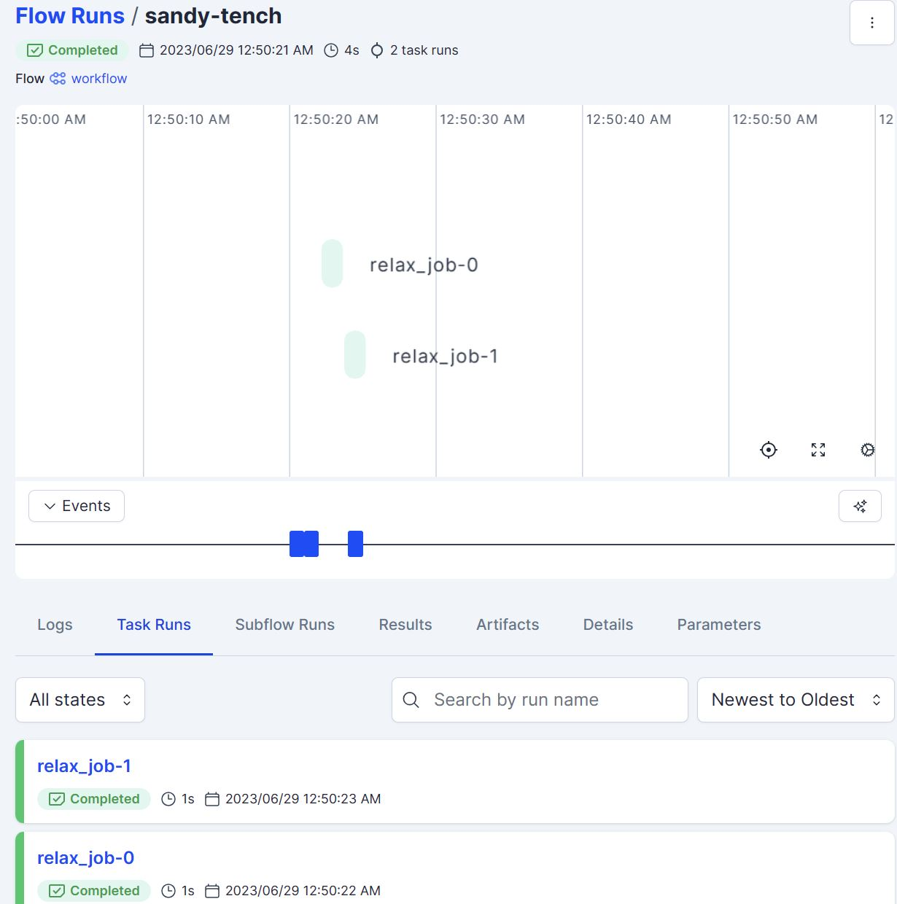
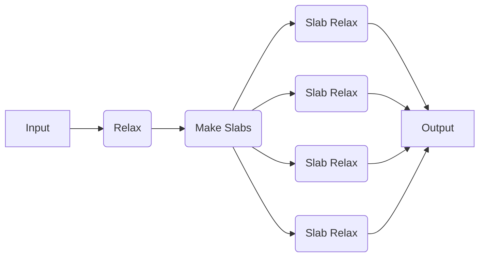
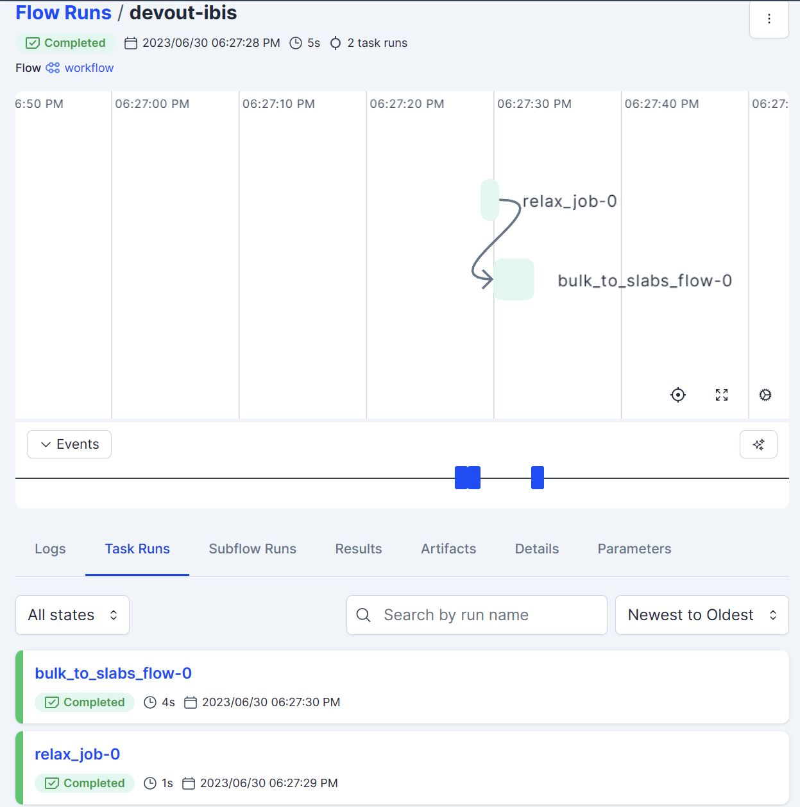
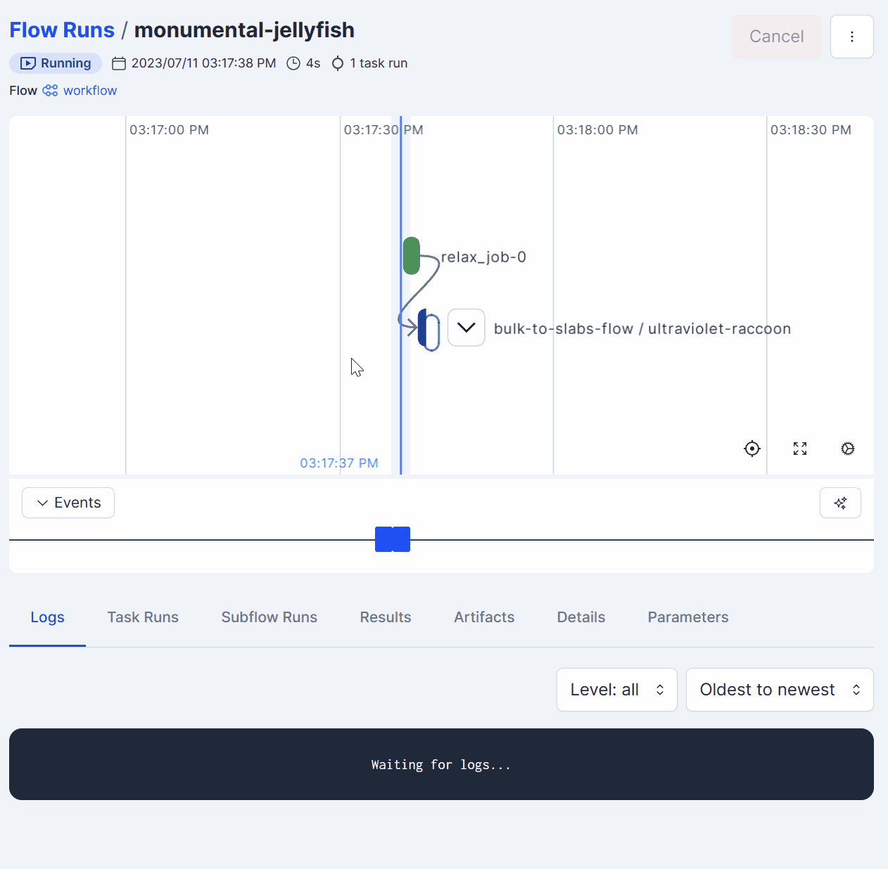

# Using a Workflow Engine

Here, we will show how to use quacc with one of a variety of workflow engines to construct, dispatch, and monitor your calculations.

!!! Tip

    If you are just getting started with workflow engines, we recommend first trying Covalent.

## Pre-Requisites

=== "Covalent"

    Take a moment to learn about the main [Covalent Concepts](https://docs.covalent.xyz/docs/user-documentation/concepts/concepts-index), namely the [`Electron`](https://docs.covalent.xyz/docs/user-documentation/concepts/covalent-basics#electron) and [`Lattice`](https://docs.covalent.xyz/docs/user-documentation/concepts/covalent-basics#lattice) objects, which describe individual compute tasks and workflows, respectively.

    In Covalent, the `@ct.lattice` decorator indicates that the function is a workflow, and the `@ct.electron` decorator indicates that the function is a job (i.e. an individual compute task). If you plan to use a job scheduling system like Slurm, you can think of each `Electron` as an individual Slurm job.

    All `Electron` and `Lattice` objects behave as normal Python functions when the necessary arguments are supplied. However, if the `ct.dispatch` command is used, the workflow will be dispatched to the Covalent server for execution and monitoring.

    !!! Info

        For a more detailed tutorial on how to use Covalent, refer to the ["Covalent Quick Start"](https://docs.covalent.xyz/docs/get-started/quick-start).

=== "Parsl"

    Take a moment to read Parsl documentation's ["Quick Start"](https://parsl.readthedocs.io/en/stable/quickstart.html) to get a sense of how Parsl works. Namely, you should understand the concept of a [`@python_app`](https://parsl.readthedocs.io/en/stable/1-parsl-introduction.html#Python-Apps) and [`@join_app`](https://parsl.readthedocs.io/en/stable/1-parsl-introduction.html?highlight=join_app#Dynamic-workflows-with-apps-that-generate-other-apps), which describe individual compute tasks and dynamic job tasks, respectively.

    !!! Info

        For a more detailed tutorial on how to use Parsl, refer to the ["Parsl Tutorial"](https://parsl.readthedocs.io/en/stable/1-parsl-introduction.html) and the even more detailed ["Parsl User Guide"](https://parsl.readthedocs.io/en/stable/userguide/index.html).

=== "Prefect"

    Take a moment to learn about the main Prefect concepts of a [`Flow`](https://docs.prefect.io/concepts/flows/) and a [`Task`](https://docs.prefect.io/concepts/tasks/).

    !!! Info

        For more details, be sure to refer to the [Prefect Tutorial](https://docs.prefect.io/tutorial/). The [Workflow Orchestration without DAGs](https://www.prefect.io/guide/blog/workflow-orchestration-without-dags/) blog post is also a good read.

=== "Jobflow"

    Take a moment to read the Jobflow documentation's [Quick Start](https://materialsproject.github.io/jobflow/tutorials/1-quickstart.html) to get a sense of how Jobflow works. Namely, you should understand the `Job` and `Flow` definitions, which describe individual compute tasks and workflows, respectively.

    !!! Info

        For a more detailed tutorial on how to use Jobflow, refer to the [Jobflow Tutorials](https://materialsproject.github.io/jobflow/tutorials) and [this helpful guide](https://github.com/JaGeo/Advanced_Jobflow_Tutorial) written by Dr. Janine George.

## Examples

### Running a Simple Serial Workflow

We will now try running a simple workflow where we relax a bulk Cu structure using EMT and take the output of that calculation as the input to a follow-up static calculation with EMT.



=== "Covalent"

    !!! Tip

        If you haven't done so yet, make sure you started the Covalent server with `covalent start` in the command-line.

    ```python
    import covalent as ct
    from ase.build import bulk
    from quacc.recipes.emt.core import relax_job, static_job

    # Define the workflow
    @ct.lattice
    def workflow(atoms):

        # Define Job 1
        result1 = relax_job(atoms)

        # Define Job 2, which takes the output of Job 1 as input
        result2 = static_job(result1)

        return result2

    # Make an Atoms object of a bulk Cu structure
    atoms = bulk("Cu")

    # Dispatch the workflow to the Covalent server
    # with the bulk Cu Atoms object as the input
    dispatch_id = ct.dispatch(workflow)(atoms) # (1)

    # Fetch the result from the server
    result = ct.get_result(dispatch_id, wait=True) # (2)
    print(result)
    ```

    1.  Because the workflow is only sent to the server with `ct.dispatch`, calling `workflow(atoms)` would run the workflow as if Covalent were not being used at all.

    2.  You don't need to set `wait=True` in practice. Once you call `ct.dispatch`, the workflow will begin running. The `ct.get_result` function is used to fetch the workflow status and results from the server.

    You can see that it is quite trivial to set up a workflow using the recipes within quacc. We define the full workflow as a `Lattice` object that stitches together the individual workflow steps. The [`quacc.recipes.emt.core.relax_job`](https://quantum-accelerators.github.io/quacc/reference/quacc/recipes/emt/core.html#quacc.recipes.emt.core.relax_job) and [`quacc.recipes.emt.core.static_job`](https://quantum-accelerators.github.io/quacc/reference/quacc/recipes/emt/core.html#quacc.recipes.emt.core.static_job) were both already defined with a `@ct.electron` decorator, so they will be interpreted by Covalent as `Electron` objects.

    Covalent will also automatically construct a directed acyclic graph of the inputs and outputs for each calculation to determine which jobs are dependent on one another and the order the jobs should be run. In this example, Covalent will know not to run `job2` until `job1` has completed successfully.

    The job will be dispatched to the Covalent server with the [`ct.dispatch`](https://docs.covalent.xyz/docs/user-documentation/concepts/covalent-basics#dispatch) command, which takes in the workflow function and the input arguments to the workflow. The [`ct.get_result`](https://docs.covalent.xyz/docs/user-documentation/concepts/covalent-basics#result) command is used to fetch the results from the server.

    

=== "Parsl"

    !!! Important

        If you haven't done so yet, make sure you have loaded a Parsl configuration in your Python script. An example for running on your local machine is included below. Note that parallel/dynamic workflow recipes may fail if multi-threading is enabled, which is why we don't use the default `parsl.load()` configuration here.

        ```python
        from parsl import Config
        from parsl.executors.threads import ThreadPoolExecutor
        parsl.load(config=Config(executors=[ThreadPoolExecutor(max_threads=1)]))
        ```

    ```python
    from parsl import python_app
    from ase.build import bulk

    # Define the Python apps
    @python_app
    def relax_app(atoms):
        from quacc.recipes.emt.core import relax_job

        return relax_job(atoms)

    @python_app
    def static_app(atoms):
        from quacc.recipes.emt.core import static_job

        return static_job(atoms)

    # Make an Atoms object of a bulk Cu structure
    atoms = bulk("Cu")

    # Call App 1
    future1 = relax_app(atoms)

    # Call App 2, which takes the output of App 1 as input
    future2 = static_app(future1.result())

    # Print result
    print(future2.result())
    ```

    You can see that it is quite trivial to set up a Parsl workflow using the recipes within quacc. We define the full workflow as a function that stitches together the individual `@python_app` workflow steps.

    The use of `.result()` serves to block any further calculations from running until it is resolved. Calling `.result()` also returns the function output as opposed to the `AppFuture` object. Technically, we did not need to call `future1.result()` because Parsl will automatically know that it cannot run `static_app` until `future1` is resolved. Nonetheless, we have included it here for clarity.

    !!! Note

        You should not include a `.result()` call in a `@python_app` or `@join_app` definition, which is why we didn't do so here. Parsl will implicitly know to call `.result()` on any `AppFuture`.

=== "Prefect"

    ```python
    from prefect import flow, task
    from prefect.task_runners import SequentialTaskRunner
    from ase.build import bulk
    from quacc.recipes.emt.core import relax_job, static_job


    # Define the workflow
    @flow(task_runner=SequentialTaskRunner()) # (1)
    def workflow(atoms):

        # Call Task 1
        future1 = task(relax_job).submit(atoms) # (2)

        # Call Task 2, which takes the output of Task 1 as input
        future2 = task(static_job).submit(future1)

        return future2

    # Make an Atoms object of a bulk Cu structure
    atoms = bulk("Cu")

    # Run the workflow with Prefect tracking
    result = workflow(atoms).result()
    print(result)
    ```

    1.  By default, the task runner for Prefect is the `ConcurrentTaskRunner`, which runs in a multi-threaded mode that is incompatible with parallel/dynamic quacc workflows. For local testing purposes, we recommend using the `SequentialTaskRunner` instead.

    2.  We have used a short-hand notation here of `task(<function>)`. This is equivalent to using the `@task` decorator and defining a new function for each task.

    You can see that it is quite trivial to set up a Prefect workflow using the recipes within quacc. We define the full `Flow` as a function that stitches together the individual `Task` workflow steps.Calling `.submit()` enables concurrent execution of the tasks, and `.result()` blocks further calculations until the result is returned. Both `.submit()` and `.result()` aren't necessary when testing Prefect workflows locally, but we have included them here to make the transition to HPC environments more seamless.

    !!! Note

        You should not call `.result()` when passing the results of tasks to other tasks, only when interacting with the result of a task inside of the flow itself. Prefect will implicitly know to call `.result()` on any `PrefectFuture`.

    

=== "Jobflow"

    ```python
    from jobflow import Flow, job, run_locally
    from ase.build import bulk
    from quacc.recipes.emt.core import relax_job, static_job

    # Make an Atoms object of a bulk Cu structure
    atoms = bulk("Cu")

    # Define Job 1
    job1 = job(relax_job)(atoms)

    # Define Job 2, which takes the output of Job 1 as input
    job2 = job(static_job)(job1.output)

    # Define the workflow
    workflow = Flow([job1, job2])

    # Run the workflow locally
    responses = run_locally(workflow, create_folders=True)

    # Get the result
    result = responses[job2.uuid][1].output
    print(result)
    ```

    The key thing to note is that we need to transform the quacc recipe, which is a normal function, into a `Job` object. This can be done using the `@job` decorator and a new function definition or, more compactly, via `job(<function>)`.

    We also must stitch the individual `Job` objects together into a `Flow`, which can be easily achieved by passing them to the `Flow()` constructor. The `Flow` object will automatically determine the order in which the jobs should be run based on the inputs and outputs of each job. In this case, it will know not to run `job2` until `job1` has completed.

    We chose to run the job locally, but other workflow managers supported by Jobflow can be imported and used.

### Running a Simple Parallel Workflow

Now let's consider a similar but nonetheless distinct example. Here, we will define a workflow where we will carry out two EMT structure relaxations, but the two jobs are not dependent on one another. In this example, Covalent will know that it can run the two jobs separately, and even if Job 1 were to fail, Job 2 would still progress.



=== "Covalent"

    ```python
    import covalent as ct
    from ase.build import bulk, molecule
    from quacc.recipes.emt.core import relax_job

    # Define workflow
    @ct.lattice
    def workflow(atoms1, atoms2):

        # Define two independent relaxation jobs
        result1 = relax_job(atoms1)
        result2 = relax_job(atoms2)

        return {"result1": result1, "result2": result2}

    # Define two Atoms objects
    atoms1 = bulk("Cu")
    atoms2 = molecule("N2")

    # Dispatch the workflow to the Covalent server
    dispatch_id = ct.dispatch(workflow)(atoms1, atoms2)

    # Fetch the results from the server
    result = ct.get_result(dispatch_id, wait=True)
    print(result)
    ```

    

=== "Parsl"

    ```python
    from parsl import python_app
    from ase.build import bulk, molecule

    # Define the Python app
    @python_app
    def relax_app(atoms):
        from quacc.recipes.emt.core import relax_job

        return relax_job(atoms)

    # Define two Atoms objects
    atoms1 = bulk("Cu")
    atoms2 = molecule("N2")

    # Define two independent relaxation jobs
    future1 = relax_app(atoms1)
    future2 = relax_app(atoms2)

    # Print the results
    print(future1.result(), future2.result())
    ```

    !!! Note

        If you find defining a new function for each `PythonApp` a bit annoying, you can use the following shorthand: `#!Python relax_app=python_app(relax_job.electron_object.function)`.

=== "Prefect"

    ```python
    from prefect import flow, task
    from prefect.task_runners import SequentialTaskRunner
    from ase.build import bulk, molecule
    from quacc.recipes.emt.core import relax_job

    # Define workflow
    @flow(task_runner=SequentialTaskRunner())
    def workflow(atoms1, atoms2):

        # Define two independent relaxation jobs
        future1 = task(relax_job).submit(atoms1)
        future2 = task(relax_job).submit(atoms2)

        return future1, future2

    # Define two Atoms objects
    atoms1 = bulk("Cu")
    atoms2 = molecule("N2")

    # Run the workflow with Prefect tracking
    future1, future2 = workflow(atoms1, atoms2)
    print(future1.result(), future2.result())
    ```
    As expected, the Prefect Cloud UI shows two jobs that are not dependent on one another.

    

=== "Jobflow"

    ```python
    from jobflow import job, Flow, run_locally
    from ase.build import bulk, molecule
    from quacc.recipes.emt.core import relax_job

    # Define two Atoms objects
    atoms1 = bulk("Cu")
    atoms2 = molecule("N2")

    # Define two independent relaxation jobs
    job1 = job(relax_job)(atoms1)
    job2 = job(relax_job)(atoms2)

    # Define the workflow
    workflow = Flow([job1, job2])

    # Run the workflow locally
    responses = run_locally(workflow, create_folders=True)

    # Get the result
    result = responses[job2.uuid][1].output
    print(result)
    ```

### Running Workflows with Complex Connectivity

For this example, let's consider a toy scenario where we wish to relax a bulk Cu structure, carve all possible slabs, and then run a new relaxation calculation on each slab (with no static calculation at the end). This is an example of a dynamic workflow.



In quacc, there are two types of recipes: individual compute tasks with the suffix `_job` and pre-made multi-step workflows with the suffix `_flow`. Here, we are interested in importing a pre-made workflow. Refer to the example below:

=== "Covalent"

    ```python
    import covalent as ct
    from ase.build import bulk
    from quacc.recipes.emt.core import relax_job
    from quacc.recipes.emt.slabs import bulk_to_slabs_flow

    @ct.lattice
    def workflow(atoms):
        relaxed_bulk = relax_job(atoms)
        relaxed_slabs = bulk_to_slabs_flow(relaxed_bulk, slab_static=None)

        return relaxed_slabs

    atoms = bulk("Cu")
    dispatch_id = ct.dispatch(workflow)(atoms)
    result = ct.get_result(dispatch_id, wait=True)
    print(result)
    ```

    We have imported the [`quacc.recipes.emt.slabs.bulk_to_slabs_flow`](https://quantum-accelerators.github.io/quacc/reference/quacc/recipes/emt/core.html#quacc.recipes.emt.slabs.bulk_to_slabs_flow) function, which takes an `Atoms` object along with several optional parameters. For demonstration purposes, we specify the `slab_static=None` option to do a relaxation but disable the static calculation on each slab. All we have to do to define the workflow is wrap it inside a `@ct.lattice` decorator.

    Due to the dynamic nature of `bulk_to_slabs_flow`, the number of returned slabs will be dependent on the input `Atoms` object. The pattern for creating a dynamic workflow in Covalent is called a ["sublattice"](https://docs.covalent.xyz/docs/user-documentation/concepts/covalent-arch/covalent-sdk#sublattice). The sublattice, which is really just a fancy name for a sub-workflow within a larger workflow, and its individual compute tasks can also be viewed in the Covalent UI.

    

=== "Parsl"

    **The Inefficient Way**

    ```python
    from parsl import python_app
    from ase.build import bulk

    @python_app
    def relax_app(atoms):
        from quacc.recipes.emt.core import relax_job

        return relax_job(atoms)

    @python_app
    def bulk_to_slabs_app(atoms):
        from quacc.recipes.emt.slabs import bulk_to_slabs_flow

        return bulk_to_slabs_flow(atoms, slab_static=None)

    # Define the Atoms object
    atoms = bulk("Cu")

    # Define the workflow
    future1 = relax_app(atoms)
    future2 = bulk_to_slabs_app(future1.result())

    # Print the results
    print(future2.result())
    ```

    When running a Covalent-based workflow like [`.emt.slabs.bulk_to_slabs_flow`](https://quantum-accelerators.github.io/quacc/reference/quacc/recipes/emt/core.html#quacc.recipes.emt.slabs.bulk_to_slabs_flow) above, the entire function will run as a single compute task even though it is composed of several individual sub-tasks. If these sub-tasks are compute-intensive, this might not be the most efficient use of resources.

    **The Efficient Way**

    Quacc fully supports Parsl-based workflows to resolve this limitation. For example, the workflow above can be equivalently run as follows using the Parsl-specific [`.emt.parsl.slabs.bulk_to_slabs_flow`](https://quantum-accelerators.github.io/quacc/reference/quacc/recipes/emt/core.html#quacc.recipes.emt.parsl.slabs.bulk_to_slabs_flow) workflow:

    ```python
    from parsl import python_app
    from ase.build import bulk
    from quacc.recipes.emt.parsl.slabs import bulk_to_slabs_flow

    # Define the Python App
    @python_app
    def relax_app(atoms):
        from quacc.recipes.emt.core import relax_job

        return relax_job(atoms)

    # Define the Atoms object
    atoms = bulk("Cu")

    # Define the workflow
    future1 = relax_app(atoms)
    future2 = bulk_to_slabs_flow(future1.result(), slab_static=None) # (1)

    # Print the results
    print(future2.result())
    ```

    1.  We didn't need to wrap `bulk_to_slabs_flow` with a `@python_app` decorator because it is simply a collection of `PythonApp` objects and is already returning an `AppFuture`.

    In this example, all the individual tasks and sub-tasks are run as separate jobs, which is more efficient. By comparing [`.emt.parsl.slabs.bulk_to_slabs_flow`](https://quantum-accelerators.github.io/quacc/reference/quacc/recipes/emt/core.html#quacc.recipes.emt.parsl.slabs.bulk_to_slabs_flow) with its Covalent counterpart [`.emt.slabs.bulk_to_slabs_flow`](https://quantum-accelerators.github.io/quacc/reference/quacc/recipes/emt/core.html#quacc.recipes.emt.slabs.bulk_to_slabs_flow), you can see that the two are extremely similar such that it is often straightforward to [interconvert](wflow_syntax.md) between the two.

=== "Prefect"

    **The Inefficient Way**

    ```python
    from prefect import task, flow
    from prefect.task_runners import SequentialTaskRunner
    from ase.build import bulk
    from quacc.recipes.emt.core import relax_job
    from quacc.recipes.emt.slabs import bulk_to_slabs_flow

    @flow(task_runner=SequentialTaskRunner())
    def workflow(atoms):
        future1 = task(relax_job).submit(atoms)
        future2 = task(bulk_to_slabs_flow).submit(future1, slab_static=None)

        return future2

    # Define the Atoms object
    atoms = bulk("Cu")

    # Run the workflow
    result = workflow(atoms).result()
    print(result)
    ```

    

    **The Efficient Way**

    ```python
    from prefect import task, flow
    from prefect.task_runners import SequentialTaskRunner
    from ase.build import bulk
    from quacc.recipes.emt.core import relax_job
    from quacc.recipes.emt.prefect.slabs import bulk_to_slabs_flow

    bulk_to_slabs_flow.task_runner = SequentialTaskRunner()

    @flow(task_runner=SequentialTaskRunner())
    def workflow(atoms):
        future1 = task(relax_job).submit(atoms)
        result = bulk_to_slabs_flow(future1, run_slab_static=False)

        return result

    # Define the Atoms object
    atoms = bulk("Cu")

    # Run the workflow
    result = workflow(atoms)
    print(result)
    ```

    

=== "Jobflow"

    **The Inefficient Way**

    ```python
    from jobflow import job, Flow, run_locally
    from ase.build import bulk
    from quacc.recipes.emt.core import relax_job
    from quacc.recipes.emt.slabs import bulk_to_slabs_flow

    # Define the Atoms object
    atoms = bulk("Cu")

    # Construct the Flow
    job1 = job(relax_job)(atoms)
    job2 = job(bulk_to_slabs_flow)(job1.output, slab_static=None)
    workflow = Flow([job1, job2])

    # Run the workflow locally
    responses = run_locally(workflow, create_folders=True)

    # Get the result
    result = responses[job2.uuid][1].output
    print(result)
    ```

    We have imported the [`.emt.slabs.bulk_to_slabs_flow`](https://quantum-accelerators.github.io/quacc/reference/quacc/recipes/emt/core.html#quacc.recipes.emt.slabs.bulk_to_slabs_flow) function, which takes an `Atoms` object along with several optional parameters. For demonstration purposes, we specify the `slab_static=None` option to do a relaxation but disable the static calculation on each slab. All we have to do to define the workflow is stitch together the individual `@job` steps into a single `Flow` object.

    **The Efficient Way**

    Quacc fully supports Jobflow-based workflows to resolve this limitation. For example, the workflow above can be equivalently run as follows using the Jobflow-specific [`.emt.jobflow.slabs.bulk_to_slabs_flow`](https://quantum-accelerators.github.io/quacc/reference/quacc/recipes/emt/core.html#quacc.recipes.emt.jobflow.slabs.bulk_to_slabs_flow) workflow:

    ```python
    from jobflow import job, Flow, run_locally
    from ase.build import bulk
    from quacc.recipes.emt.core import relax_job
    from quacc.recipes.emt.jobflow.slabs import bulk_to_slabs_flow

    # Define the Atoms object
    atoms = bulk("Cu")

    # Construct the Flow
    job1 = job(relax_job)(atoms)
    job2 = job(bulk_to_slabs_flow)(job1.output, slab_static=None)
    workflow = Flow([job1, job2])

    # Run the workflow locally
    run_locally(workflow, create_folders=True)
    ```

    In this example, all the individual tasks and sub-tasks are run as separate jobs, which is more efficient. By comparing [`.emt.jobflow.slabs.bulk_to_slabs_flow`](https://quantum-accelerators.github.io/quacc/reference/quacc/recipes/emt/core.html#quacc.recipes.emt.jobflow.slabs.bulk_to_slabs_flow) with its Covalent counterpart [`.emt.slabs.bulk_to_slabs_flow`](https://quantum-accelerators.github.io/quacc/reference/quacc/recipes/emt/core.html#quacc.recipes.emt.slabs.bulk_to_slabs_flow), you can see that the two are extremely similar such that it is often straightforward to [interconvert](wflow_syntax.md) between the two. In the case of `bulk_to_slabs_flow`, it actually returns a [`Response(replace)`](<https://materialsproject.github.io/jobflow/tutorials/5-dynamic-flows.html#The-Response(replace)-option>) object that dynamically replaces the `Flow` with several downstream jobs.

## Learn More

=== "Covalent"

    If you want to learn more about Covalent, you can read the [Covalent Documentation](https://docs.covalent.xyz/docs/). Please refer to the Covalent [Discussion Board](https://github.com/AgnostiqHQ/covalent/discussions) for any Covalent-specific questions.

=== "Parsl"

    If you want to learn more about Parsl, you can read the [Parsl Documentation](https://parsl.readthedocs.io/en/stable/#). Please refer to the [Parsl Slack Channel](http://parsl-project.org/support.html) for any Parsl-specific questions.

=== "Prefect"

    If you want to learn more about Perfect, you can read the [Prefect Documentation](https://docs.prefect.io/). Please refer to the [Prefect Slack Channel](https://www.prefect.io/slack/) and/or [Prefect Community Discourse](https://discourse.prefect.io/) page for any Prefect-specific questions.

=== "Jobflow"

    If you want to learn more about Jobflow, you can read the [Jobflow Documentation](https://materialsproject.github.io/jobflow/). Please refer to the [Jobflow Discussions Board](https://github.com/materialsproject/jobflow/discussions) for Jobflow-specific questions.
