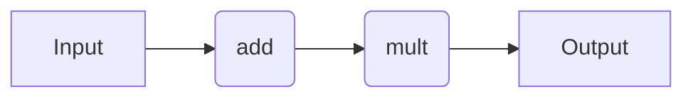
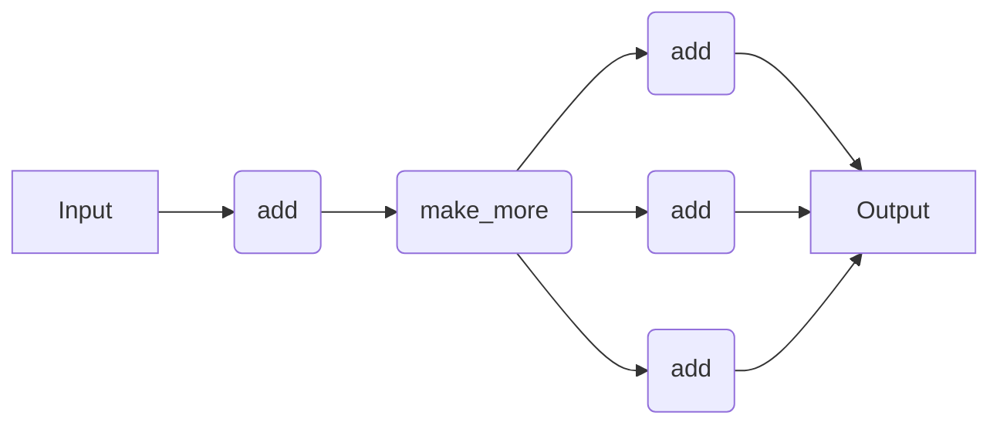

# Workflow Syntax

## Introduction

Here, we provide code snippets for several decorator-based workflow engines. For a comparison of the pros and cons of each approach, refer to the [Workflow Engines Overview](wflow_overview.md) page. We describe the specifics of each workflow engine in more detail later in the documentation. Nonetheless, this page serves as a useful point of reference that is independent of quacc-specific details.

!!! Tip

    You don't need to learn the syntax for all the different workflow solutions. You only need to learn the syntax for the one you plan to use! Regardless, the syntax is quite similar across all of the workflow engines.

## Simple Workflow

Let's do the following:

1. Add two numbers (e.g. `#!Python 1 + 2`)
2. Multiply the output of Step 1 by a third number (e.g. `#!Python 3 * 3`)

In practice, we would want each of the two tasks to be their own compute job.



=== "Covalent"

    !!! Info

        For a more detailed tutorial on how to use Covalent, refer to the ["Covalent Quick Start"](https://docs.covalent.xyz/docs/get-started/quick-start).

    Take a moment to learn about the main [Covalent Concepts](https://docs.covalent.xyz/docs/user-documentation/concepts/concepts-index), namely the [`Electron`](https://docs.covalent.xyz/docs/user-documentation/concepts/covalent-basics#electron) and [`Lattice`](https://docs.covalent.xyz/docs/user-documentation/concepts/covalent-basics#lattice) objects, which describe individual compute tasks and workflows, respectively.

    In Covalent, the `#!Python @ct.lattice` decorator indicates that the function is a workflow, and the `#!Python @ct.electron` decorator indicates that the function is a job (i.e. an individual compute task). If you plan to use a job scheduling system like Slurm, you can think of each `Electron` as an individual Slurm job.

    All `Electron` and `Lattice` objects behave as normal Python functions when the necessary arguments are supplied. However, if the `#!Python ct.dispatch` command is used, the workflow will be dispatched to the Covalent server for execution and monitoring.

    !!! Tip

        Make sure you run `covalent start` in the terminal before running the examples below.

    ```python
    import covalent as ct


    @ct.electron  # (1)!
    def add(a, b):
        return a + b


    @ct.electron
    def mult(a, b):
        return a * b


    @ct.lattice  # (2)!
    def workflow(a, b, c):
        return mult(add(a, b), c)


    # Locally
    result = workflow(1, 2, 3)  # 9  (3)!

    # Dispatched
    dispatch_id = ct.dispatch(workflow)(1, 2, 3)  # (4)!
    result = ct.get_result(dispatch_id, wait=True)  # 9  (5)!
    ```

    1. `#!Python @ct.electron` is a decorator that tells Covalent to treat the function as a compute job.

    2. `#!Python @ct.lattice` is a decorator that tells Covalent to treat the function as a workflow.

    3. By default, Covalent workflows run locally.

    4. The `#!Python ct.dispatch` function tells Covalent to dispatch the workflow to the Covalent server.

    5. The `#!Python ct.get_result` function tells Covalent to fetch the result from the server.

=== "Parsl"

    !!! Info

        For a more detailed tutorial on how to use Parsl, refer to the ["Parsl Tutorial"](https://parsl.readthedocs.io/en/stable/1-parsl-introduction.html) and the even more detailed ["Parsl User Guide"](https://parsl.readthedocs.io/en/stable/userguide/index.html).

    Take a moment to read the Parsl documentation's ["Quick Start"](https://parsl.readthedocs.io/en/stable/quickstart.html) to get a sense of how Parsl works. Namely, you should understand the concept of a [`#!Python @python_app`](https://parsl.readthedocs.io/en/stable/1-parsl-introduction.html#Python-Apps) and [`#!Python @join_app`](https://parsl.readthedocs.io/en/stable/1-parsl-introduction.html?highlight=join_app#Dynamic-workflows-with-apps-that-generate-other-apps), which describe individual compute tasks and dynamic job tasks, respectively.


    !!! Tip
        Make sure you run `#!Python import parsl` followed by `#!Python parsl.load()` in Python to load a default Parsl configuration.

    ```python
    from parsl import python_app


    @python_app  # (1)!
    def add(a, b):
        return a + b


    @python_app
    def mult(a, b):
        return a * b


    def workflow(a, b, c):
        return mult(add(a, b), c)


    result = workflow(1, 2, 3).result()  # 9  (2)!
    ```

    1. `#!Python @python_app` is a decorator that tells Parsl to treat the function as a compute job.

    2. `#!Python .result()` is a method that tells Parsl to wait for the result of the job. If `#!Python .result()` were not called, an `#!Python AppFuture` would be returned instead of the actual result.

=== "Jobflow"

    !!! Info

        For a more detailed tutorial on how to use Jobflow, refer to the [Jobflow Tutorials](https://materialsproject.github.io/jobflow/tutorials) and [this helpful guide](https://github.com/JaGeo/Advanced_Jobflow_Tutorial) written by Dr. Janine George.

    Take a moment to read the Jobflow documentation's [Quick Start](https://materialsproject.github.io/jobflow/tutorials/1-quickstart.html) to get a sense of how Jobflow works. Namely, you should understand the `Job` and `Flow` definitions, which describe individual compute tasks and workflows, respectively.

    ```python
    from jobflow import Flow, job, run_locally


    @job  # (1)!
    def add(a, b):
        return a + b


    @job
    def mult(a, b):
        return a * b


    job1 = add(1, 2)
    job2 = mult(job1.output, 3)
    flow = Flow([job1, job2])  # (2)!

    responses = run_locally(flow)  # (3)!
    result = responses[job2.uuid][1].output  # 9
    ```

    1. `#!Python @job` is a decorator that tells Jobflow to treat the function as a compute job.

    2. `#!Python Flow` is a class that tells Jobflow to treat the list of jobs as a workflow.

    3. `#!Python run_locally` is a function that tells Jobflow to run the workflow locally.

## Dynamic Workflow

Let's do the following:

1. Add two numbers (e.g. `#!Python 1 + 2`)
2. Make a list of copies of the output from Step 1 (e.g. `#!Python [3, 3, 3]`) where the size of the list is not known until runtime
3. Add a third number to each element of the list from Step 2 (e.g. `#!Python [3 + 3, 3 + 3, 3 + 3]`)

We will treat this as a dynamic workflow where the number of elements in the list from Step 2 may not necessarily be known until runtime. In practice, we would want each of the individual addition tasks to be their own compute job.



=== "Covalent"

    ```python
    import random

    import covalent as ct


    @ct.electron
    def add(a, b):
        return a + b


    @ct.electron
    def make_more(val):
        return [val] * random.randint(2, 5)


    @ct.electron  # (1)!
    @ct.lattice
    def add_distributed(vals, c):
        return [add(val, c) for val in vals]


    @ct.lattice
    def workflow(a, b, c):
        result1 = add(a, b)
        result2 = make_more(result1)
        return add_distributed(result2, c)


    # Locally
    result = workflow(1, 2, 3)  # e.g. [6, 6, 6]

    # Dispatched
    dispatch_id = ct.dispatch(workflow)(1, 2, 3)
    result = ct.get_result(dispatch_id, wait=True)  # e.g. [6, 6, 6]
    ```

    1. `#!Python @ct.electron` followed by `#!Python @ct.lattice` is called a sublattice and tells Covalent to treat the function as a dynamic, sub-workflow.

=== "Parsl"

    ```python
    from parsl import join_app, python_app


    @python_app
    def add(a, b):
        return a + b


    @python_app
    def make_more(val):
        import random

        return [val] * random.randint(2, 5)


    @join_app  # (1)!
    def add_distributed(vals, c):
        return [add(val, c) for val in vals]


    def workflow(a, b, c):
        future1 = add(a, b)
        future2 = make_more(future1)
        return add_distributed(future2, c)


    result = workflow(1, 2, 3).result()  # e.g. [6, 6, 6]
    ```

    1. `#!Python @join_app` is a decorator that tells Parsl to treat the function as a dynamic, sub-workflow. Calling `#!Python .result()` will wait for all of the jobs to finish before returning the result. If you were to use a `#!Python @python_app`, a `#!Python list[AppFuture[int]]` would be returned instead of an `#!Python AppFuture[list[int]]`.

=== "Jobflow"

    ```python
    import random

    from jobflow import Flow, Response, job, run_locally


    @job
    def add(a, b):
        return a + b


    @job
    def make_more(val):
        return [val] * random.randint(2, 5)


    @job
    def add_distributed(vals, c):
        jobs = []
        for val in vals:
            jobs.append(add(val, c))
        return Response(replace=Flow(jobs))  # (1)


    job1 = add(1, 2)
    job2 = make_more(job1.output)
    job3 = add_distributed(job2.output, 3)
    flow = Flow([job1, job2, job3])

    responses = run_locally(flow)  # e.g. [6, 6, 6] (job3.output)
    ```

    1. `#!Python Response(replace)` is a class that tells Jobflow to replace the current job with the jobs in the flow.
