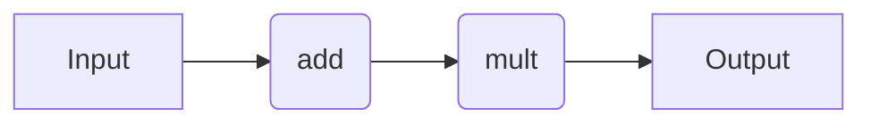
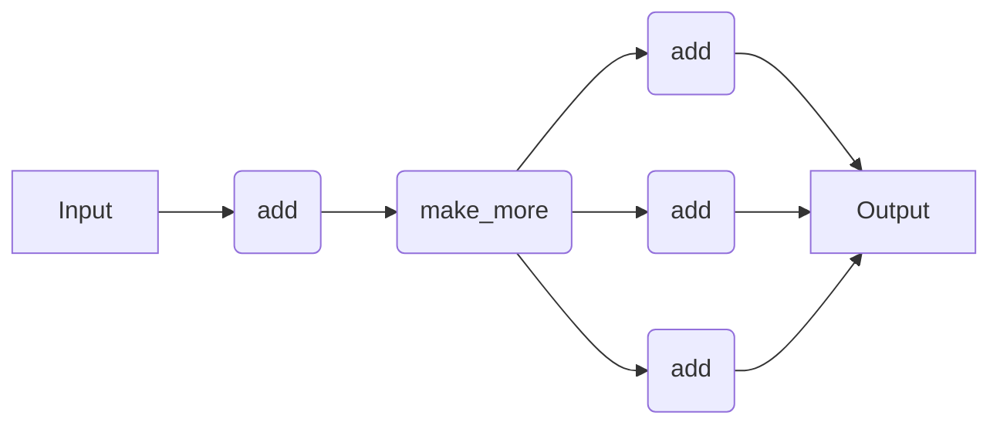

# Workflow Syntax

## Introduction

Here, we provide code snippets for several decorator-based workflow engines. For a comparison of the pros and cons of each approach, refer to the [Workflow Engines Overview](wflow_overview.md) page. We describe the specific of each workflow engine in more detail later in the documentation. Nonetheless, this page serves as a useful point of reference that is independent of quacc-specific details.

## Simple Workflow

Let's do the following:

1. Add two numbers (e.g. `#!Python 1 + 2`)
2. Multiply the output of Step 1 by a third number (e.g. `#!Python 3 * 3`)

In practice, we would want each of the two tasks to be their own compute job.



=== "No Workflow Engine"

    ```python
    def add(a, b):
        return a + b


    def mult(a, b):
        return a * b


    def workflow(a, b, c):
        return mult(add(a, b), c)


    result = workflow(1, 2, 3)  # 9
    ```

=== "Covalent"

    !!! Tip

        Make sure you run `covalent start` in the terminal to have the results show up in the GUI.

    ```python
    import covalent as ct


    @ct.electron
    def add(a, b):
        return a + b


    @ct.electron
    def mult(a, b):
        return a * b


    @ct.lattice
    def workflow(a, b, c):
        return mult(add(a, b), c)


    # Locally
    result = workflow(1, 2, 3)  # 9

    # Dispatched
    dispatch_id = ct.dispatch(workflow)(1, 2, 3)
    result = ct.get_result(dispatch_id, wait=True)  # 9
    ```

=== "Parsl"

    !!! Tip
        Make sure you run `#!Python import parsl` followed by `#!Python parsl.load()` in Python to load a default Parsl configuration.

    ```python
    from parsl import python_app


    @python_app
    def add(a, b):
        return a + b


    @python_app
    def mult(a, b):
        return a * b


    def workflow(a, b, c):
        return mult(add(a, b), c)


    result = workflow(1, 2, 3).result()  # 9
    ```

=== "Prefect"

    ```python
    from prefect import flow, task


    @task
    def add(a, b):
        return a + b


    @task
    def mult(a, b):
        return a * b


    @flow
    def workflow(a, b, c):
        return mult.submit(add.submit(a, b), c)


    result = workflow(1, 2, 3).result()  # 9
    ```

=== "Jobflow"

    ```python
    from jobflow import Flow, job, run_locally


    @job
    def add(a, b):
        return a + b


    @job
    def mult(a, b):
        return a * b


    job1 = add(1, 2)
    job2 = mult(job1.output, 3)
    flow = Flow([job1, job2])

    responses = run_locally(flow)
    result = responses[job2.uuid][1].output  # 9
    ```

## Dynamic Workflow

Let's do the following:

1. Add two numbers (e.g. `#!Python 1 + 2`)
2. Make a list of copies of the output from Step 1 (e.g. `#!Python [3, 3, 3]`) where the size of the list is not known until runtime
3. Add a third number to each element of the list from Step 2 (e.g. `#!Python [3 + 3, 3 + 3, 3 + 3]`)

We will treat this as a dynamic workflow where the number of elements in the list from Step 2 may not necessarily be known until runtime. In practice, we would want each of the individual addition tasks to be their own compute job.



=== "No Workflow Engine"

    ```python
    import random


    def add(a, b):
        return a + b


    def workflow(a, b, c):
        add_result = add(a, b)
        vals = [add_result] * random.randint(2, 5)
        return [add(val, c) for val in vals]


    result = workflow(1, 2, 3)  # e.g. [6, 6, 6]
    ```

=== "Covalent"

    ```python
    import random

    import covalent as ct


    @ct.electron
    def add(a, b):
        return a + b


    @ct.electron
    def make_more(val):
        return [val] * random.randint(2, 5)


    @ct.electron
    @ct.lattice
    def add_distributed(vals, c):
        return [add(val, c) for val in vals]


    @ct.lattice
    def workflow(a, b, c):
        result1 = add(a, b)
        result2 = make_more(result1)
        return add_distributed(result2, c)


    # Locally
    result = workflow(1, 2, 3)  # e.g. [6, 6, 6]

    # Dispatched
    dispatch_id = ct.dispatch(workflow)(1, 2, 3)
    result = ct.get_result(dispatch_id, wait=True)  # e.g. [6, 6, 6]
    ```

=== "Parsl"

    ```python
    from parsl import join_app, python_app


    @python_app
    def add(a, b):
        return a + b


    @python_app
    def make_more(val):
        import random

        return [val] * random.randint(2, 5)


    @join_app
    def add_distributed(vals, c):
        return [add(val, c) for val in vals]


    def workflow(a, b, c):
        future1 = add(a, b)
        future2 = make_more(future1)
        return add_distributed(future2, c)


    result = workflow(1, 2, 3).result()  # e.g. [6, 6, 6]
    ```

=== "Prefect"

    ```python
    import random

    from prefect import flow, task


    @task
    def add(a, b):
        return a + b


    @flow
    def workflow(a, b, c):
        future1 = add.submit(a, b)
        vals_to_add = [future1.result()] * random.randint(2, 5)
        return [add.submit(val, c).result() for val in vals_to_add]


    result = workflow(1, 2, 3)  # e.g. [6, 6, 6]
    ```

=== "Jobflow"

    ```python
    import random

    from jobflow import Flow, Response, job, run_locally


    @job
    def add(a, b):
        return a + b


    @job
    def make_more(val):
        return [val] * random.randint(2, 5)


    @job
    def add_distributed(vals, c):
        jobs = []
        for val in vals:
            jobs.append(add(val, c))
        return Response(replace=Flow(jobs))


    job1 = add(1, 2)
    job2 = make_more(job1.output)
    job3 = add_distributed(job2.output, 3)
    flow = Flow([job1, job2, job3])

    responses = run_locally(flow)  # e.g. [6, 6, 6] (job3.output)
    ```
